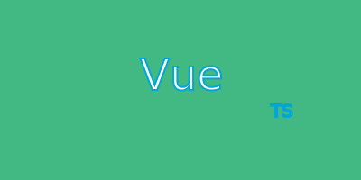

# vue-ts-vite 模板


<!-- truncate -->

## 關於模板

- 方便每次開新專案時，不須重裝套件

## 使用方式

### 1. 下載模板

### 2. 於 `package.json` 修改專案名稱

```js
{
  // highlight-next-line
  "name": "vue-ts-template",
  "private": true,
  "version": "0.0.0",
  "type": "module",
  "scripts": {
    "dev": "vite",
    "build": "vue-tsc && vite build",
    "preview": "vite preview"
  },
  "dependencies": {
    "axios": "^1.1.3",
    "jssha": "^3.3.0",
    "pinia": "^2.0.23",
    "tailwindcss": "^3.2.1",
    "vue": "^3.2.41",
    "vue-router": "^4.1.6"
  },
  "devDependencies": {
    "@vitejs/plugin-vue": "^3.2.0",
    "typescript": "^4.6.4",
    "vite": "^3.2.0",
    "vue-tsc": "^1.0.9"
  }
}
```

## 完整版

- vite 3.2.0
- vue 3.2.41
- typescript 4.6.4
- vue-router 4.1.6
- axios 1.1.3
- jssha 3.3.0
- pinia 2.0.23
- tailwindcss 3.2.1

## 標準版

[連結](https://github.com/LonelyYeezhiChicken/vue-ts-template/tree/pinia)

- vite 3.2.0
- vue 3.2.41
- typescript 4.6.4
- vue-router 4.1.6
- axios 1.1.3
- jssha 3.3.0
- pinia 2.0.23

## Api版

[連結](https://github.com/LonelyYeezhiChicken/vue-ts-template/tree/axios)

- vite 3.2.0
- vue 3.2.41
- typescript 4.6.4
- vue-router 4.1.6
- axios 1.1.3
- jssha 3.3.0

## Router版

[連結](https://github.com/LonelyYeezhiChicken/vue-ts-template/tree/v-router)

- vite 3.2.0
- vue 3.2.41
- typescript 4.6.4
- vue-router 4.1.6

## 簡約版

[連結](https://github.com/LonelyYeezhiChicken/vue-ts-template/tree/simple)

- vite 3.2.0
- vue 3.2.41
- typescript 4.6.4