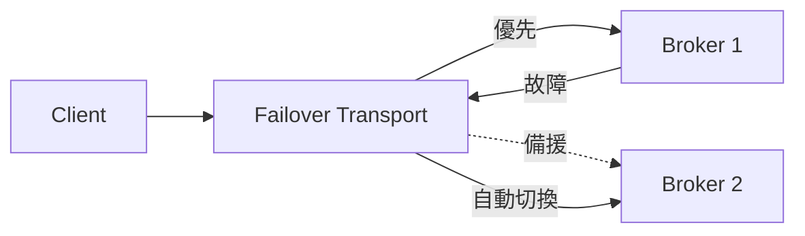

# 🧣 連線容錯 Failover URI

本章節解析 ActiveMQ 客戶端端的連線容錯機制。透過 Failover URI，應用程式可在 Broker 故障或網路中斷時自動切換到備援節點，對開發者透明地完成重連。

## 環境

- windows10 ~ 11 (win64)
- [ActiveMQ 5.16.6](https://activemq.apache.org/activemq-5016006-release)
- [JDK 1.8](https://blog.lychicken.com/docs/daylilyTool/toolScoop/setJdk)

## 1. Failover URI 結構

```
failover:(tcp://host1:61616,tcp://host2:61616)?參數=值
```



## 2. 常用參數

| 參數 | 說明 | 建議值 |
|------|------|--------|
| `randomize` | 是否隨機選擇 Broker | `false`（按順序優先） |
| `initialReconnectDelay` | 首次重連延遲（毫秒） | `100` |
| `maxReconnectDelay` | 最大重連延遲（毫秒） | `30000` |
| `maxReconnectAttempts` | 最大重連次數，`-1` 為無限 | `-1` |
| `backup` | 是否預先建立備援連線 | `true` |
| `timeout` | 連線超時（毫秒） | `3000` |

## 3. Java 客戶端範例

```java
String brokerUrl = "failover:(tcp://192.168.1.10:61616,tcp://192.168.1.11:61616)"
    + "?randomize=false"
    + "&initialReconnectDelay=100"
    + "&maxReconnectAttempts=-1"
    + "&backup=true";

ActiveMQConnectionFactory factory = new ActiveMQConnectionFactory(brokerUrl);
factory.setUserName("admin");
factory.setPassword("admin1pwd");

Connection connection = factory.createConnection();
connection.start();
```

## 4. Spring Boot 設定

```yaml
spring:
  activemq:
    broker-url: failover:(tcp://192.168.1.10:61616,tcp://192.168.1.11:61616)?randomize=false&backup=true
    user: admin
    password: admin1pwd
```

## 5. 與 Broker 端 HA 的搭配

| 架構 | 客戶端 Failover | Broker 端 |
|------|----------------|-----------|
| 單機 + 備援 IP | 指向主備兩個 IP | 手動切換或 DNS |
| Master-Slave | 指向 Master 與 Slave | 共享 KahaDB / JDBC |
| Network of Brokers | 指向多個 Broker | 訊息橋接 |

- Master-Slave 詳見 [`masterSlave`](/docs/activeMQ/advanced/masterSlave)
- Network of Brokers 詳見 [`networkOfBrokers`](/docs/activeMQ/advanced/networkOfBrokers)

## 6. 常見問題與排查

| 現象 | 可能原因 | 處理方式 |
|------|----------|----------|
| 切換後訊息重複 | 非持久化訊息在切換時重投 | 關鍵訊息設為持久化 |
| 重連失敗 | 備援 Broker 未啟動 | 確認 Slave 狀態與網路 |
| 連線抖動 | `initialReconnectDelay` 太小 | 適度增大並啟用指數退避 |
| 認證失敗 | 備援節點帳密不同 | 統一兩端認證設定 |

## 7. 與其他文章的關聯

- JMS 客戶端基礎：[`jmsClient`](/docs/activeMQ/usage/jmsClient)
- Spring 整合：[`springJms`](/docs/activeMQ/usage/springJms)
- Master-Slave HA：[`masterSlave`](/docs/activeMQ/advanced/masterSlave)