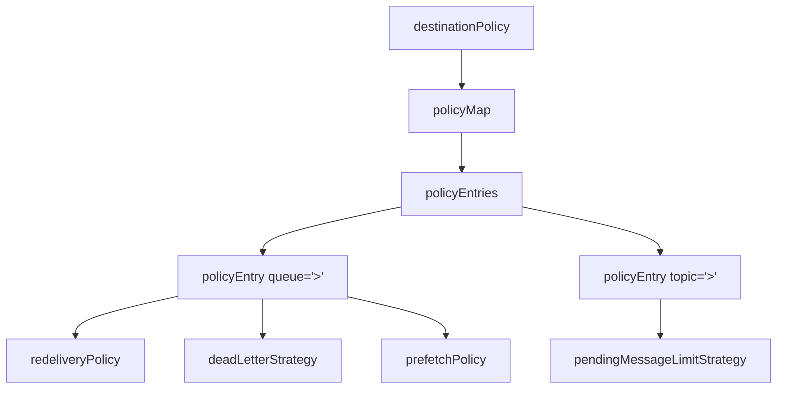

# 🧣 目的地策略 destinationPolicy

本章節解析 ActiveMQ Broker 中最核心的設定區塊之一：`destinationPolicy`。它統一管控每個 Queue / Topic 的預取、重送、死信、慢消費者與資源回收行為，是將「概念」落地為「可運行設定」的關鍵。

## 環境

- windows10 ~ 11 (win64)
- [ActiveMQ 5.16.6](https://activemq.apache.org/activemq-5016006-release)
- [JDK 1.8](https://blog.lychicken.com/docs/daylilyTool/toolScoop/setJdk)

## 1. 策略結構 —— 三層對應關係



- 檔案: `/conf/activemq.xml`
- `queue=">"` 與 `topic=">"` 中的 `>` 為萬用字元，代表**所有** Queue 或 Topic
- 更具體的名稱優先匹配，例如 `queue="ORDER.>"` 優先於 `queue=">"`

## 2. 完整設定範例

```xml
<broker xmlns="http://activemq.apache.org/schema/core" brokerName="localhost" dataDirectory="${activemq.data}">
  <destinationPolicy>
    <policyMap>
      <policyEntries>
        <!-- Queue 策略 -->
        <policyEntry queue=">"
                     prioritizedMessages="true"
                     maxPageSize="200"
                     gcInactiveDestinations="true"
                     inactiveTimoutBeforeGC="600000">
          <pendingMessageLimitStrategy>
            <constantPendingMessageLimitStrategy limit="1000"/>
          </pendingMessageLimitStrategy>
          <deadLetterStrategy>
            <individualDeadLetterStrategy queuePrefix="DLQ." processExpired="true"/>
          </deadLetterStrategy>
          <redeliveryPolicy>
            <redeliveryPolicy maximumRedeliveries="3"
                              redeliveryDelay="2000"
                              useExponentialBackOff="true"/>
          </redeliveryPolicy>
        </policyEntry>

        <!-- Topic 策略 -->
        <policyEntry topic=">"
                     producerFlowControl="true"
                     advisoryForConsumed="true">
          <pendingMessageLimitStrategy>
            <constantPendingMessageLimitStrategy limit="1000"/>
          </pendingMessageLimitStrategy>
        </policyEntry>
      </policyEntries>
    </policyMap>
  </destinationPolicy>
</broker>
```

## 3. policyEntry 常用屬性

### 3.1 通用屬性

| 屬性 | 說明 | 建議 |
|------|------|------|
| `prioritizedMessages` | 啟用訊息優先級排序 | 金融、告警場景設 `true` |
| `maxPageSize` | 每次從 Store 載入訊息的筆數 | 預設 200，大訊息可調低 |
| `producerFlowControl` | 目的地滿時限制 Producer 發送 | Topic 建議 `true` |
| `gcInactiveDestinations` | 閒置 Queue 自動回收 | 動態建立 Queue 的場景設 `true` |
| `inactiveTimoutBeforeGC` | 閒置多久後回收（毫秒） | 生產環境建議 ≥ 600000（10 分鐘） |

### 3.2 Prefetch 預取策略

Prefetch 決定 Consumer 一次從 Broker **預拉**多少則訊息到本地緩衝：

| 目的地 | 預設 prefetch | 調校方向 |
|--------|---------------|----------|
| Queue | 1000 | 慢消費者設為 1，高吞吐可維持預設 |
| Topic | 32767 | 通常不需調整 |

```xml
<policyEntry queue="ORDER.>" queuePrefetch="10"/>
```

:::tip
競爭消費者（Competing Consumers）場景下，將 `queuePrefetch` 設為 `1` 可讓訊息更均勻分配給多個 Consumer。
:::

### 3.3 慢消費者策略

當 Consumer 處理速度跟不上 Producer 時，Broker 需要決定如何處理堆積：

```xml
<policyEntry topic=">" slowConsumerStrategy="multicastTopicPrefetch">
  <slowConsumerStrategy>
    <abortSlowConsumerStrategy abortConnection="false"/>
  </slowConsumerStrategy>
</policyEntry>
```

| 策略 | 行為 |
|------|------|
| `abortSlowConsumerStrategy` | 斷開慢消費者的連線 |
| `abortSlowAckConsumerStrategy` | 針對 ACK 遲緩的消費者斷線 |

## 4. 巢狀子策略對照

| 子策略 | 所屬文章 | 功能 |
|--------|----------|------|
| `redeliveryPolicy` | [`ackAndRedelivery`](/docs/activeMQ/usage/ackAndRedelivery) | 重送次數與間隔 |
| `deadLetterStrategy` | [`deadLetterQueue`](/docs/activeMQ/usage/deadLetterQueue) | 死信佇列行為 |
| `pendingMessageLimitStrategy` | [`setGC`](/docs/activeMQ/setUp/setGC) | Topic 待處理訊息上限 |

## 5. 常見問題與排查

| 現象 | 相關屬性 | 處理方式 |
|------|----------|----------|
| 訊息堆積但 Consumer 閒置 | `queuePrefetch` 過大 | 調低 prefetch，讓其他 Consumer 有機會取得訊息 |
| Queue 被意外刪除 | `gcInactiveDestinations` | 增大 `inactiveTimoutBeforeGC` 或關閉 GC |
| Producer 發送被阻塞 | `producerFlowControl` | 檢查 `memoryUsage` / `storeUsage` 是否已滿 |
| 優先級訊息未優先處理 | `prioritizedMessages` | 確認設為 `true` 且 Producer 有設定 priority |

## 6. 與其他文章的關聯

- Topic / Queue 自動回收：[`setGC`](/docs/activeMQ/setUp/setGC)
- 延遲與優先級概念：[`efficientPrioritization`](/docs/activeMQ/fundamentals/efficientPrioritization)
- 流量控制與記憶體：[`flowControl`](/docs/activeMQ/advanced/flowControl)