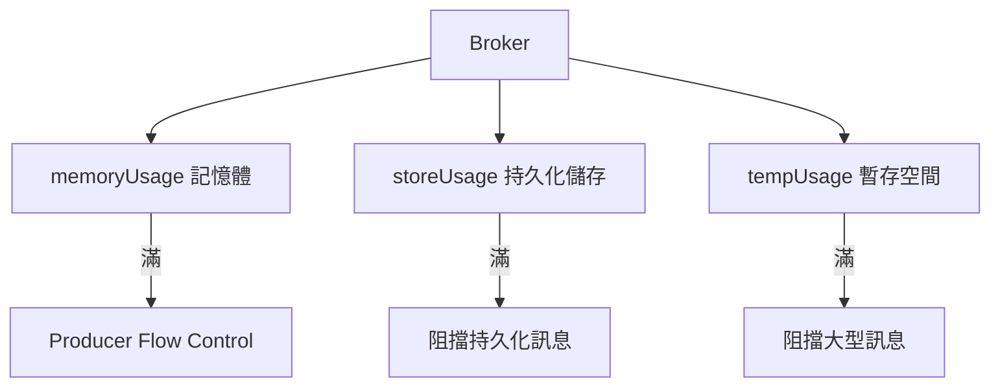

# 🧣 流量控制與記憶體限制

本章節解析 ActiveMQ Broker 的資源護欄機制。當記憶體、磁碟或暫存空間達到上限時，Broker 如何透過流量控制保護自身不被壓垮，是生產環境穩定運行的關鍵設定。

## 環境

- windows10 ~ 11 (win64)
- [ActiveMQ 5.16.6](https://activemq.apache.org/activemq-5016006-release)
- [JDK 1.8](https://blog.lychicken.com/docs/daylilyTool/toolScoop/setJdk)

## 1. systemUsage —— 三層資源上限



- 檔案: `/conf/activemq.xml`

```xml
<broker xmlns="http://activemq.apache.org/schema/core" brokerName="localhost" dataDirectory="${activemq.data}">
  <systemUsage>
    <systemUsage>
      <memoryUsage>
        <memoryUsage percentOfJvmHeap="70"/>
      </memoryUsage>
      <storeUsage>
        <storeUsage limit="10 gb"/>
      </storeUsage>
      <tempUsage>
        <tempUsage limit="5 gb"/>
      </tempUsage>
    </systemUsage>
  </systemUsage>
</broker>
```

## 2. 三種 Usage 說明

| 類型 | 管控對象 | 滿了會怎樣 |
|------|----------|------------|
| `memoryUsage` | 非持久化訊息、分頁緩衝 | Producer 被阻塞或拋例外 |
| `storeUsage` | KahaDB 持久化訊息 | 持久化訊息無法寫入 |
| `tempUsage` | 大型訊息溢出到磁碟的暫存 | 大型訊息無法處理 |

### 2.1 memoryUsage 設定方式

```xml
<!-- 方式一：佔 JVM Heap 百分比 -->
<memoryUsage percentOfJvmHeap="70"/>

<!-- 方式二：固定值 -->
<memoryUsage>
  <memoryUsage limit="512 mb"/>
</memoryUsage>
```

## 3. Producer Flow Control

當目的地資源不足時，Broker 可限制 Producer 繼續發送：

```xml
<destinationPolicy>
  <policyMap>
    <policyEntries>
      <policyEntry queue=">" producerFlowControl="true" sendFailIfNoSpace="false">
        <pendingMessageLimitStrategy>
          <constantPendingMessageLimitStrategy limit="1000"/>
        </pendingMessageLimitStrategy>
      </policyEntry>
    </policyEntries>
  </policyMap>
</destinationPolicy>
```

| 屬性 | 說明 |
|------|------|
| `producerFlowControl` | 啟用後，資源滿時阻塞 Producer |
| `sendFailIfNoSpace` | `true` 時直接拋例外而非阻塞 |
| `cursorMemoryHighWaterMark` | 記憶體使用水位線（預設 70%） |

## 4. JVM Heap 與 memoryUsage 的關係

ActiveMQ 啟動腳本中的 JVM 參數決定了 Heap 上限，`memoryUsage` 再從中取一部分：

```shell
# activemq.bat 或 wrapper.conf
set ACTIVEMQ_OPTS=-Xms512M -Xmx2G
```

搭配 `percentOfJvmHeap="70"` 時，Broker 記憶體上限約為 2G × 70% = 1.4G。

## 5. 常見問題與排查

| 現象 | 可能原因 | 處理方式 |
|------|----------|----------|
| Producer 卡住不報錯 | `producerFlowControl=true` 且資源滿 | 檢查 Consumer 是否跟上，或調高 limit |
| `ResourceAllocationException` | `sendFailIfNoSpace=true` | 增大 storeUsage 或清理堆積 |
| 記憶體持續增長 | 非持久化訊息堆積 | 調低 prefetch 或增大 memoryUsage |
| storeUsage 滿 | 持久化訊息未消費 | 排查 Consumer 與 DLQ |

## 6. 與其他文章的關聯

- KahaDB 儲存：[`kahadbTuning`](/docs/activeMQ/advanced/kahadbTuning)
- 目的地策略：[`destinationPolicy`](/docs/activeMQ/advanced/destinationPolicy)
- 效能調校：[`performanceTuning`](/docs/activeMQ/operations/performanceTuning)
- 故障排除：[`loggingTroubleshoot`](/docs/activeMQ/operations/loggingTroubleshoot)