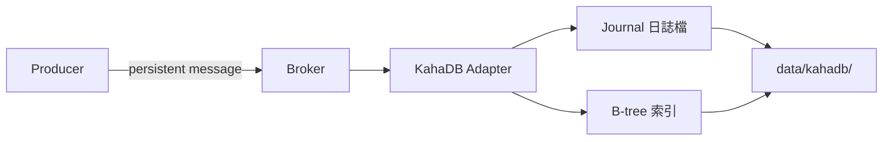

# 🧣 KahaDB 調校

本章節深入 ActiveMQ Classic 預設的持久化引擎 KahaDB，解析其日誌寫入、索引結構與可調參數。正確調校 KahaDB，是在「訊息不丟失」與「磁碟 I/O 效能」之間取得平衡的必經之路。

## 環境

- windows10 ~ 11 (win64)
- [ActiveMQ 5.16.6](https://activemq.apache.org/activemq-5016006-release)
- [JDK 1.8](https://blog.lychicken.com/docs/daylilyTool/toolScoop/setJdk)

## 1. KahaDB 在 Broker 中的位置

ActiveMQ 5.x 預設使用 KahaDB 作為 `persistenceAdapter`，所有持久化訊息最終寫入 `${activemq.data}/kahadb/` 目錄。



## 2. 預設與自訂設定

- 檔案: `/conf/activemq.xml`

### 2.1 預設（大多數安裝）

```xml
<persistenceAdapter>
  <kahaDB directory="${activemq.data}/kahadb"/>
</persistenceAdapter>
```

### 2.2 調校版

```xml
<persistenceAdapter>
  <kahaDB directory="${activemq.data}/kahadb"
          journalMaxFileLength="32mb"
          checkpointInterval="5000"
          indexWriteBatchSize="1000"
          enableJournalDiskSyncs="true"
          enableIndexDiskSyncs="false"/>
</persistenceAdapter>
```

## 3. 關鍵屬性說明

| 屬性 | 說明 | 預設 | 調校建議 |
|------|------|------|----------|
| `directory` | KahaDB 資料目錄 | `${activemq.data}/kahadb` | 生產環境使用獨立磁碟/partition |
| `journalMaxFileLength` | 單一日誌檔上限 | `32mb` | 大流量可調至 `64mb` 減少檔案數 |
| `checkpointInterval` | 索引 checkpoint 間隔（毫秒） | `5000` | 縮短可加速恢復，但增加 I/O |
| `indexWriteBatchSize` | 索引批次寫入大小 | `1000` | 高吞吐可適度增大 |
| `enableJournalDiskSyncs` | 日誌是否 fsync 到磁碟 | `true` | 設 `false` 提升效能但降低耐久性 |
| `enableIndexDiskSyncs` | 索引是否 fsync 到磁碟 | `false` | 通常維持 `false` |

:::caution
將 `enableJournalDiskSyncs` 設為 `false` 可在斷電時遺失最後一批未 fsync 的訊息。僅在可容忍極少量遺失的場景使用。
:::

## 4. 資料目錄結構

```
${activemq.data}/kahadb/
├── db-1.log          # 訊息日誌
├── db-2.log
├── db.data           # B-tree 索引
├── db.redo           # 重做日誌
└── lock              # 檔案鎖
```

| 檔案 | 用途 |
|------|------|
| `db-*.log` | 追加寫入的訊息日誌，定期合併 |
| `db.data` | B-tree 索引，加速訊息查找 |
| `db.redo` | 異常關閉後的恢復日誌 |
| `lock` | 防止多個 Broker 同時寫入同一目錄 |

## 5. 啟動恢復流程

Broker 非正常關閉後重啟時，KahaDB 執行以下步驟：

1. 讀取 `db.redo` 重做未完成的操作
2. 回放 `db-*.log` 中尚未索引的訊息
3. 重建 B-tree 索引
4. 恢復完成後開始接受連線

恢復時間與未 checkpoint 的日誌量成正比。適當的 `checkpointInterval` 可縮短重啟時間。

## 6. 磁碟規劃建議

| 場景 | 建議 |
|------|------|
| 開發環境 | 預設路徑即可 |
| 生產環境 | KahaDB 目錄放在獨立 SSD |
| 高持久化流量 | 監控磁碟使用率，預留 30% 空間 |
| Master-Slave 共享 | 使用共享檔案系統（NFS/SAN），確保 `lock` 機制正常 |

## 7. 清理與維護

### 7.1 正常停止後清理

停止 Broker 後，可安全刪除整個 `kahadb` 目錄以清空所有持久化訊息（**僅限開發環境**）。

### 7.2 磁碟空間不足

當 `storeUsage` 達到上限時，Broker 會阻擋 Producer 發送持久化訊息。處理步驟：

1. 檢查 Web Console 中 Queue 是否有大量堆積
2. 清理或消費堆積訊息
3. 必要時調高 `<systemUsage><storeUsage>` 上限

```xml
<systemUsage>
  <systemUsage>
    <storeUsage>
      <storeUsage limit="10 gb"/>
    </storeUsage>
  </systemUsage>
</systemUsage>
```

## 8. KahaDB vs JDBC 取捨

| 項目 | KahaDB | JDBC（MySQL 等） |
|------|--------|------------------|
| 效能 | 高（本地 I/O） | 較低（網路 + SQL） |
| 運維複雜度 | 低 | 需維護外部資料庫 |
| HA 方案 | Shared File System | Shared Database |
| 適用場景 | 大多數單機與 Master-Slave | 需集中化管理訊息資料 |

JDBC 設定詳見 [`jdbcPersistence`](/docs/activeMQ/advanced/jdbcPersistence)。

## 9. 常見問題與排查

| 現象 | 可能原因 | 處理方式 |
|------|----------|----------|
| Broker 啟動緩慢 | 大量未 checkpoint 日誌 | 縮短 `checkpointInterval` |
| `Failed to load: lock` | 另一個 Broker 實例佔用 | 確認無重複實例，檢查殘留 lock |
| 磁碟持續增長 | 訊息堆積未消費 | 排查 Consumer 與 DLQ |
| 斷電後訊息遺失 | `enableJournalDiskSyncs=false` | 生產環境保持 `true` |

## 10. 與其他文章的關聯

- KahaDB 概念與流程圖：[`durable`](/docs/activeMQ/fundamentals/durable)
- 流量控制與 storeUsage：[`flowControl`](/docs/activeMQ/advanced/flowControl)
- Master-Slave 共享儲存：[`masterSlave`](/docs/activeMQ/advanced/masterSlave)