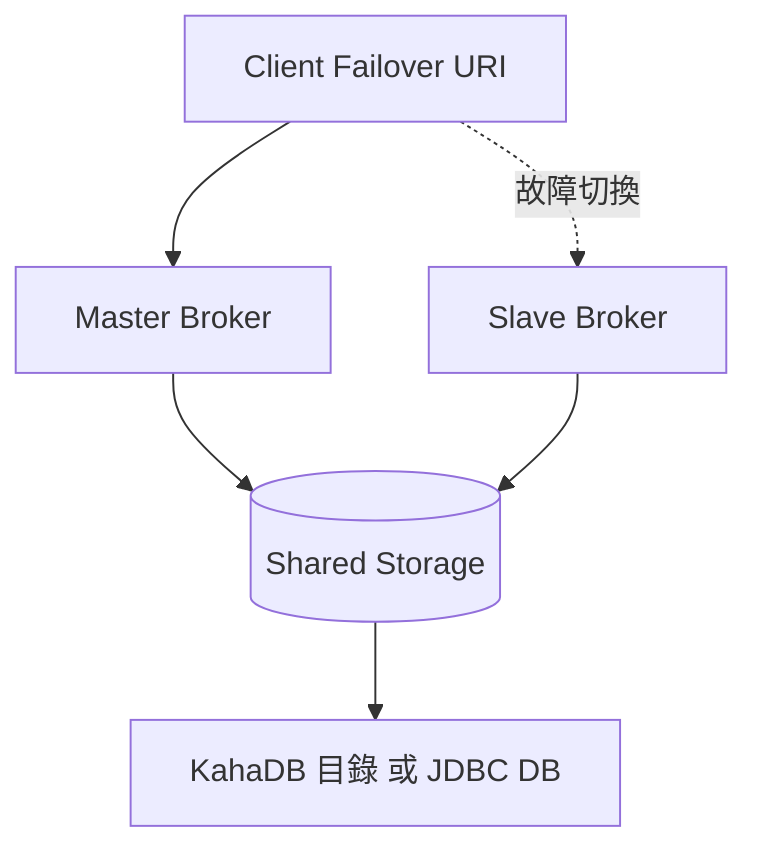

# 🧣 Master-Slave 高可用

本章節解析 ActiveMQ Classic 的 Master-Slave 架構。透過共享儲存（檔案系統或資料庫），Slave Broker 在 Master 故障時自動接管，確保訊息服務不中斷。

## 環境

- windows10 ~ 11 (win64)
- [ActiveMQ 5.16.6](https://activemq.apache.org/activemq-5016006-release)
- 兩台以上伺服器（或本機多實例測試）

## 1. 架構概覽



| 模式 | 共享方式 | 適用 |
|------|----------|------|
| Shared File System | NFS / SAN 掛載同一目錄 | 內網檔案共享 |
| Shared Database | MySQL / PostgreSQL | 已有 DB 基礎設施 |

## 2. Shared File System 設定

### 2.1 Master activemq.xml

```xml
<broker xmlns="http://activemq.apache.org/schema/core" brokerName="master" dataDirectory="/shared/activemq-data">
  <persistenceAdapter>
    <kahaDB directory="/shared/activemq-data/kahadb"/>
  </persistenceAdapter>
  <transportConnectors>
    <transportConnector name="openwire" uri="tcp://0.0.0.0:61616"/>
  </transportConnectors>
</broker>
```

### 2.2 Slave activemq.xml

```xml
<broker xmlns="http://activemq.apache.org/schema/core" brokerName="slave" dataDirectory="/shared/activemq-data">
  <persistenceAdapter>
    <kahaDB directory="/shared/activemq-data/kahadb"/>
  </persistenceAdapter>
  <transportConnectors>
    <transportConnector name="openwire" uri="tcp://0.0.0.0:61617"/>
  </transportConnectors>
</broker>
```

Slave 啟動時會偵測到 lock 被 Master 持有，進入待機狀態。Master 關閉後 Slave 取得 lock 並接管。

## 3. Shared Database 設定

Slave 與 Master 使用相同的 `jdbcPersistenceAdapter` 設定（參見 [`jdbcPersistence`](/docs/activeMQ/advanced/jdbcPersistence)），`lease-database-locker` 確保同一時間只有一個 Broker 寫入。

## 4. 客戶端 Failover

```java
String url = "failover:(tcp://master-host:61616,tcp://slave-host:61617)?randomize=false";
ActiveMQConnectionFactory factory = new ActiveMQConnectionFactory(url);
```

詳見 [`connectionFailover`](/docs/activeMQ/advanced/connectionFailover)。

## 5. 與多實例的差異

| 項目 | createMoreActiveMQ 多實例 | Master-Slave |
|------|--------------------------|--------------|
| 目的 | 同一機器跑多個獨立 Broker | 高可用備援 |
| 儲存 | 各自獨立 | 共享 |
| 訊息 | 不互通 | 同一份資料 |

## 6. 常見問題與排查

| 現象 | 可能原因 | 處理方式 |
|------|----------|----------|
| Slave 無法啟動 | Master 仍持有 lock | 確認 Master 已正常關閉 |
| 雙 Master 同時寫入 | NFS lock 不可靠 | 改用 Shared Database 方案 |
| 切換後 Client 斷線 | 未使用 Failover URI | 客戶端配置 failover |
| 資料不一致 | 共享目錄未真正共享 | 確認兩端掛載同一路徑 |

## 7. 與其他文章的關聯

- 單機多實例：[`createMoreActiveMQ`](/docs/activeMQ/setUp/createMoreActiveMQ)
- JDBC 持久化：[`jdbcPersistence`](/docs/activeMQ/advanced/jdbcPersistence)
- 連線容錯：[`connectionFailover`](/docs/activeMQ/advanced/connectionFailover)
- KahaDB：[`kahadbTuning`](/docs/activeMQ/advanced/kahadbTuning)