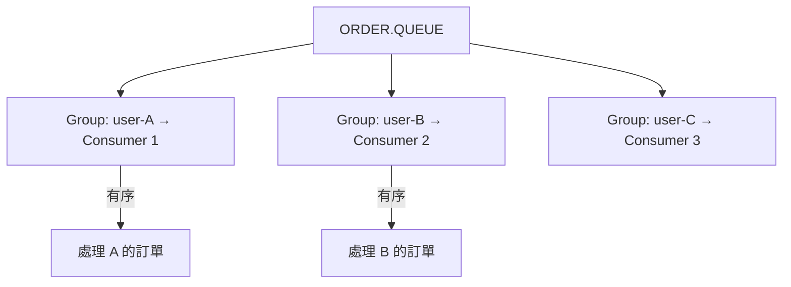

# 🧣 Message Group 訊息分組

本章節解析 ActiveMQ 的 Message Group 機制。透過 `JMSXGroupID`，Broker 保證同一分組內的訊息由同一 Consumer 按順序處理，同時不同分組之間仍可平行消費。

## 環境

- windows10 ~ 11 (win64)
- [ActiveMQ 5.16.6](https://activemq.apache.org/activemq-5016006-release)
- [JDK 1.8](https://blog.lychicken.com/docs/daylilyTool/toolScoop/setJdk)

## 1. 問題場景

訂單系統中，同一使用者的「建立 → 付款 → 出貨」必須按順序處理，但不同使用者的訂單可以平行處理。

| 方案 | 效果 | 缺點 |
|------|------|------|
| 單一 Consumer | 全局有序 | 無法平行，吞吐低 |
| Message Group | 組內有序、組間平行 | 需正確設定 GroupID |

## 2. 運作原理



Broker 將相同 `JMSXGroupID` 的訊息路由到同一 Consumer，直到該 Consumer 關閉或不再消費該 Group。

## 3. Producer 設定 GroupID

```java
TextMessage message = session.createTextMessage("Payment for order #1001");
message.setStringProperty("JMSXGroupID", "user-12345");
producer.send(message);
```

## 4. Broker 端建議設定

```xml
<policyEntry queue="ORDER.>" queuePrefetch="1" consumersBeforeDispatchStarts="1">
  <dispatchPolicy>
    <roundRobinDispatchPolicy/>
  </dispatchPolicy>
</policyEntry>
```

| 屬性 | 說明 |
|------|------|
| `queuePrefetch="1"` | 避免一個 Consumer 預取過多導致 Group 分配不均 |
| `consumersBeforeDispatchStarts="1"` | 至少有一個 Consumer 才開始分派 |

## 5. 常見問題與排查

| 現象 | 可能原因 | 處理方式 |
|------|----------|----------|
| 順序仍被打亂 | GroupID 未設定或每次不同 | 用固定業務鍵（如 userId） |
| 某 Group 堆積 | 該 Group 的 Consumer 處理慢 | 優化業務邏輯或拆分 Group 粒度 |
| Group 不再重新分配 | Consumer 持有舊 Group 獨佔 | 關閉並重啟 Consumer |
| 吞吐不如預期 | Group 數太少 | 確保 GroupID 有足夠分散度 |

## 6. 與其他文章的關聯

- 優先級管理：[`efficientPrioritization`](/docs/activeMQ/fundamentals/efficientPrioritization)
- 目的地策略：[`destinationPolicy`](/docs/activeMQ/advanced/destinationPolicy)
- JMS 客戶端：[`jmsClient`](/docs/activeMQ/usage/jmsClient)