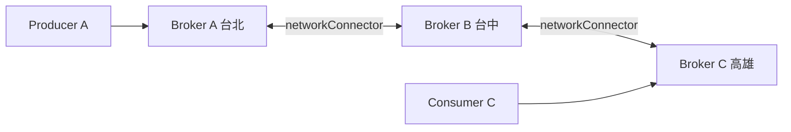

# 🧣 Network of Brokers

本章節解析 ActiveMQ 的 Network of Brokers 架構。透過 `networkConnector`，多個獨立 Broker 之間建立訊息橋接，實現跨機房的訊息路由與地理分散部署。

## 環境

- windows10 ~ 11 (win64)
- [ActiveMQ 5.16.6](https://activemq.apache.org/activemq-5016006-release)
- 兩台以上獨立 Broker

## 1. 與 Master-Slave 的差異

| 項目 | Master-Slave | Network of Brokers |
|------|-------------|-------------------|
| 關係 | 主備、共享儲存 | 對等、各自獨立儲存 |
| 目的 | 高可用 | 地理分散、擴展 |
| 訊息 | 同一份資料 | 橋接複製或轉發 |



## 2. 基本設定

### 2.1 Broker A（發起連線方）

- 檔案: `/conf/activemq.xml`

```xml
<broker xmlns="http://activemq.apache.org/schema/core" brokerName="broker-a" dataDirectory="${activemq.data}">
  <networkConnectors>
    <networkConnector name="to-broker-b"
                      uri="static:(tcp://broker-b-host:61616)"
                      duplex="false"/>
  </networkConnectors>
  <transportConnectors>
    <transportConnector name="openwire" uri="tcp://0.0.0.0:61616"/>
  </transportConnectors>
</broker>
```

### 2.2 關鍵屬性

| 屬性 | 說明 |
|------|------|
| `duplex` | `true` 雙向橋接，`false` 單向 |
| `dynamicOnly` | 只橋接有 Consumer 的目的地 |
| `conduitSubscriptions` | 合併訂閱以減少流量 |

## 3. 目的地過濾

限制只橋接特定 Queue / Topic：

```xml
<networkConnector name="to-broker-b"
                  uri="static:(tcp://broker-b-host:61616)">
  <filteredDestination queue="ORDER.>" />
  <filteredDestination topic="EVENT.>" />
</networkConnector>
```

## 4. 雙向橋接

```xml
<networkConnector name="bridge-b"
                  uri="static:(tcp://broker-b-host:61616)"
                  duplex="true"/>
```

雙向模式下，兩端 Broker 的訊息互相同步，需注意避免迴圈（Broker 預設有迴圈偵測）。

## 5. 常見問題與排查

| 現象 | 可能原因 | 處理方式 |
|------|----------|----------|
| 訊息未橋接到遠端 | 遠端無 Consumer | 啟用 `dynamicOnly` 或確認訂閱 |
| 訊息迴圈 | 雙向橋接配置錯誤 | 檢查 `duplex` 與過濾規則 |
| 延遲高 | 大量目的地同步 | 使用 `filteredDestination` 限縮 |
| 連線反覆斷開 | 網路或防火牆 | 確認 61616 雙向可連通 |

## 6. 與其他文章的關聯

- Master-Slave HA：[`masterSlave`](/docs/activeMQ/advanced/masterSlave)
- 連線容錯：[`connectionFailover`](/docs/activeMQ/advanced/connectionFailover)
- 多實例安裝：[`createMoreActiveMQ`](/docs/activeMQ/setUp/createMoreActiveMQ)