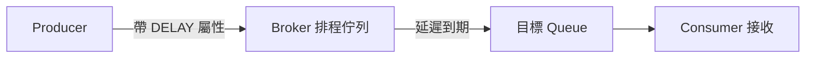

# 🧣 排程與延遲訊息

本章節解析 ActiveMQ 的延遲投遞機制。透過 Scheduled Message Plugin，Producer 可指定訊息在未來某個時間點才被 Consumer 接收，適用於重試退避、定時任務與訂單超時等場景。

## 環境

- windows10 ~ 11 (win64)
- [ActiveMQ 5.16.6](https://activemq.apache.org/activemq-5016006-release)
- [JDK 1.8](https://blog.lychicken.com/docs/daylilyTool/toolScoop/setJdk)

## 1. 啟用 Scheduled Message Plugin

- 檔案: `/conf/activemq.xml`

```xml
<broker xmlns="http://activemq.apache.org/schema/core" brokerName="localhost" dataDirectory="${activemq.data}">
  <plugins>
    <timeStampingBrokerPlugin zeroExpirationOverride="86400000"/>
    <scheduledMessageBrokerPlugin/>
  </plugins>
</broker>
```

## 2. 延遲投遞方式

### 2.1 訊息屬性

| 屬性 | 說明 | 範例 |
|------|------|------|
| `AMQ_SCHEDULED_DELAY` | 延遲毫秒數後投遞 | `60000`（1 分鐘） |
| `AMQ_SCHEDULED_PERIOD` | 重複投遞間隔 | `3600000`（每小時） |
| `AMQ_SCHEDULED_REPEAT` | 重複次數 | `5` |
| `AMQ_SCHEDULED_CRON` | Cron 表達式排程 | `0 0 9 * * ?`（每天 9 點） |

### 2.2 Java 範例

```java
TextMessage message = session.createTextMessage("Order timeout check #1001");
message.setLongProperty("AMQ_SCHEDULED_DELAY", 30 * 60 * 1000L); // 30 分鐘後
producer.send(message);
```

### 2.3 Spring JmsTemplate

```java
jmsTemplate.convertAndSend("ORDER.TIMEOUT", orderId, message -> {
    message.setLongProperty("AMQ_SCHEDULED_DELAY", 1800000L); // 30 分鐘
    return message;
});
```

## 3. 運作流程



延遲期間訊息存放在 Broker 內部排程目的地，不會出現在目標 Queue 的待處理列表中。

## 4. 應用場景

| 場景 | 設定 |
|------|------|
| 訂單 30 分鐘未付款自動取消 | `AMQ_SCHEDULED_DELAY=1800000` |
| 每小時同步報表 | `PERIOD=3600000, REPEAT=-1` |
| 每天早上 9 點發送提醒 | `AMQ_SCHEDULED_CRON=0 0 9 * * ?` |

## 5. 常見問題與排查

| 現象 | 可能原因 | 處理方式 |
|------|----------|----------|
| 延遲訊息立即被消費 | Plugin 未啟用 | 加入 `scheduledMessageBrokerPlugin` |
| Cron 不觸發 | 表達式格式錯誤 | 使用 Quartz Cron 格式 |
| Broker 重啟後延遲訊息遺失 | 非持久化訊息 | 設為 persistent delivery mode |
| 排程佇列堆積 | 大量延遲訊息 | 監控內部排程目的地深度 |

## 6. 與其他文章的關聯

- TTL 與延遲概念：[`efficientPrioritization`](/docs/activeMQ/fundamentals/efficientPrioritization)
- 持久化：[`durable`](/docs/activeMQ/fundamentals/durable)
- JMS 客戶端：[`jmsClient`](/docs/activeMQ/usage/jmsClient)