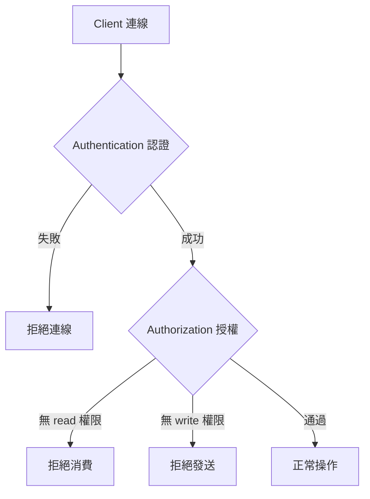

# 🧣 安全認證與權限授權

本章節解析 ActiveMQ 的兩道安全防線：認證（Authentication）確認「你是誰」，授權（Authorization）決定「你能做什麼」。生產環境中，這兩者必須同時啟用才能防止未授權的讀寫操作。

## 環境

- windows10 ~ 11 (win64)
- [ActiveMQ 5.16.6](https://activemq.apache.org/activemq-5016006-release)
- [JDK 1.8](https://blog.lychicken.com/docs/daylilyTool/toolScoop/setJdk)

:::info
完整操作步驟亦可參考工具筆記：[`setUser`](/docs/daylilyTool/toolActiveMQ/setUser)。
:::

## 1. 安全架構概覽



| 層級 | 管控對象 | 設定位置 |
|------|----------|----------|
| Web Console | 管理後台登入 | `jetty-realm.properties` |
| Client 認證 | JMS/STOMP/MQTT 連線 | `activemq.xml` plugins |
| Client 授權 | Queue/Topic 讀寫管理 | `activemq.xml` authorizationPlugin |

## 2. Web Console 帳號

- 檔案: `/conf/jetty-realm.properties`

```properties
admin: your_password, admin
user: your_password, user
```

## 3. Simple Authentication — 快速上手

適合開發與小型部署，帳密直接寫在 `activemq.xml`：

```xml
<broker xmlns="http://activemq.apache.org/schema/core" brokerName="localhost" dataDirectory="${activemq.data}">
  <plugins>
    <simpleAuthenticationPlugin>
      <users>
        <authenticationUser username="admin" password="admin1pwd" groups="admins"/>
        <authenticationUser username="app" password="app-pw" groups="users"/>
      </users>
    </simpleAuthenticationPlugin>

    <authorizationPlugin>
      <map>
        <authorizationMap>
          <authorizationEntries>
            <authorizationEntry queue=">" read="users,admins" write="users,admins" admin="admins"/>
            <authorizationEntry topic=">" read="users,admins" write="users,admins" admin="admins"/>
            <authorizationEntry topic="ActiveMQ.Advisory.>" read="users,admins" write="users,admins" admin="admins"/>
          </authorizationEntries>
        </authorizationMap>
      </map>
    </authorizationPlugin>
  </plugins>
</broker>
```

:::caution
若未設定 `topic=">"` 萬用規則，必須額外授權 `ActiveMQ.Advisory.>`，否則 Broker 內部 Advisory 機制會異常。
:::

## 4. authorizationEntry 權限說明

| 屬性 | 權限 | 說明 |
|------|------|------|
| `read` | 消費 | 可建立 Consumer、接收訊息 |
| `write` | 發送 | 可建立 Producer、發送訊息 |
| `admin` | 管理 | 可建立/刪除目的地、purge 訊息 |

## 5. JAAS Authentication — 生產推薦

帳密與群組分離到獨立檔案，修改後可熱重載，無需重啟 Broker。

### 5.1 users.properties

```properties
admin=admin_password
app=app_password
```

### 5.2 groups.properties

```properties
admins=admin
users=app
```

### 5.3 login.config

```
activemq {
    org.apache.activemq.jaas.PropertiesLoginModule required
    debug=true
    reload=true
    org.apache.activemq.jaas.properties.user="users.properties"
    org.apache.activemq.jaas.properties.group="groups.properties";
};
```

### 5.4 activemq.xml 啟用

```xml
<plugins>
  <jaasAuthenticationPlugin configuration="activemq"/>
  <authorizationPlugin>
    <!-- 同 Simple Auth 的 authorizationMap -->
  </authorizationPlugin>
</plugins>
```

:::caution
JAAS 模式不支援 `anonymous` 群組。所有 Client 必須提供有效帳密。
:::

## 6. 客戶端帶入認證

```java
ActiveMQConnectionFactory factory = new ActiveMQConnectionFactory("tcp://localhost:61616");
factory.setUserName("app");
factory.setPassword("app-pw");
```

```yaml
# Spring Boot
spring:
  activemq:
    user: app
    password: app-pw
```

## 7. 常見問題與排查

| 現象 | 可能原因 | 處理方式 |
|------|----------|----------|
| `SecurityException` | 帳密錯誤或無授權 | 檢查 users 與 authorizationEntry |
| 能連線但無法發送 | 缺少 write 權限 | 在對應 queue/topic 加入群組 |
| Advisory 相關錯誤 | 未授權 `ActiveMQ.Advisory.>` | 加入 Advisory 授權規則 |
| 修改帳密不生效 | Simple Auth 需重啟 | 改用 JAAS + `reload=true` |

## 8. 與其他文章的關聯

- 完整圖文教學：[`setUser`](/docs/daylilyTool/toolActiveMQ/setUser)
- JMS 連線範例：[`jmsClient`](/docs/activeMQ/usage/jmsClient)
- STOMP/MQTT 認證：[`stompMqttClient`](/docs/activeMQ/usage/stompMqttClient)