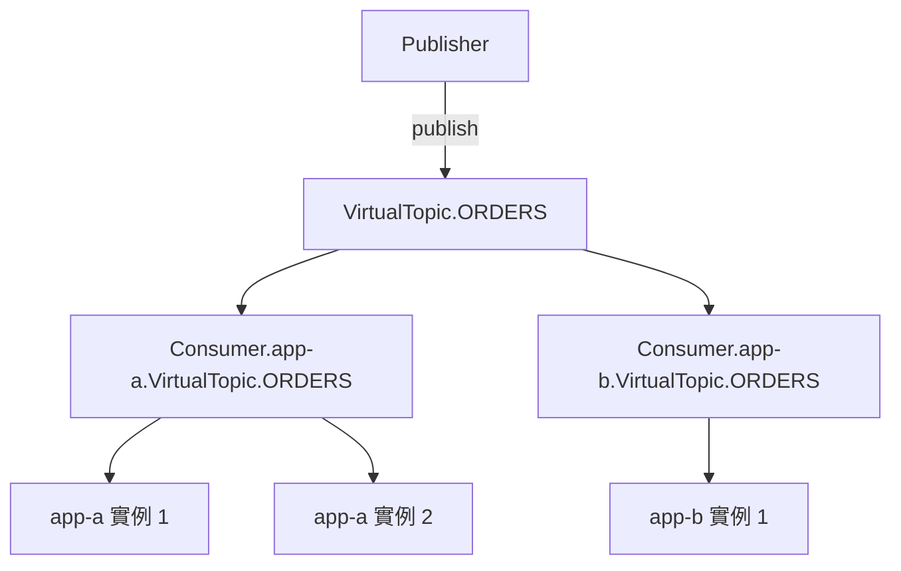

# 🧣 Virtual Topic

本章節解析 ActiveMQ 的 Virtual Topic 模式——它讓 Publisher 以 Topic 方式廣播訊息，同時讓每個 Consumer 以 Queue 方式競爭消費，兼顧「一對多通知」與「負載均衡」兩種需求。

## 環境

- windows10 ~ 11 (win64)
- [ActiveMQ 5.16.6](https://activemq.apache.org/activemq-5016006-release)
- [JDK 1.8](https://blog.lychicken.com/docs/daylilyTool/toolScoop/setJdk)

## 1. 為什麼需要 Virtual Topic

| 模式 | 廣播給所有服務 | 同服務多實例負載均衡 |
|------|---------------|---------------------|
| 純 Topic | ✓ | ✗（每個實例都收到） |
| 純 Queue | ✗ | ✓ |
| Virtual Topic | ✓ | ✓ |



## 2. Broker 設定

Virtual Topic 在 ActiveMQ 5.x 中預設已啟用，無需額外 plugin。確認 `activemq.xml` 中有預設的 Virtual Destination 攔截器即可（5.16.6 預設包含）。

## 3. 命名規則

| 角色 | 目的地名稱 |
|------|-----------|
| Publisher 發送到 | `VirtualTopic.ORDERS` |
| Consumer 訂閱 | `Consumer.{groupName}.VirtualTopic.ORDERS` |

- `{groupName}` 是消費者群組名稱，同一群組內的實例競爭消費
- 不同群組各自收到一份完整副本

## 4. 程式範例

### 4.1 Publisher（發送到 Virtual Topic）

```java
Destination topic = session.createTopic("VirtualTopic.ORDERS");
MessageProducer producer = session.createProducer(topic);
producer.send(session.createTextMessage("Order created #1001"));
```

### 4.2 Consumer（訂閱 Consumer Queue）

```java
// 庫存服務群組
Destination queue = session.createQueue("Consumer.inventory.VirtualTopic.ORDERS");
MessageConsumer consumer = session.createConsumer(queue);

// 通知服務群組（另一份副本）
Destination notifyQueue = session.createQueue("Consumer.notify.VirtualTopic.ORDERS");
```

## 5. Spring Boot 範例

```java
// Publisher
jmsTemplate.setPubSubDomain(true);
jmsTemplate.convertAndSend("VirtualTopic.ORDERS", orderEvent);

// Consumer（inventory 群組）
@JmsListener(destination = "Consumer.inventory.VirtualTopic.ORDERS")
public void onOrder(OrderEvent event) { ... }
```

## 6. 常見問題與排查

| 現象 | 可能原因 | 處理方式 |
|------|----------|----------|
| Consumer 收不到訊息 | Queue 名稱不符合規則 | 確認 `Consumer.{group}.VirtualTopic.{name}` 格式 |
| 某群組收到兩次 | groupName 不一致 | 統一同一服務的 groupName |
| 訊息只到一個群組 | 只有一個 Consumer Queue | 為每個下游服務建立獨立 group |

## 7. 與其他文章的關聯

- Queue vs Topic：[`queueAndTopic`](/docs/activeMQ/fundamentals/queueAndTopic)
- 目的地策略：[`destinationPolicy`](/docs/activeMQ/advanced/destinationPolicy)
- Spring 整合：[`springJms`](/docs/activeMQ/usage/springJms)