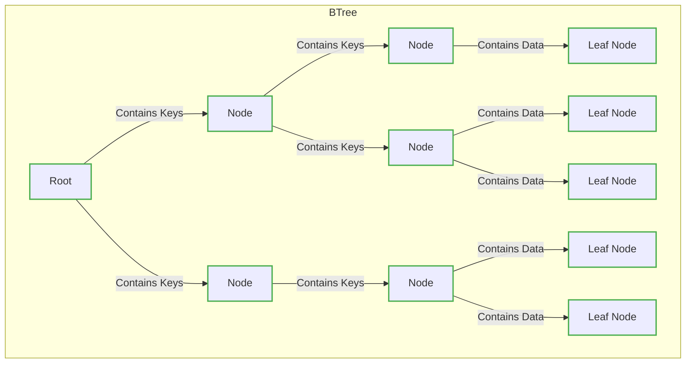
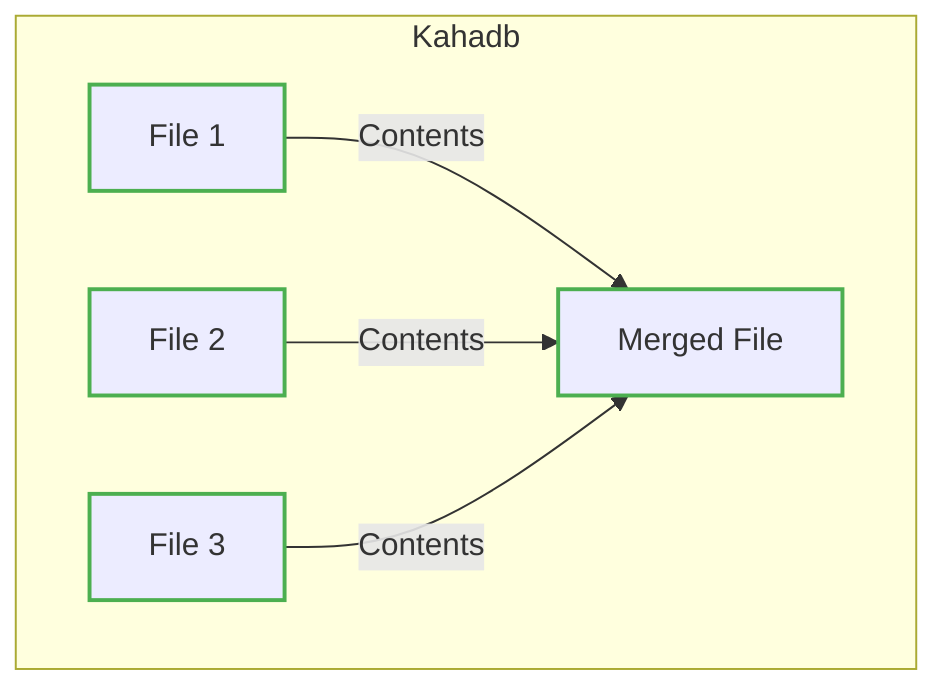

# 🧣 ActiveMQ 持久化和非持久化

## 持久化訊息

> 持久化訊息在 ActiveMQ 中的實現涉及到訊息中間件的存儲機制一旦發送一條持久化訊息，它會被永久保存在訊息中間件的存儲系統中，通常是一種可靠且高效的存儲介質，例如資料庫這樣的設計確保了即使在訊息發送後，如果消費者暫時無法接收訊息，訊息仍然安全地存儲在系統中，不會丟失這對於需要保證訊息不會丟失且能夠被後續消費者處理的場景非常重要

### 持久化訊息在 ActiveMQ 中的實現

- 在訊息驅動的應用程式中，訊息的可靠性是至關重要的
- 確保即使在系統故障或消費者暫時無法接收訊息的情況下，訊息仍然安全地存儲在系統中不會丟失

### 什麼是持久化訊息？

- 持久化訊息是指一旦發送到訊息中間件，該訊息將被永久保存在中間件的存儲系統中
- 這種存儲機制通常使用可靠且高效的介質，比如資料庫
- 這樣的設計確保了訊息的持久性，即使在發送後，消費者暫時無法接收訊息，訊息仍然存在等待被處理

### ActiveMQ 中的持久化訊息機制

- ActiveMQ 使用多種方式實現持久化訊息，其中之一是通過資料庫
- 當訊息被標記為持久化時，ActiveMQ 將該訊息存儲在設定的資料庫中
- 這使得即使訊息代理重啟，訊息仍然可用，並且能夠在需要時被重新發送給消費者

### 應用場景：訂單處理系統

> 讓我們以一個訂單處理系統為例，來理解持久化訊息的實際應用

- 在這樣的系統中，當用戶建立一個新訂單時，一條訂單建立的訊息被發送到訊息中間件，同時被標記為持久化
- 這意味著即使在訂單系統發生故障或暫時性的消費者不可用的情況下，訂單訊息仍然安全地存儲在資料庫中
- 當系統恢復正常時，訊息中間件將再次嘗試將訊息發送給消費者，確保訂單被正確處理

## Kahadb 持久化機制

> 在 ActiveMQ 中，KahaDB 是一個儲存引擎，用於實現訊息的持久化，它提供了高效且可靠的本地存儲解決方案，適用於需要快速訪問訊息的應用場景
>
> 以下是有關 Kahadb 持久化機制的補充訊息：

- **儲存格式：** Kahadb 使用一種高效的二進制格式來儲存訊息，這有助於提高讀寫性能
  
- **事務支持：** Kahadb 提供了事務支持，確保訊息的原子性這意味著當多個訊息需要被一併處理時，它們要麼全部成功，要麼全部失敗，從而確保訊息的一致性

- **索引結構：** Kahadb 使用 B-tree 索引結構，這使得在大型數據集上進行高效的查詢和檢索成為可能

### Kahadb 持久化流程

1. **訊息寫入：** 當一條訊息需要被持久化時，Kahadb 將該訊息追加到日誌文件（Log File）中

2. **索引更新：** 同時，Kahadb 更新 B-tree 索引，以便能夠快速地查找和檢索訊息

3. **定期檔案合併：** 為了提高效能，Kahadb 執行定期的檔案合併操作，將多個日誌文件合併為一個更大的文件這有助於減少文件數量，提高查詢效率

4. **快照：** Kahadb 還支持快照，這是一種在運行時創建索引的方法，有助於加速啟動時間

> Kahadb 持久化流程及 B-tree 索引結構

> 檔案合併流程

### Kahadb 的優勢

- **高性能：** Kahadb 的二進制格式和 B-tree 索引結構確保了高性能的訊息持久化和檢索

- **可靠性：** 事務支持確保了訊息的原子性，從而確保了訊息的可靠性和一致性

- **有效的檔案管理：** 定期的檔案合併操作有助於維護文件數量，提高整體效能

### Kahadb 的設定

在 ActiveMQ 的設定文件中，可以通過設定屬性來調整 Kahadb 的行為，例如調整檔案合併的頻率、設置快照等，這些設定選項使得 Kahadb 可以根據特定應用場景進行調優，以達到最佳性能

## 非持久化訊息

> 非持久化訊息是一種訊息處理方式，其特點在於更加注重實時性和即時性，相較於持久化訊息更著重於即時通知和瞬時事件的傳遞，在這種設計下訊息僅在成功發送到所有活動的消費者後保留在記憶體中，並在確保所有消費者都已接收訊息後被立即刪除

### 非持久化訊息的特點

- **即時性：** 這類訊息不需要長時間保存，而是專注於即時地傳遞給所有需要的消費者
  
- **記憶體存儲：** 與持久化訊息使用可靠且高效的存儲介質（如資料庫）不同，非持久化訊息通常僅在記憶體中暫存，以確保快速的傳遞和即時的反應

- **資源效率：** 由於不需要將訊息永久保存，非持久化訊息的設計更輕量，能夠節省系統資源，確保系統高效運作

### 應用場景：即時股票價格更新

> 一個典型的應用場景是即時股票價格更新

- 當股票價格發生變動時，即時性變得至關重要
- 非持久化訊息確保價格變動的訊息迅速地被發送給所有感興趣的消費者
- 一旦這些消費者成功接收到訊息，系統即可安全地將訊息從記憶體中移除，節省資源，同時確保後續價格變動的訊息仍能迅速而有效地傳遞

> 總體而言，非持久化訊息是一種適用於即時通知和事件的輕量級設計，通常用於那些不需要長時間保存的訊息，並強調系統的即時性和資源效率
