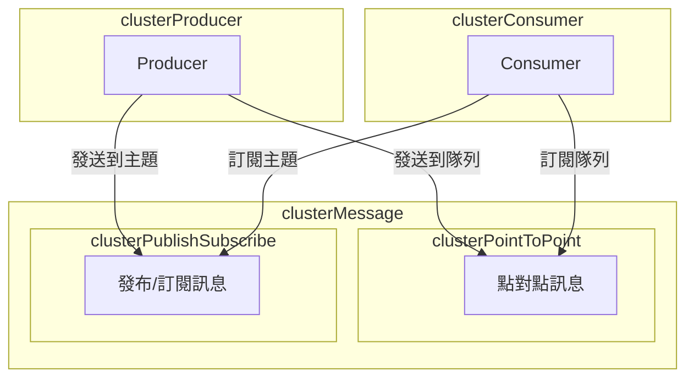

# 🧣 ActiveMQ 成員

## 訊息（Message）

訊息是在 ActiveMQ 中進行數據交換的基本單位，它可以包含各種類型的內容，例如文本、二進制數據，或其他格式的數據

> ActiveMQ 支援兩種主要的訊息類型：點對點訊息和發布/訂閱訊息

### `點對點 訊息`

是一種單發單收的模型，其中生產者將訊息發送到特定的隊列（Queue），而僅有一個消費者可以接收並處理該訊息

這種模型適用於需要確保每條訊息僅被一個消費者處理的場景

### `發布/訂閱 訊息`

允許生產者將訊息發送到特定的主題（Topic），而多個消費者可以訂閱這個主題以接收訊息

這種模型適用於需要一條訊息被多個消費者處理的場景

## 生產者（Producer）

- 生產者是負責建立和發送訊息的實體

- 它們扮演著將信息注入 ActiveMQ 系統的角色

- 生產者通常需要指定訊息的目的地，即訊息要發送到的隊列或主題

- 這樣的設定確保了訊息被發送到正確的地方，以便相應的消費者能夠接收和處理

## 消費者（Consumer）

- 消費者是訊息的接收者和處理者

- 它們在 ActiveMQ 中訂閱特定的隊列或主題，以接收生產者發送的訊息

- 消費者的角色至關重要，因為它們確保訊息得以有效地傳遞並被適當地利用

- 消費者可以選擇以同步或異步的方式處理訊息，具體取決於應用的需求

