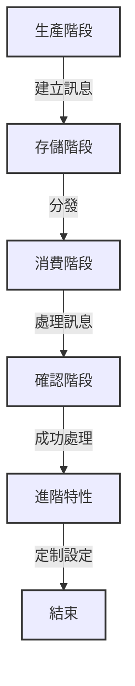

# 🧣 ActiveMQ 隊列和主題

在 ActiveMQ 中，隊列（Queue）和主題（Topic）是兩種不同的訊息傳遞模型，它們分別適用於不同的應用場景

## 隊列（Queue）

隊列是一種點對點（Point-to-Point）的訊息傳遞模型

> 在隊列中，訊息的生產者（Producer）將訊息發送到隊列中，而訊息的消費者（Consumer）則從隊列中接收訊息，每條訊息只有一個消費者能夠接收，確保訊息的獨立性即便有多個消費者，每條訊息也只會被其中一個消費者處理，這種模型適用於需要點對點通信的情境，如任務分配、工作排程等

### 隊列的應用場景
  
- 點對點通信需求
- 確保每條訊息只被一個消費者處理

## 主題（Topic）

主題是一種發布/訂閱（Publish/Subscribe）的訊息傳遞模型

> 在主題中，訊息的生產者將訊息發送到主題，而所有訂閱了該主題的消費者都能夠接收這些訊息，每條訊息會被所有訂閱者收到，這種模型適用於需要一對多通信的情境，如訊息通知、事件發佈等

### 主題的應用場景
  
- 一對多通信需求
- 多個消費者需要獲取相同的訊息

## 訊息的生命週期

在 ActiveMQ 中，訊息的生命週期包括幾個關鍵階段，這些階段涵蓋了訊息從生產者到消費者的整個傳遞過程

### 生產階段

- 當訊息的生產者將訊息發送到隊列或主題時，這標誌著訊息的生命週期的起始點在這個階段

- 訊息被建立，並包含有關內容的元數據，例如訊息的標題、內容和發送時間戳

### 存儲階段

- 一旦訊息進入隊列或主題，它進入了存儲階段

- 在這個階段，ActiveMQ 負責存儲訊息，並根據訊息的特性進行分發

- 在隊列中訊息按照先進先出（FIFO）的原則排隊，而在主題中所有訂閱者都能夠獲取訊息的副本

### 消費階段

- 當消費者開始從隊列或主題中接收訊息時，這標誌著訊息的消費階段

- 在這個階段，訊息被傳遞給消費者，並且消費者可以開始處理訊息的內容消費者可能執行與訊息相關的業務邏輯，並在需要時進行回應

### 確認階段

- 在成功處理完訊息後，消費者可能需要向 ActiveMQ 發送確認（acknowledge）以表明訊息已經被成功處理

- 這是確保訊息處理完畢並成功處理的重要步驟

- 在某些情況下，如果消費者未能成功處理訊息，可能需要發送拒絕（reject）通知，以便訊息能夠被重新處理或進入死信隊列

### 進階特性

- 除了基本的訊息傳遞模型外，ActiveMQ 還提供了一些進階特性，這些特性能夠進一步定制訊息的生命週期和處理流程

- 例如，訊息的優先級、持久性、以及死信隊列的配置都是可以調整的參數，這使得開發人員能夠根據應用的需求來優化訊息的處理

### 生命週期圖示

