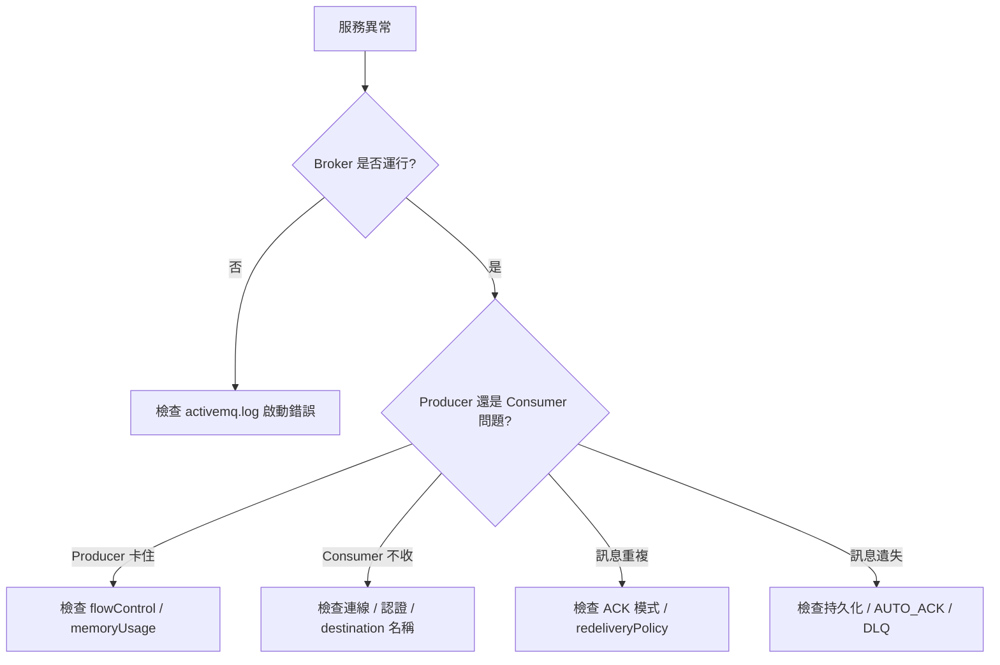

# 🧣 日誌分析與故障排除

本章節整理 ActiveMQ 日常維運中最常見的故障現象與排查路徑。從日誌位置到典型錯誤訊息，幫助你在 Broker 異常時快速定位根因。若需**出事前**的預防性告警策略，請先參閱 [`proactiveAlerting`](/docs/activeMQ/operations/proactiveAlerting)。

## 環境

- windows10 ~ 11 (win64)
- [ActiveMQ 5.16.6](https://activemq.apache.org/activemq-5016006-release)
- 日誌位置: `${ACTIVEMQ_HOME}/data/activemq.log`

## 1. 日誌檔案位置

| 檔案 | 內容 |
|------|------|
| `data/activemq.log` | Broker 主要運行日誌 |
| `data/audit.log` | 安全審計日誌（若啟用） |
| `conf/log4j2.properties` | 日誌等級設定 |

調高日誌等級：

```properties
# conf/log4j2.properties
logger.activemq.name=org.apache.activemq
logger.activemq.level=DEBUG
```

## 2. 故障診斷流程



## 3. 常見錯誤訊息對照

| 日誌關鍵字 | 含義 | 處理方式 |
|-----------|------|----------|
| `IOException: Transport scheme NOT recognized` | 連線 URI 格式錯誤 | 檢查 `tcp://` 前綴 |
| `SecurityException` | 認證或授權失敗 | 參見 [`security`](/docs/activeMQ/advanced/security) |
| `ResourceAllocationException` | 記憶體或 store 已滿 | 參見 [`flowControl`](/docs/activeMQ/advanced/flowControl) |
| `Slow consumer` | 消費者處理太慢 | 調高 Consumer 數或優化邏輯 |
| `Failed to load: lock` | KahaDB lock 被佔用 | 確認無重複 Broker 實例 |
| `javax.jms.IllegalStateException: The Session is closed` | 連線已斷開仍操作 | 加入重連機制 |

## 4. 典型場景排查

### 4.1 訊息堆積不消費

1. Web Console 確認 `ConsumerCount` 是否為 0
2. 檢查 Consumer 應用是否運行、連線 URI 是否正確
3. 檢查認證帳密與 authorization 權限
4. 確認 destination 名稱大小寫一致

### 4.2 Producer 發送阻塞

1. 檢查 `MemoryPercentUsage` 與 `StorePercentUsage`
2. 確認 `producerFlowControl` 是否啟用
3. 加快 Consumer 或增大 `systemUsage` 限制

### 4.3 Broker 啟動失敗

1. 檢查 JDK 版本相容性
2. 確認 61616 / 8161 port 未被佔用
3. 檢查 KahaDB lock 與資料目錄權限

### 4.4 訊息無限重送

1. 確認 Consumer 的 ACK 模式
2. 檢查 `maximumRedeliveries` 設定
3. 確認 DLQ 策略已啟用

## 5. 與其他文章的關聯

- ACK 與重送：[`ackAndRedelivery`](/docs/activeMQ/usage/ackAndRedelivery)
- DLQ：[`deadLetterQueue`](/docs/activeMQ/usage/deadLetterQueue)
- 流量控制：[`flowControl`](/docs/activeMQ/advanced/flowControl)
- Web Console：[`webConsole`](/docs/activeMQ/operations/webConsole)
- JMX 監控：[`jmxMonitoring`](/docs/activeMQ/operations/jmxMonitoring)