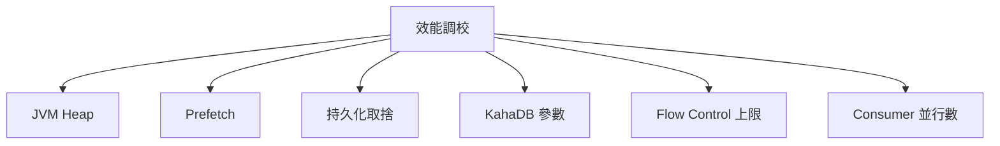

# 🧣 效能調校實戰

本章節整理 ActiveMQ Classic 的效能調校要點。從 JVM 參數、Prefetch 策略到持久化取捨，幫助你在吞吐量與可靠性之間找到適合業務的平衡點。

## 環境

- windows10 ~ 11 (win64)
- [ActiveMQ 5.16.6](https://activemq.apache.org/activemq-5016006-release)
- [JDK 1.8](https://blog.lychicken.com/docs/daylilyTool/toolScoop/setJdk)

## 1. 調校維度總覽



## 2. JVM 參數

```shell
# bin/activemq.bat 或 wrapper.conf
set ACTIVEMQ_OPTS=-Xms1G -Xmx2G -Djava.util.logging.config.file=logging.properties
```

| 參數 | 建議 | 說明 |
|------|------|------|
| `-Xms` | 與 `-Xmx` 相同 | 避免 Heap 動態擴展的開銷 |
| `-Xmx` | 2G ~ 4G（視流量） | 過小導致 GC 頻繁，過大影響恢復速度 |
| `-XX:+UseG1GC` | JDK 8u40+ 可考慮 | 降低 Full GC 停頓 |

`memoryUsage` 應為 Heap 的 60%~70%，參見 [`flowControl`](/docs/activeMQ/advanced/flowControl)。

## 3. Prefetch 調校

| 場景 | queuePrefetch | 原因 |
|------|---------------|------|
| 多 Consumer 競爭 | `1` | 均勻分配 |
| 單 Consumer 高吞吐 | `500` ~ `1000` | 減少網路往返 |
| Message Group | `1` | 確保 Group 正確分配 |
| 大型訊息 | `1` | 避免記憶體壓力 |

```xml
<policyEntry queue=">" queuePrefetch="100"/>
```

## 4. 持久化取捨

| 模式 | 吞吐 | 可靠性 | 適用 |
|------|------|--------|------|
| 非持久化 | 最高 | 斷線可能遺失 | 即時股價、感測器 |
| 持久化 + KahaDB | 中高 | 高 | 訂單、交易 |
| 持久化 + JDBC | 較低 | 高 + 可 SQL 查詢 | 需 DB HA |

```java
// 非持久化發送
producer.send(message, DeliveryMode.NON_PERSISTENT, ...);
```

## 5. 客戶端連線池

```java
PooledConnectionFactory pooled = new PooledConnectionFactory();
pooled.setConnectionFactory(factory);
pooled.setMaxConnections(20);
pooled.setMaximumActiveSessionPerConnection(50);
```

Spring Boot 啟用連線池：

```yaml
spring.activemq.pool.enabled: true
spring.activemq.pool.max-connections: 20
```

## 6. Consumer 並行度

```java
// Spring JMS
factory.setConcurrency("5-20"); // 5~20 個消費執行緒
```

並行數建議與 CPU 核心數和業務處理時間匹配，過多反而增加上下文切換。

## 7. 壓測指標

| 指標 | 觀察方式 | 健康參考 |
|------|----------|----------|
| 吞吐量（msg/s） | JMX `EnqueueCount` 變化率 | 依業務需求 |
| 端到端延遲 | Producer 打時間戳，Consumer 計算差值 | < 100ms（即時場景） |
| GC 停頓 | JVM GC log | Full GC < 1 次/小時 |
| Store 使用率 | JMX `StorePercentUsage` | < 70% |

## 8. 常見問題與排查

| 現象 | 可能原因 | 處理方式 |
|------|----------|----------|
| 吞吐低 | prefetch=1 且單 Consumer | 增加 Consumer 或調高 prefetch |
| GC 頻繁 | Heap 太小或訊息過大 | 增大 `-Xmx` 或縮小訊息 |
| 延遲飄高 | 持久化 + 磁碟 I/O 瓶頸 | KahaDB 放 SSD，參見 [`kahadbTuning`](/docs/activeMQ/advanced/kahadbTuning) |
| CPU 飆高 | Consumer 過多或無限重送 | 調整並行數與 redeliveryPolicy |

## 9. 與其他文章的關聯

- KahaDB 調校：[`kahadbTuning`](/docs/activeMQ/advanced/kahadbTuning)
- 流量控制：[`flowControl`](/docs/activeMQ/advanced/flowControl)
- 目的地策略：[`destinationPolicy`](/docs/activeMQ/advanced/destinationPolicy)
- JMX 監控：[`jmxMonitoring`](/docs/activeMQ/operations/jmxMonitoring)