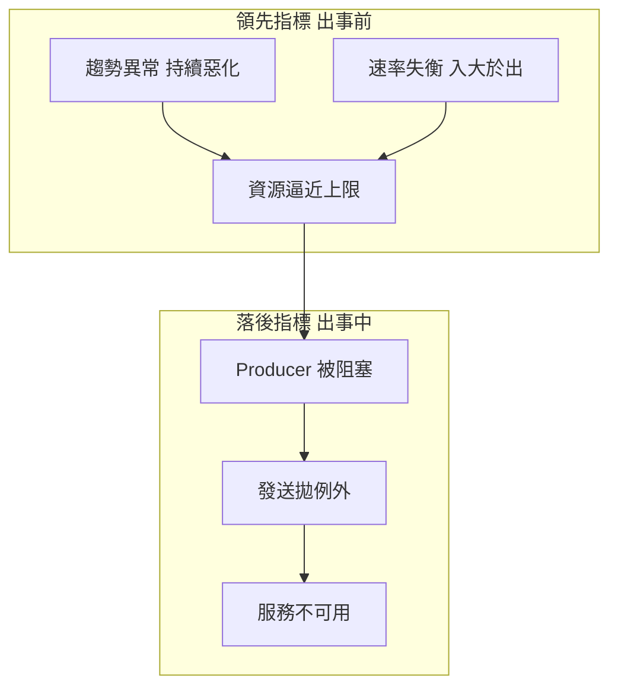
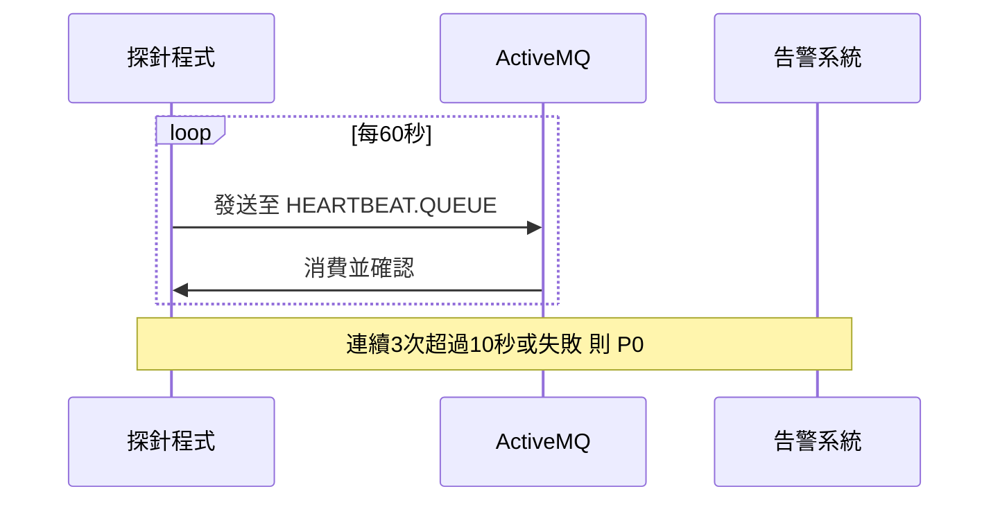

# 🧣 出事前告警與領先指標

本章節解析維運人員如何在 ActiveMQ 出事之前，透過趨勢、速率與品質訊號提早發出告警。重點不在事後排除，而在 flow control 啟動與服務中斷之前抓住異常。

## 環境

- windows10 ~ 11 (win64)
- [ActiveMQ 5.16.6](https://activemq.apache.org/activemq-5016006-release)
- 指標來源：JMX（參見 [`jmxMonitoring`](/docs/activeMQ/operations/jmxMonitoring)）

## 1. 領先指標 vs 落後指標

有效的事前告警，應在「資源飽和」與「服務阻塞」之間攔截，而不是等 Producer 已被擋或 Broker 無回應才動作。



| 類型 | 代表訊號 | 告警時機 |
|------|----------|----------|
| 領先 | 使用率成長率、入出淨差擴大、DLQ 緩增 | 趨勢惡化時 |
| 落後 | Flow Control 日誌、Store 100%、Broker 無回應 | 已影響業務（太晚了） |

:::tip
[`webConsole`](/docs/activeMQ/operations/webConsole) 適合人工抽查，不適合作為唯一事前告警手段。自動化應以 JMX 指標、日誌規則與心跳探針為主。
:::

## 2. 四層觀測模型

### 2.1 Layer 1 — Broker 資源（最先爆）

對應 [`flowControl`](/docs/activeMQ/advanced/flowControl) 的 `systemUsage`。

| 指標 (JMX) | 事前告警條件 | 意義 |
|------------|-------------|------|
| `StorePercentUsage` | > 60% 注意，> 75% 警告 | 持久化訊息堆積，接近滿載後無法寫入 |
| `MemoryPercentUsage` | > 60% 注意，> 75% 警告 | 記憶體緩衝撐滿，即將 flow control |
| `TempPercentUsage` | > 50% | 大型訊息溢出暫存異常 |
| 主機磁碟（KahaDB 目錄） | 可用空間 < 30% | OS 磁碟滿會讓 Broker 整體失效 |

### 2.2 Layer 2 — Queue 健康（業務異常前哨）

| 指標 | 事前告警條件 | 意義 |
|------|-------------|------|
| `QueueSize` | 連續 1~2 小時單調上升 | 消費跟不上生產 |
| `EnqueueCount` − `DequeueCount` 淨差 | 每分鐘淨增且持續 30 分鐘 | 系統性失衡 |
| `ConsumerCount` | = 0 且 `QueueSize` > 0 | 消費端掛了或未連上 |
| `ConsumerCount` 驟降 | 非計畫維護時段從 N → 0 | 部署、網路或認證問題 |

### 2.3 Layer 3 — 死信與重送（品質惡化）

對應 [`deadLetterQueue`](/docs/activeMQ/usage/deadLetterQueue)、[`ackAndRedelivery`](/docs/activeMQ/usage/ackAndRedelivery)。

| 觀測點 | 事前告警條件 | 意義 |
|--------|-------------|------|
| `DLQ.*` 的 `QueueSize` | 任何持續增長 | 消費邏輯或下游已出問題 |
| `DLQ.*` 的 `EnqueueCount` 增速 | 15 分鐘內明顯上升 | 重送耗盡正在加速 |
| `ExpiredCount` | 持續 > 0 且上升 | TTL 大量過期 |
| `InFlightCount` | 長期偏高 | 訊息已投遞但未 ACK |

DLQ 往往比全面堆積早 **30 分鐘～數小時** 出現，是最值得獨立監控的面板之一。

### 2.4 Layer 4 — 連線與 JVM（基礎設施壓力）

| 指標 | 事前告警條件 | 意義 |
|------|-------------|------|
| `CurrentConnectionsCount` | 異常飆升或歸零 | 連線風暴或集體斷線 |
| 連線建立/斷開頻率 | Failover 反覆切換 | HA 不穩定 |
| JVM Heap 使用率 | > 75% 且 GC 時間上升 | 即將 OOM 或長停頓 |
| Broker CPU | 持續 > 80% 超過 15 分鐘 | 處理能力逼近上限 |

## 3. 趨勢告警 — 比固定閾值更有效

靜態閾值（如 `QueueSize > 10000`）容易誤報或漏報。建議加上**變化率**判斷：

### 3.1 資源成長率

每 5 分鐘記錄一次 `StorePercentUsage`，計算每小時成長：

```
成長率 = (現在值 - 1小時前值) / 1小時前值 × 100%
```

| 條件 | 建議動作 |
|------|----------|
| 成長率 > 5% 且持續 1 小時 | P2 注意 |
| 依成長率推算到 90% 的時間 < 4 小時 | P1 警告 |

### 3.2 入出速率淨差

```
淨差增速 = (EnqueueCount - DequeueCount) 的每分鐘變化
```

若淨差連續 30 分鐘擴大，即使 `QueueSize` 尚未達絕對閾值，也應告警。

### 3.3 告警訊息應附帶的上下文

每條 P1 以上告警建議包含：

- 當前值
- 1 小時前對比值
- 變化率或淨差趨勢
- 相關 `ConsumerCount`

值班人員才能區分「批次高峰」與「結構性失控」。

## 4. 日誌領先關鍵字

若已用 Filebeat 蒐集日誌（參見 [`addActiveMq`](/docs/daylilyTool/toolELK/addActiveMq)），可對 `activemq.log` 設**事前** alert rule：

| 日誌關鍵字 | 嚴重度 | 意義 |
|-----------|--------|------|
| `Slow consumer` | Warning | 消費者跟不上，即將堆積 |
| `Producer Flow Control` | Warning | 已開始限流 |
| `Memory limit` / `Store limit` | Critical | 快到硬上限 |
| `IOException` / `Connection refused` | Warning | 網路或對端異常 |
| `SecurityException` | Warning | 認證問題，Consumer 可能全滅 |
| `KahaDB` + `lock` | Critical | 雙實例搶 lock 或異常關閉 |

這些關鍵字往往比 JMX 閾值**更早**指出問題方向。事後排除流程見 [`loggingTroubleshoot`](/docs/activeMQ/operations/loggingTroubleshoot)。

## 5. 告警分級

### P2 — 注意（趨勢異常，可排程處理）

- `StorePercentUsage` 60%~75%，或每小時成長 > 3%
- 核心 Queue `QueueSize` 連續 1 小時上升
- DLQ 有新增但增速緩慢
- 日誌單次出現 `Slow consumer`

### P1 — 警告（數小時內可能影響業務）

- `StorePercentUsage` > 75%，或推算 4 小時內到 90%
- 核心 Queue `ConsumerCount = 0` 且 `QueueSize > 0`
- 入出淨差持續擴大 30 分鐘以上
- DLQ 增速明顯加快
- 連線重連次數異常

### P0 — 緊急（即將或已影響寫入/讀取）

- `MemoryPercentUsage` 或 `StorePercentUsage` > 90%
- 日誌持續出現 `Producer Flow Control`
- 核心 Queue 超過業務 SLA 且無 Consumer
- Broker 無回應 / JMX 抓不到指標

## 6. 業務分級監控

不要對所有 Queue 使用同一閾值：

| 類別 | 範例 | 監控策略 |
|------|------|----------|
| Tier-1 核心 | 訂單、付款 | 低閾值 + 趨勢告警 + 探針 + DLQ |
| Tier-2 一般 | 通知、日誌 | 中等閾值 + ConsumerCount |
| Tier-3 可容忍延遲 | 報表、批次 | 僅監控極端堆積與資源上限 |

## 7. 心跳探針（Synthetic Monitoring）

被動指標之外，建議建立獨立**心跳 Queue** 驗證端到端通路：



| 條件 | 動作 |
|------|------|
| 連續 3 次 send/receive 失敗 | P0 |
| 端到端延遲 > 基線 3 倍 | P1 |
| 延遲緩步上升（過去 1 小時） | P2 |

可抓到「JMX 正常但實際通訊已壞」的隱性故障。

## 8. 維運觀測節奏

| 頻率 | 動作 | 方式 |
|------|------|------|
| 即時 | JMX scrape + 告警規則 | Prometheus / Grafana / Zabbix |
| 即時 | 日誌關鍵字 match | ELK Alert |
| 每小時 | 核心 Queue Top 10 深度 | Dashboard 報表 |
| 每日 | DLQ 總量、過期訊息趨勢 | JMX 或 Web Console |
| 每週 | 閾值回顧、減少誤報 | 告警回顧 |

## 9. 最小可行方案（資源有限時）

若只能先做三件事，建議優先順序：

1. **Grafana 監控** `StorePercentUsage`、`MemoryPercentUsage`、核心 Queue `QueueSize` **趨勢**（非僅瞬時值）
2. **ELK 告警** 對 `Slow consumer`、`Flow Control`、`Store limit` 設 rule
3. **每 60 秒心跳探針** 打核心路徑

這三項分別覆蓋「資源要滿」「消費跟不上」「通訊已壞」三種最常見的事前訊號。

## 10. 與其他文章的關聯

| 主題 | 文章 |
|------|------|
| MBean 指標定義 | [`jmxMonitoring`](/docs/activeMQ/operations/jmxMonitoring) |
| 資源上限語意 | [`flowControl`](/docs/activeMQ/advanced/flowControl) |
| DLQ 機制 | [`deadLetterQueue`](/docs/activeMQ/usage/deadLetterQueue) |
| 日誌蒐集 | [`addActiveMq`](/docs/daylilyTool/toolELK/addActiveMq) |
| 事後排除 | [`loggingTroubleshoot`](/docs/activeMQ/operations/loggingTroubleshoot) |
| 效能調校 | [`performanceTuning`](/docs/activeMQ/operations/performanceTuning) |