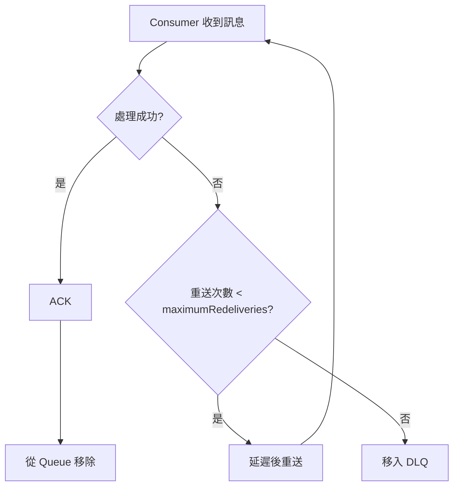

# 🧣 確認模式與重送策略

本章節解析 ActiveMQ 訊息消費中最常踩坑的兩個環節：消費者如何向 Broker 確認訊息（ACK），以及確認失敗後 Broker 如何重送。理解這兩者的搭配，是確保訊息「至少處理一次」而不無限重試的必經之路。

## 環境

- windows10 ~ 11 (win64)
- [ActiveMQ 5.16.6](https://activemq.apache.org/activemq-5016006-release)
- [JDK 1.8](https://blog.lychicken.com/docs/daylilyTool/toolScoop/setJdk)

## 1. 確認模式 (Acknowledge Mode) —— 消費者的承諾

當消費者收到訊息後，必須透過 ACK 告知 Broker「這則訊息已處理完畢，可以刪除」。不同的 ACK 模式決定了**何時**發送確認，以及**失敗時**的行為。

### 1.1 四種 Session 確認模式

| 模式 | 常數 | 行為 | 適用場景 |
|------|------|------|----------|
| AUTO_ACKNOWLEDGE | `Session.AUTO_ACKNOWLEDGE` | 收到訊息後立即自動 ACK | 簡單場景、可容忍偶發遺失 |
| CLIENT_ACKNOWLEDGE | `Session.CLIENT_ACKNOWLEDGE` | 呼叫 `message.acknowledge()` 才 ACK | 需確保業務邏輯完成後才確認 |
| DUPS_OK_ACKNOWLEDGE | `Session.DUPS_OK_ACKNOWLEDGE` | 延遲批次 ACK，可能重複投遞 | 高吞吐、可容忍重複 |
| INDIVIDUAL_ACKNOWLEDGE | ActiveMQ 擴展 | 逐則 ACK，不影響同 Session 其他訊息 | 批次接收但需逐則確認 |

### 1.2 CLIENT_ACKNOWLEDGE 程式範例

```java
Connection connection = connectionFactory.createConnection();
connection.start();
Session session = connection.createSession(false, Session.CLIENT_ACKNOWLEDGE);
MessageConsumer consumer = session.createConsumer(session.createQueue("ORDER.QUEUE"));

Message message = consumer.receive(5000);
if (message != null) {
    try {
        processOrder(message);
        message.acknowledge(); // 業務成功才確認
    } catch (Exception e) {
        // 不呼叫 acknowledge，Broker 將重送
    }
}
```

:::caution
`AUTO_ACKNOWLEDGE` 在 `onMessage` 回呼**一進入就 ACK**，若後續業務邏輯拋出例外，訊息已從 Queue 移除，造成**靜默遺失**。
:::

## 2. 重送策略 (Redelivery Policy) —— Broker 的耐心

當消費者未 ACK（或明確 `recover()` / Session rollback）時，Broker 會將訊息重新投遞。重送次數與間隔由 `redeliveryPolicy` 控制。

### 2.1 Broker 端設定

- 檔案: `/conf/activemq.xml`

```xml
<broker xmlns="http://activemq.apache.org/schema/core" brokerName="localhost" dataDirectory="${activemq.data}">
  <destinationPolicy>
    <policyMap>
      <policyEntries>
        <policyEntry queue=">">
          <redeliveryPolicy>
            <redeliveryPolicy maximumRedeliveries="3"
                              initialRedeliveryDelay="1000"
                              redeliveryDelay="2000"
                              useExponentialBackOff="true"
                              backOffMultiplier="2"/>
          </redeliveryPolicy>
        </policyEntry>
      </policyEntries>
    </policyMap>
  </destinationPolicy>
</broker>
```

### 2.2 關鍵屬性

| 屬性 | 說明 | 範例值 |
|------|------|--------|
| `maximumRedeliveries` | 最大重送次數，超過後進 DLQ | `3` |
| `initialRedeliveryDelay` | 首次重送延遲（毫秒） | `1000` |
| `redeliveryDelay` | 後續重送間隔（毫秒） | `2000` |
| `useExponentialBackOff` | 是否指數退避 | `true` |
| `backOffMultiplier` | 退避倍數 | `2` |

### 2.3 重送流程



## 3. 客戶端主動觸發重送

除了不 ACK 之外，還可以明確要求 Broker 重送：

```java
// 方式一：Session recover（非 Transaction Session）
session.recover();

// 方式二：Transaction rollback
Session txSession = connection.createSession(true, Session.SESSION_TRANSACTED);
// ... 處理失敗後
txSession.rollback();
```

## 4. 常見問題與排查

| 現象 | 可能原因 | 處理方式 |
|------|----------|----------|
| 同一則訊息反覆出現 | 業務邏輯拋例外但未進 DLQ | 檢查 `maximumRedeliveries` 與 DLQ 設定 |
| 訊息處理失敗後消失 | 使用 `AUTO_ACKNOWLEDGE` | 改為 `CLIENT_ACKNOWLEDGE` |
| 重送間隔過短造成壓力 | `redeliveryDelay` 太小 | 啟用指數退避 |
| `JMSXDeliveryCount` 持續增加 | 消費者邏輯有 bug | 在日誌中記錄 delivery count 輔助排查 |

可透過訊息屬性 `JMSXDeliveryCount` 判斷目前為第幾次投遞：

```java
int count = message.getIntProperty("JMSXDeliveryCount");
if (count > 3) {
    // 接近 DLQ 閾值，記錄告警
}
```

## 5. 與其他文章的關聯

- 訊息生命週期的確認階段：[`queueAndTopic`](/docs/activeMQ/fundamentals/queueAndTopic)
- 重送次數用盡後的 DLQ 機制：[`deadLetterQueue`](/docs/activeMQ/usage/deadLetterQueue)
- Redelivery 概念介紹：[`efficientPrioritization`](/docs/activeMQ/fundamentals/efficientPrioritization)
- `destinationPolicy` 完整策略：[`destinationPolicy`](/docs/activeMQ/advanced/destinationPolicy)