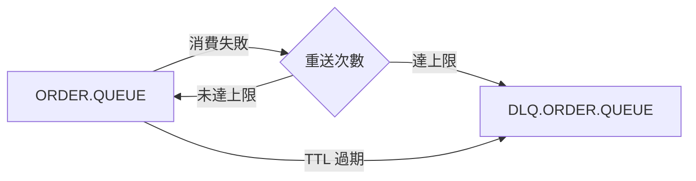

# 🧣 死信佇列 DLQ

本章節解析 ActiveMQ 的「最後防線」——死信佇列（Dead Letter Queue）。當訊息重送次數耗盡、過期或被 Broker 主動丟棄時，DLQ 承接這些無法正常投遞的訊息，避免它們在業務 Queue 中無限循環。

## 環境

- windows10 ~ 11 (win64)
- [ActiveMQ 5.16.6](https://activemq.apache.org/activemq-5016006-release)
- [JDK 1.8](https://blog.lychicken.com/docs/daylilyTool/toolScoop/setJdk)

## 1. DLQ 的觸發條件

ActiveMQ 預設將無法投遞的訊息移至 `ActiveMQ.DLQ`，常見觸發原因如下：

| 觸發原因 | 說明 |
|----------|------|
| 重送次數耗盡 | 超過 `maximumRedeliveries` 仍未成功 ACK |
| 訊息過期 | 超過 TTL（Time-to-Live） |
| 投遞失敗 | 目的地不存在且無法自動建立 |
| 手動丟棄 | 管理介面或 Advisory 操作 |

## 2. Broker 端 DLQ 設定

- 檔案: `/conf/activemq.xml`

```xml
<broker xmlns="http://activemq.apache.org/schema/core" brokerName="localhost" dataDirectory="${activemq.data}">
  <destinationPolicy>
    <policyMap>
      <policyEntries>
        <policyEntry queue=">">
          <deadLetterStrategy>
            <individualDeadLetterStrategy
              queuePrefix="DLQ."
              useQueueForQueueMessages="true"
              processExpired="true"
              processNonPersistent="false"/>
          </deadLetterStrategy>
          <redeliveryPolicy>
            <redeliveryPolicy maximumRedeliveries="3"/>
          </redeliveryPolicy>
        </policyEntry>
      </policyEntries>
    </policyMap>
  </destinationPolicy>
</broker>
```

### 2.1 individualDeadLetterStrategy 屬性

| 屬性 | 說明 | 建議值 |
|------|------|--------|
| `queuePrefix` | DLQ 名稱前綴 | `DLQ.` → 產生 `DLQ.ORDER.QUEUE` |
| `useQueueForQueueMessages` | Queue 訊息是否進 Queue 型 DLQ | `true` |
| `processExpired` | 過期訊息是否進 DLQ | `true` |
| `processNonPersistent` | 非持久化訊息是否進 DLQ | `false`（即時場景通常不需要） |

:::tip
預設策略下，來自 `ORDER.QUEUE` 的死信會進入 `DLQ.ORDER.QUEUE`，方便按業務 Queue 分類排查。
:::

## 3. 在 Web Console 監控 DLQ

1. 開啟 `http://localhost:8161/admin`
2. 在 Queues 列表中搜尋 `DLQ.` 前綴
3. 檢查 **Enqueue Count**、**Messages Pending** 是否有持續增長

若 DLQ 訊息持續堆積，代表消費端存在系統性錯誤，而非偶發失敗。

## 4. DLQ 訊息重處理

### 4.1 Web Console 手動搬移

在 Web Console 中選取 DLQ 訊息，使用 **Move to** 功能將訊息搬回原始 Queue 進行重試。

### 4.2 程式化重處理

```java
Connection connection = connectionFactory.createConnection();
connection.start();
Session session = connection.createSession(false, Session.AUTO_ACKNOWLEDGE);

MessageConsumer dlqConsumer = session.createConsumer(session.createQueue("DLQ.ORDER.QUEUE"));
MessageProducer producer = session.createProducer(session.createQueue("ORDER.QUEUE"));

Message deadMessage;
while ((deadMessage = dlqConsumer.receive(1000)) != null) {
    // 檢查重送次數，避免無限循環
    int deliveryCount = deadMessage.getIntProperty("JMSXDeliveryCount");
    if (deliveryCount < 5) {
        producer.send(deadMessage);
    } else {
        // 記錄日誌，人工介入
        log.warn("Message exceeded retry limit: {}", deadMessage.getJMSMessageID());
    }
}
```

## 5. DLQ 與重送策略的協作



`maximumRedeliveries` 與 DLQ 必須搭配設定：

- `maximumRedeliveries=3` 表示最多重送 3 次，第 4 次投遞失敗後進 DLQ
- 若未設定 `deadLetterStrategy`，訊息可能被直接丟棄

## 6. 常見問題與排查

| 現象 | 可能原因 | 處理方式 |
|------|----------|----------|
| DLQ 快速增長 | 消費者邏輯 bug 或下游服務宕機 | 修復消費者後再搬移 DLQ 訊息 |
| 訊息憑空消失 | `processExpired=false` 且 TTL 過期 | 啟用 `processExpired` 或調整 TTL |
| DLQ 名稱找不到 | 使用了 `sharedDeadLetterStrategy` | 確認策略類型，共享 DLQ 統一為 `ActiveMQ.DLQ` |
| 重處理後再次進 DLQ | 根本問題未修復 | 先修 bug，再批次重送 |

## 7. 與其他文章的關聯

- 重送策略與 ACK 模式：[`ackAndRedelivery`](/docs/activeMQ/usage/ackAndRedelivery)
- TTL 過期機制：[`efficientPrioritization`](/docs/activeMQ/fundamentals/efficientPrioritization)
- 目的地策略完整指南：[`destinationPolicy`](/docs/activeMQ/advanced/destinationPolicy)
- Web Console 操作：[`webConsole`](/docs/activeMQ/operations/webConsole)