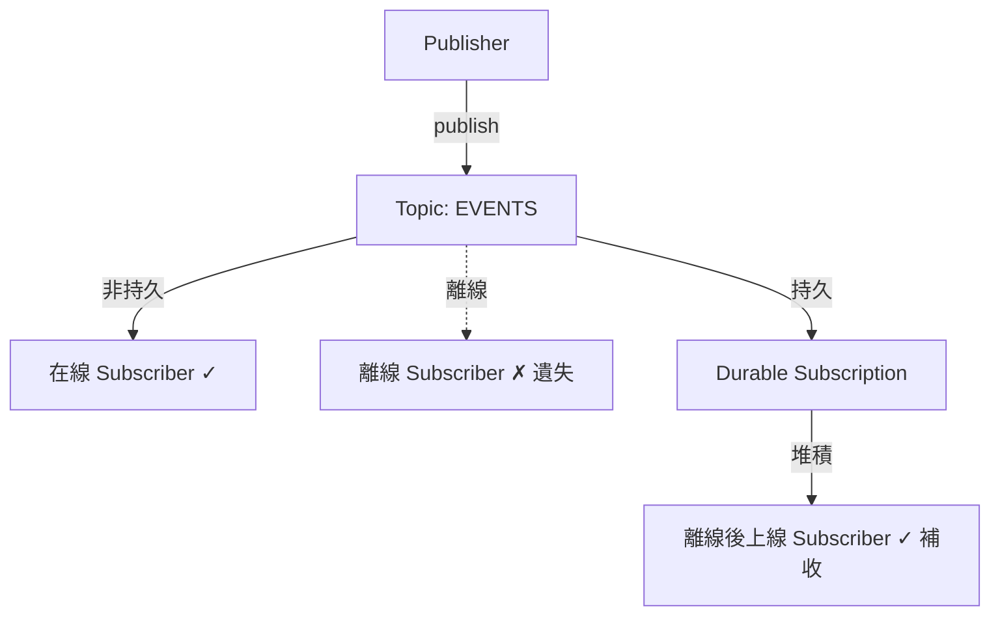

# 🧣 持久訂閱

本章節解析 ActiveMQ Topic 模式下最關鍵的可靠性機制——持久訂閱（Durable Subscription）。它讓訂閱者在離線期間錯過的訊息，在重新上線後仍能被完整接收。

## 環境

- windows10 ~ 11 (win64)
- [ActiveMQ 5.16.6](https://activemq.apache.org/activemq-5016006-release)
- [JDK 1.8](https://blog.lychicken.com/docs/daylilyTool/toolScoop/setJdk)

## 1. 非持久 vs 持久訂閱

| 類型 | 離線期間訊息 | 需要 clientId | 典型場景 |
|------|-------------|---------------|----------|
| 非持久訂閱 | **遺失** | 否 | 即時股價、即時通知 |
| 持久訂閱 | **保留** | 是 | 系統事件、審計日誌 |



## 2. JMS 程式範例

### 2.1 建立持久訂閱

```java
ConnectionFactory factory = new ActiveMQConnectionFactory("tcp://localhost:61616");
Connection connection = factory.createConnection();
connection.setClientID("billing-service-01"); // 必須唯一且固定
connection.start();

Session session = connection.createSession(false, Session.AUTO_ACKNOWLEDGE);
Topic topic = session.createTopic("BILLING.EVENTS");

// subscriptionName 在 Broker 端識別此訂閱
MessageConsumer consumer = session.createDurableSubscriber(topic, "billing-sub");
consumer.setMessageListener(message -> {
    System.out.println("Received: " + ((TextMessage) message).getText());
});
```

### 2.2 取消持久訂閱

```java
session.unsubscribe("billing-sub");
```

:::caution
`clientId` 在同一 Broker 上必須唯一。若兩個應用實例使用相同 clientId，後連線者會踢掉先連線者。
:::

## 3. Spring Boot 持久訂閱

```yaml
spring:
  activemq:
    broker-url: tcp://localhost:61616
```

```java
@Bean
public DefaultJmsListenerContainerFactory durableTopicFactory(
        ConnectionFactory connectionFactory) {
    DefaultJmsListenerContainerFactory factory =
        new DefaultJmsListenerContainerFactory();
    factory.setConnectionFactory(connectionFactory);
    factory.setPubSubDomain(true);
    factory.setSubscriptionDurable(true);
    factory.setClientId("billing-service-01");
    return factory;
}

@JmsListener(
    destination = "BILLING.EVENTS",
    containerFactory = "durableTopicFactory",
    subscription = "billing-sub"
)
public void onBillingEvent(String event) {
    processEvent(event);
}
```

## 4. Broker 端：離線訂閱者回收

持久訂閱者長期離線會佔用 Broker 資源。可透過 `offlineDurableSubscriberTimeout` 自動清理：

```xml
<broker xmlns="http://activemq.apache.org/schema/core"
        brokerName="localhost"
        dataDirectory="${activemq.data}"
        offlineDurableSubscriberTimeout="86400000"
        offlineDurableSubscriberTaskSchedule="30000">
</broker>
```

詳見 [`setGC`](/docs/activeMQ/setUp/setGC)。

## 5. 常見問題與排查

| 現象 | 可能原因 | 處理方式 |
|------|----------|----------|
| 離線後收不到歷史訊息 | 未設 clientId 或非持久訂閱 | 使用 `createDurableSubscriber` |
| `InvalidClientIDException` | clientId 重複 | 每個實例使用不同 clientId |
| 堆積訊息過多 | 消費者長期離線 | 啟用離線訂閱者回收或加快消費 |
| Web Console 看不到訂閱 | 尚未建立連線 | 持久訂閱在首次連線後才會出現 |

## 6. 與其他文章的關聯

- Topic 模型：[`queueAndTopic`](/docs/activeMQ/fundamentals/queueAndTopic)
- 持久化概念：[`durable`](/docs/activeMQ/fundamentals/durable)
- 訂閱者回收：[`setGC`](/docs/activeMQ/setUp/setGC)
- Spring 整合：[`springJms`](/docs/activeMQ/usage/springJms)