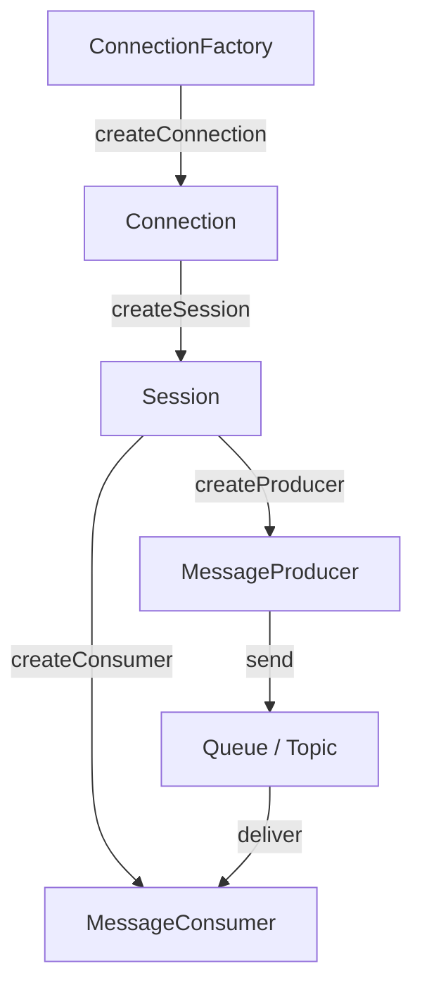

# 🧣 JMS 客戶端基礎

本章節從程式端出發，解析 JMS 客戶端與 ActiveMQ Broker 互動的核心物件與生命週期。掌握 ConnectionFactory → Session → Producer/Consumer 這條鏈路，是撰寫任何 ActiveMQ 應用的起點。

## 環境

- windows10 ~ 11 (win64)
- [ActiveMQ 5.16.6](https://activemq.apache.org/activemq-5016006-release)
- [JDK 1.8](https://blog.lychicken.com/docs/daylilyTool/toolScoop/setJdk)

## 1. JMS 核心物件 —— 四層結構



| 物件 | 職責 |
|------|------|
| `ConnectionFactory` | 建立與 Broker 的連線工廠，通常以 Singleton 持有 |
| `Connection` | 代表一條 TCP 連線，開啟後才能建立 Session |
| `Session` | 訊息收發的工作單元，控制 ACK 模式與 Transaction |
| `Producer / Consumer` | 訊息的生產者與消費者，綁定目的地 |

## 2. Maven 依賴

```xml
<dependency>
  <groupId>org.apache.activemq</groupId>
  <artifactId>activemq-client</artifactId>
  <version>5.16.6</version>
</dependency>
```

## 3. Queue 點對點範例

### 3.1 Producer — 發送訊息

```java
ActiveMQConnectionFactory factory =
    new ActiveMQConnectionFactory("tcp://localhost:61616");
Connection connection = factory.createConnection();
connection.start();

Session session = connection.createSession(false, Session.AUTO_ACKNOWLEDGE);
Destination queue = session.createQueue("ORDER.QUEUE");
MessageProducer producer = session.createProducer(queue);

TextMessage message = session.createTextMessage("New order #1001");
message.setStringProperty("category", "urgent");
producer.send(message);

producer.close();
session.close();
connection.close();
```

### 3.2 Consumer — 同步接收

```java
ActiveMQConnectionFactory factory =
    new ActiveMQConnectionFactory("tcp://localhost:61616");
Connection connection = factory.createConnection();
connection.start();

Session session = connection.createSession(false, Session.AUTO_ACKNOWLEDGE);
Destination queue = session.createQueue("ORDER.QUEUE");
MessageConsumer consumer = session.createConsumer(queue);

Message message = consumer.receive(5000); // 等待 5 秒
if (message instanceof TextMessage) {
    System.out.println("Received: " + ((TextMessage) message).getText());
}

consumer.close();
session.close();
connection.close();
```

### 3.3 Consumer — 異步監聽

```java
connection.start();
Session session = connection.createSession(false, Session.AUTO_ACKNOWLEDGE);
MessageConsumer consumer = session.createConsumer(session.createQueue("ORDER.QUEUE"));

consumer.setMessageListener(message -> {
    try {
        if (message instanceof TextMessage) {
            System.out.println("Async received: " + ((TextMessage) message).getText());
        }
    } catch (JMSException e) {
        e.printStackTrace();
    }
});

// 主執行緒保持運行，等待訊息到達
Thread.sleep(Long.MAX_VALUE);
```

## 4. Topic 發布/訂閱範例

Topic 與 Queue 的程式差異在於目的地類型與消費模式：同一則訊息會被**所有**訂閱者接收。

### 4.1 Publisher

```java
Session session = connection.createSession(false, Session.AUTO_ACKNOWLEDGE);
Topic topic = session.createTopic("STOCK.PRICE");
MessageProducer publisher = session.createProducer(topic);

TextMessage message = session.createTextMessage("AAPL: 185.50");
publisher.send(message);
```

### 4.2 Subscriber

```java
Session session = connection.createSession(false, Session.AUTO_ACKNOWLEDGE);
Topic topic = session.createTopic("STOCK.PRICE");
MessageConsumer subscriber = session.createConsumer(topic);

subscriber.setMessageListener(msg -> {
    System.out.println("Price update: " + ((TextMessage) msg).getText());
});
```

:::caution
Topic 的 Subscriber 必須在 Publisher 發送**之前**就上線，否則非持久化訊息會錯過。需要離線接收請使用持久訂閱（參見 [`durableSubscription`](/docs/activeMQ/usage/durableSubscription)）。
:::

## 5. 連線與認證

若 Broker 啟用了 Simple Authentication（參見 [`setUser`](/docs/daylilyTool/toolActiveMQ/setUser)），連線字串需帶入帳密：

```java
ActiveMQConnectionFactory factory = new ActiveMQConnectionFactory(
    "tcp://localhost:61616");
factory.setUserName("admin");
factory.setPassword("admin1pwd");
```

## 6. 資源釋放與最佳實踐

| 實踐 | 說明 |
|------|------|
| 依序關閉資源 | Producer → Consumer → Session → Connection |
| ConnectionFactory 單例 | 避免重複建立連線工廠 |
| 生產環境用連線池 | 使用 `PooledConnectionFactory` 包裹 |
| 避免在 Listener 中阻塞 | 長時間處理應交由工作執行緒 |

```java
PooledConnectionFactory pooledFactory = new PooledConnectionFactory();
pooledFactory.setConnectionFactory(new ActiveMQConnectionFactory("tcp://localhost:61616"));
pooledFactory.setMaxConnections(10);
```

## 7. Queue vs Topic 程式對照

| 項目 | Queue | Topic |
|------|-------|-------|
| 建立方式 | `session.createQueue(name)` | `session.createTopic(name)` |
| 消費者數量 | 多消費者競爭，每則訊息只一人收到 | 所有訂閱者都收到 |
| 典型用途 | 任務分配、訂單處理 | 事件廣播、價格推送 |

## 8. 與其他文章的關聯

- 成員概念（Producer / Consumer）：[`member`](/docs/activeMQ/fundamentals/member)
- Queue 與 Topic 模型：[`queueAndTopic`](/docs/activeMQ/fundamentals/queueAndTopic)
- 訊息過濾 Selector：[`filter`](/docs/activeMQ/fundamentals/filter)
- 確認模式：[`ackAndRedelivery`](/docs/activeMQ/usage/ackAndRedelivery)
- Spring 整合：[`springJms`](/docs/activeMQ/usage/springJms)