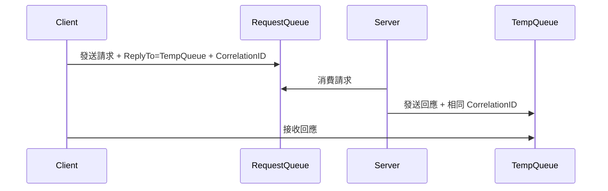

# 🧣 Request-Reply 請求回應模式

本章節解析 JMS 中最經典的同步通訊模式——Request-Reply。生產者發送請求後等待回應，透過 `JMSReplyTo` 與 `JMSCorrelationID` 完成請求與回應的配對。

## 環境

- windows10 ~ 11 (win64)
- [ActiveMQ 5.16.6](https://activemq.apache.org/activemq-5016006-release)
- [JDK 1.8](https://blog.lychicken.com/docs/daylilyTool/toolScoop/setJdk)

## 1. 運作流程



## 2. 原生 JMS 範例

### 2.1 Client 端（發送請求並等待回應）

```java
Connection connection = factory.createConnection();
connection.start();
Session session = connection.createSession(false, Session.AUTO_ACKNOWLEDGE);

Destination requestQueue = session.createQueue("CALC.REQUEST");
TemporaryQueue replyQueue = session.createTemporaryQueue();

MessageProducer producer = session.createProducer(requestQueue);
MessageConsumer consumer = session.createConsumer(replyQueue);

String correlationId = UUID.randomUUID().toString();
TextMessage request = session.createTextMessage("10 + 20");
request.setJMSReplyTo(replyQueue);
request.setJMSCorrelationID(correlationId);
producer.send(request);

Message response = consumer.receive(5000); // 5 秒超時
if (response != null) {
    System.out.println("Result: " + ((TextMessage) response).getText());
}
```

### 2.2 Server 端（處理請求並回應）

```java
MessageConsumer consumer = session.createConsumer(session.createQueue("CALC.REQUEST"));
consumer.setMessageListener(request -> {
    if (request instanceof TextMessage) {
        String expr = ((TextMessage) request).getText();
        String result = calculate(expr); // 業務邏輯

        Destination replyTo = request.getJMSReplyTo();
        if (replyTo != null) {
            TextMessage response = session.createTextMessage(result);
            response.setJMSCorrelationID(request.getJMSCorrelationID());
            MessageProducer replyProducer = session.createProducer(replyTo);
            replyProducer.send(response);
            replyProducer.close();
        }
    }
});
```

## 3. Spring JmsTemplate 簡化寫法

```java
@Bean
public JmsTemplate jmsTemplate(ConnectionFactory connectionFactory) {
    JmsTemplate template = new JmsTemplate(connectionFactory);
    template.setReceiveTimeout(5000); // 5 秒超時
    return template;
}

// 發送並等待回應
String response = (String) jmsTemplate.convertSendAndReceive(
    "CALC.REQUEST", "10 + 20");
```

`convertSendAndReceive` 內部自動建立 Temporary Queue 並處理 CorrelationID。

## 4. 設計注意事項

| 項目 | 建議 |
|------|------|
| 超時處理 | Client 必須設定 `receiveTimeout`，避免無限等待 |
| Temporary Queue | 連線關閉後自動刪除，無需手動清理 |
| 高併發 | 大量同步請求會佔用連線，考慮改用非同步 + 回呼 |
| 微服務場景 | 簡單查詢可用 Request-Reply，複雜流程建議純非同步 |

:::tip
在微服務中，若呼叫方可以非同步等待結果，優先使用「發送事件 + 另一 Queue 回傳結果」取代同步 Request-Reply，避免阻塞消費執行緒。
:::

## 5. 常見問題與排查

| 現象 | 可能原因 | 處理方式 |
|------|----------|----------|
| Client 永遠等不到回應 | Server 未設定 ReplyTo | 確認 Server 讀取 `JMSReplyTo` |
| 回應配對錯誤 | CorrelationID 不一致 | 回應時複製請求的 CorrelationID |
| 超時 | Server 處理過慢或宕機 | 調整 timeout 並記錄 DLQ |
| Temporary Queue 洩漏 | 連線未關閉 | 使用 try-with-resources 或連線池 |

## 6. 與其他文章的關聯

- JMS 基礎：[`jmsClient`](/docs/activeMQ/usage/jmsClient)
- Spring 整合：[`springJms`](/docs/activeMQ/usage/springJms)
- Queue 模型：[`queueAndTopic`](/docs/activeMQ/fundamentals/queueAndTopic)