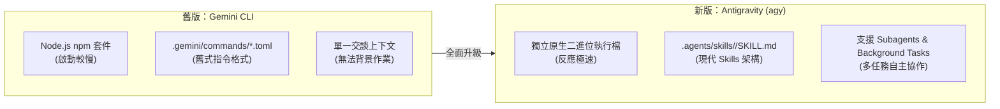

# 🔄 無痛轉移至 agy 指南

> Google 官方已宣布停止維護並下架舊有的 Gemini CLI (`@google/gemini-cli`)，後續全面改由新世代終端 AI 開發助理 **Google Antigravity (簡稱 `agy`)** 接替。
>
> 本篇整理兩者的架構差異、升級優勢，以及從 Gemini CLI 遷移至 `agy` 的操作步驟與指令對照。

## Gemini CLI 下架背景

- **舊版架構：** 舊版 `@google/gemini-cli` 為基於 Node.js 的命令列工具，主要提供單輪文字生成與基本交談功能
- **現代需求：** 隨著 AI 輔助軟體開發朝向多檔案操作、背景任務執行與規格驅動發展，舊版架構已無法滿足需求
- **官方策略：** Google 官方已停止維護與分發舊套件，並以 Antigravity (`agy`) 作為現代命令列 AI 代理的核心工具

## Antigravity (agy) 核心優勢

相比舊版 Gemini CLI，`agy` 在架構與功能上有顯著提升：



1. **原生執行檔：** 採用獨立二進位編譯，無需 Node.js 運行時，啟動速度與反應更加迅速
2. **現代 Skills 架構：** 以 `.agents/skills/<name>/SKILL.md` 作為標準擴充，支援 Slash Command 原生呼叫
3. **多代理人 (Subagents) 與背景任務：** 支援在背景平行執行測試、編譯與子任務調研，不阻塞主對話流程
4. **標準協議支援：** 原生整合 MCP (Model Context Protocol)，便於掛載外部資料庫與自訂工具鏈

## 遷移步驟 (Migration SOP)

### 步驟 1：移除舊版 Gemini CLI

清理本機既有的 npm 全域套件：

```bash
npm uninstall -g @google/gemini-cli
```

### 步驟 2：安裝 Antigravity CLI (`agy`)

Antigravity 提供官方安裝腳本：

- **Windows (PowerShell)：**
  ```powershell
  irm https://antigravity.google/cli/install.ps1 | iex
  ```

- **macOS / Linux (Terminal)：**
  ```bash
  curl -fsSL https://antigravity.google/cli/install.sh | bash
  ```

安裝完成後，可重啟終端機並檢查版本：

```bash
agy --version
```

### 步驟 3：帳號授權

1. 在終端機執行 `agy`
2. 系統會自動開啟預設瀏覽器跳轉至 Google 授權頁面
3. 登入 Google 帳號並確認授權，完成後認證憑證會自動保存於本地端

### 步驟 4：遷移既有設定與規則

1. **專案規則 (Rules)：**
   - 專案根目錄的 `GEMINI.md` 在 `agy` 中仍向下相容
   - 建議逐步更名為跨代理通用的標準檔名 `AGENTS.md`
2. **自訂指令 (Commands -> Skills)：**
   - 舊版 `.gemini/commands/*.toml` 或 `.agent/workflows/*.md` 已由現代 Skills 取代
   - 建議改建為 `.agents/skills/<skill-name>/SKILL.md`

## 常用指令對照表

| 操作情境 | 舊版 Gemini CLI | 新版 Antigravity (`agy`) | 備註說明 |
| :--- | :--- | :--- | :--- |
| **進入互動終端** | `gemini chat` | `agy` | 直接執行 `agy` 即可進入互動介面 |
| **單次快速提問** | `gemini generate "..."` | `agy "..."` | 可直接在命令後方帶入 prompt |
| **查看說明/選單** | `gemini help` | `/help` | 在 `agy` 內輸入 `/help` 檢視所有指令 |
| **查看版本資訊** | `gemini version` | `agy --version` | 終端機參數速查 |
| **退出互動介面** | `Ctrl+C` | `Ctrl+D Ctrl+D` 或 `/exit` | 連按兩次 Ctrl+D 或輸入 `/exit` 退出 |
| **清空對話畫面** | `clear` | `/clear` | 清空目前的對話視窗 |

## 總結

Gemini CLI 停更後，終端 AI 開發全面轉向以 Antigravity (`agy`) 為核心。透過移除舊版全域套件並遷移既有設定檔，即可順利銜接現代 AI 代理工作流。

相關入門教學請參考：
- [🚀 agy 新手安裝教學](../toolAgy/installAgy.md)
