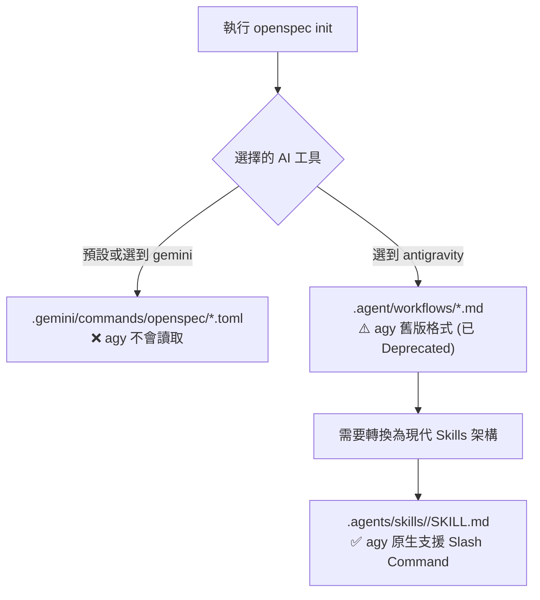
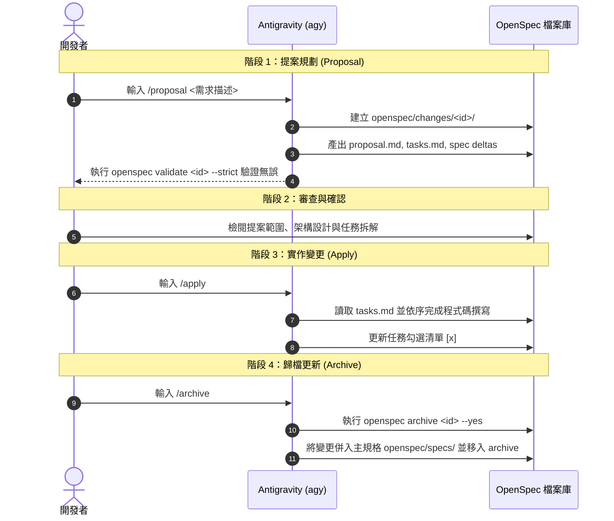

# 🛠️ agy 整合 OpenSpec 指南

> 在專案中安裝並初始化 OpenSpec 後，若在 Antigravity CLI (`agy`) 輸入 `/` 找不到相關指令，通常導因於工具配置不符或架構版本演進。
>
> 本篇記錄此問題的根本原因，並提供將舊版 Workflows 轉換為現代 Skills 架構的完整設定步驟，以利在 `agy` 中正常調用 `/proposal`、`/apply` 與 `/archive` 等指令。

## 1. 問題背景與現象

在專案中執行 OpenSpec 初始化：

```powershell
openspec init
```

完成後啟動 Antigravity CLI (`agy`)：

```powershell
agy
```

在輸入框中鍵入 `/`，選單中未顯示 OpenSpec 相關的 Slash Command（如 `/openspec-proposal` 或 `/proposal`），無法調用規格流程。

---

## 2. 原因診斷

此現象通常由以下三點原因導致：



1. **工具配置不符（Gemini CLI vs Antigravity）：**
   - 若初始化時選取 `gemini`，設定僅會生成至 `.gemini/commands/openspec/*.toml`，`agy` 不會讀取此路徑。
2. **架構版本演進（Workflows vs Skills）：**
   - OpenSpec CLI 針對 Antigravity 預設產出的是舊版工作流目錄 `.agent/workflows/openspec-*.md`。
   - Antigravity 2.0 (`agy`) 已棄用 `.agent/workflows/`，改以 `.agents/skills/<name>/SKILL.md` 作為 Slash Command 與技能的主要載入機制。
3. **CLI 啟動載入快取：**
   - `agy` 的指令清單與可用技能是在程式啟動時載入並建立快取，新增或修改 Skills 後需重啟 `agy` 終端才能刷新選單。

---

## 3. 設定步驟 (Setup SOP)

日後在其他專案或新環境進行設定時，可依照以下步驟操作：

### 步驟 1：使用 OpenSpec 註冊 Antigravity 工具鏈

在專案根目錄下執行：

```powershell
openspec init --tools antigravity
```

此指令會建立：
- `AGENTS.md`：根目錄指令相容宣告
- 相容更新器之工作流程：
  - `.agent/workflows/openspec-proposal.md`
  - `.agent/workflows/openspec-apply.md`
  - `.agent/workflows/openspec-archive.md`

> 💡 保留 `.agent/workflows/` 結構可確保未來執行 `openspec update` 時能自動同步官方更新。

### 步驟 2：建立 Antigravity 原生 Skills 架構

在專案根目錄建立 `.agents/skills/`，並為每個階段建立 `SKILL.md`（可同時配置全名與簡短別名）：

```text
.agents/
└── skills/
    ├── openspec-proposal/
    │   └── SKILL.md
    ├── proposal/               <-- 簡短別名
    │   └── SKILL.md
    ├── openspec-apply/
    │   └── SKILL.md
    ├── apply/                  <-- 簡短別名
    │   └── SKILL.md
    ├── openspec-archive/
    │   └── SKILL.md
    └── archive/                <-- 簡短別名
        └── SKILL.md
```

#### Skill 設定檔範例 (`proposal/SKILL.md`)：

```markdown
---
name: proposal
description: Scaffold a new OpenSpec change proposal and validate strictly.
---

# OpenSpec Proposal

<!-- OPENSPEC:START -->
(此處放入對應 .agent/workflows/openspec-proposal.md 的 OpenSpec Guardrails 與 Steps 內容)
<!-- OPENSPEC:END -->
```

### 步驟 3：重啟 Antigravity CLI

關閉當前的 `agy` 視窗，重新開啟終端機並進入專案目錄：

```powershell
agy
```

重新進入 `agy` 並輸入 `/`，即可在自動補全清單中看到 `/proposal`、`/apply`、`/archive` 等指令。

---

## 4. OpenSpec 開發四大階段與 Slash Commands

OpenSpec 採用規格驅動開發（Spec-Driven Development）流程：



### 指令職責對照

| 指令 (全名) | 簡短別名 | 適用階段 | 核心職責 |
| :--- | :--- | :--- | :--- |
| `/openspec-proposal` | `/proposal` | 階段 1：提案 | 探索現有規格與架構，建立變更資料夾、草擬 `proposal.md`、`tasks.md`、`specs/` 差異，**此階段不撰寫業務程式碼**。 |
| `/openspec-apply` | `/apply` | 階段 3：實作 | 依照審核通過的 `tasks.md` 逐項進行實作與驗證，邊做邊更新任務清單。 |
| `/openspec-archive` | `/archive` | 階段 4：歸檔 | 完成全部任務後，呼叫 CLI 將變更合併至主規格 `openspec/specs/`，並歸檔已完成提案。 |

---

## 5. OpenSpec CLI 常用終端指令速查

在系統一般終端機中可使用的輔助命令：

```powershell
# 檢視當前所有進行中與已歸檔的提案
openspec list

# 檢視目前系統的所有核心規格
openspec list --specs

# 驗證指定變更提案的格式與相依性
openspec validate <change-id> --strict

# 檢視提案的規格差異 (Deltas)
openspec show <change-id> --deltas-only

# 當 OpenSpec 有版本更新時，同步更新本專案的說明文件與 Workflows
openspec update
```

---

## 6. 目錄檔案用途一覽

| 路徑 | 用途 |
| :--- | :--- |
| `openspec/project.md` | 專案核心架構、技術棧、通訊規則與編程約定（AI 代理最重要的指引）。 |
| `openspec/specs/` | 系統功能之主規格庫（單一事實來源 Single Source of Truth）。 |
| `openspec/changes/` | 當前進行中與已歸檔的變更提案目錄。 |
| `AGENTS.md` | 專案根目錄指引，告知各 AI 工具在規劃與提案時參考 OpenSpec。 |
| `.agents/skills/` | Antigravity 專用的技能目錄，負責驅動 Slash Commands。 |
| `.agent/workflows/` | OpenSpec 產生的工作流模板，確保執行 `openspec update` 時能自動同步。 |

---

## 7. 總結

- Antigravity 2.0 (`agy`) 不再讀取 `.agent/workflows/`，需配置於 `.agents/skills/<name>/SKILL.md` 才能在 `agy` 中載入 Slash Command。
- 透過別名設定（如 `/proposal` 代替 `/openspec-proposal`），可提升日常終端操作效率。
- 保留 `.agent/workflows/` 結構，利於日後執行 `openspec update` 時同步官方最新更新。
