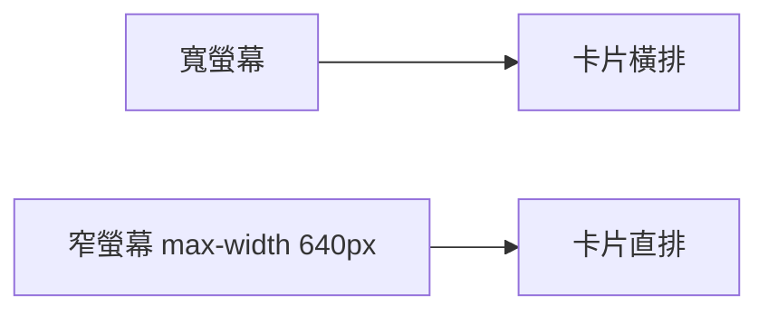

# 響應式入門

> 讓同一個網頁在手機與桌機都能舒適閱讀：viewport 設定與 `@media` 斷點。

## 你會用到什麼

- [Flexbox 排版](./cssFlexbox.md)

## 步驟 1：viewport meta（必備）

在 `<head>` 加入：

```html
<meta name="viewport" content="width=device-width, initial-scale=1" />
```

沒有這行，手機瀏覽器可能把網頁縮成小縮圖，字會難以閱讀。

## 步驟 2：流動寬度

```css
img {
  max-width: 100%;
  height: auto;
}
```

圖片不會超出螢幕寬度。

```css
main {
  max-width: 960px;
  margin: 0 auto;
  padding: 0 16px;
}
```

窄螢幕時左右留 16px 內距，避免貼邊。

## 步驟 3：media query 概念

```css
.card-row {
  display: flex;
  gap: 16px;
}

@media (max-width: 640px) {
  .card-row {
    flex-direction: column;
  }
}
```

意思是：**螢幕寬度 ≤ 640px** 時，卡片改為直向堆疊。

`max-width` 由大寫到小（桌機樣式先寫，手機覆蓋）是常見做法。

## 步驟 4：導覽列在手機上直排（選做）

```css
@media (max-width: 640px) {
  .site-header {
    flex-direction: column;
    align-items: flex-start;
    gap: 12px;
  }

  .nav a {
    margin-left: 0;
    margin-right: 16px;
  }
}
```

## 步驟 5：完整範例片段

`style.css` 末尾加上：

```css
img {
  max-width: 100%;
  height: auto;
}

@media (max-width: 640px) {
  body {
    padding: 16px;
  }

  .card-row {
    flex-direction: column;
  }

  .site-header {
    flex-direction: column;
    align-items: flex-start;
    gap: 12px;
  }
}
```

## 步驟 6：怎麼測試

1. Chrome F12 → 點「切換裝置工具列」圖示（或 `Ctrl + Shift + M`）。
2. 選 iPhone 或自訂寬度 375px。
3. 重新整理，看卡片是否改為單欄。



## 動手做

1. 所有練習頁 `<head>` 加上 viewport meta。
2. `img` 設 `max-width: 100%`。
3. `.card-row` 在 ≤640px 時改 `flex-direction: column`。
4. 用 F12 裝置模式確認手機與桌機版面都合理。

**完成標準**：375px 寬時三張卡片直排；桌機寬時橫排。

## 常見卡關

| 問題 | 解法 |
|------|------|
| 手機上字很小 | 是否漏了 viewport meta？ |
| media 沒觸發 | 寬度單位是 `px`；確認用裝置模式測 |
| 橫排溢出 | 父層加 `flex-wrap: wrap` 或窄螢幕改 `column` |

## 參考

- [MDN：響應式設計](https://developer.mozilla.org/zh-TW/docs/Learn/CSS/CSS_layout/Responsive_Design)
- [MDN：@media](https://developer.mozilla.org/zh-TW/docs/Web/CSS/@media)