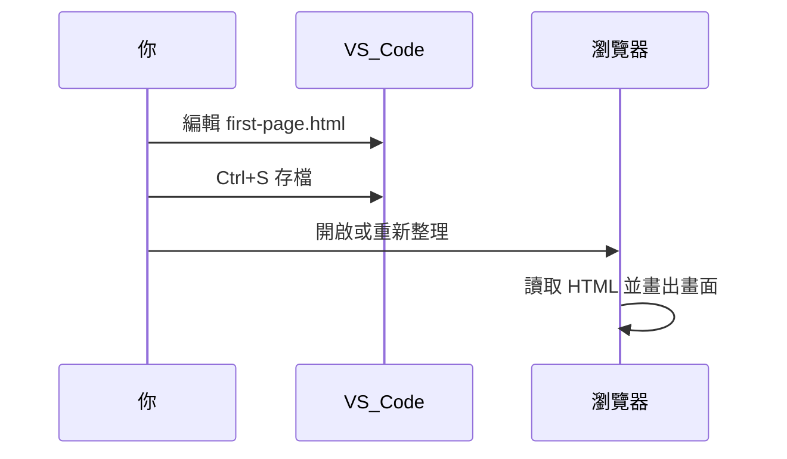

# 🐄 零基礎起步

> 搞懂「網頁是什麼檔案、瀏覽器怎麼顯示它」，並用 VS Code 做出第一個能在瀏覽器開啟的頁面。

## 你會用到什麼

無（系列第一篇）。

## 步驟 1：網頁其實就是檔案

你在網路上看到的畫面，本質上是瀏覽器讀取電腦或伺服器上的**文字檔**，再依照裡面的標記畫出畫面。

常見副檔名：

| 副檔名 | 用途 |
|--------|------|
| `.html` | 網頁結構與內容 |
| `.css` | 外觀樣式（之後會學） |
| `.js` | 互動行為（之後會學） |

本系列一開始只需要 `.html`。

## 步驟 2：安裝 VS Code

1. 前往 [https://code.visualstudio.com/](https://code.visualstudio.com/) 下載並安裝。
2. 打開 VS Code，左側點「資料夾」圖示 →「開啟資料夾」。
3. 在桌面新建資料夾 `my-first-site`，選取它。

之後所有練習檔案都放在這個資料夾裡。

## 步驟 3：建立第一個 HTML 檔

1. 在 VS Code 左側檔案列表，對 `my-first-site` 按右鍵 →「新增檔案」。
2. 檔名輸入 `first-page.html`（**一定要**有 `.html` 結尾）。
3. 貼上以下內容：

```html
<!doctype html>
<html lang="zh-Hant">
  <head>
    <meta charset="utf-8" />
    <title>我的第一個網頁</title>
  </head>
  <body>
    <h1>你好，前端世界！</h1>
    <p>這是我寫的第一個網頁。</p>
  </body>
</html>
```

4. 按 `Ctrl + S` 存檔。

## 步驟 4：用瀏覽器打開

**方法一（建議）**：在 VS Code 對 `first-page.html` 按右鍵 →「Reveal in File Explorer」（在檔案總管中顯示）→ 雙擊檔案。

**方法二**：把 `first-page.html` 拖進 Chrome 視窗。

你應該看到大標「你好，前端世界！」和一行內文。瀏覽器分頁標題會顯示「我的第一個網頁」。

## 步驟 5：修改後重新整理

1. 回到 VS Code，把 `<h1>` 改成 `你好，[你的名字]！`。
2. 存檔。
3. 回到瀏覽器按 `F5` 或重新整理按鈕。

畫面會更新——**改 HTML、存檔、重新整理**是之後每天會重複的循環。

## 步驟 6：認識開發者工具（F12）

1. 在瀏覽器頁面按 `F12`（Mac：`Cmd + Option + I`）。
2. 點上方 **Elements**（元素）分頁。
3. 左側會出現一棵「DOM 樹」——就是瀏覽器解析你的 HTML 後的結構。

點選 `<h1>` 那一行，右側可以看到套用在它上面的樣式（目前幾乎是瀏覽器預設值）。之後學 CSS、JS 時會常常用到這個面板。



## 動手做

在 `my-first-site` 資料夾完成以下項目：

1. `first-page.html` 能正常在瀏覽器顯示。
2. 頁面至少有 1 個 `<h1>` 和 2 個 `<p>`，內容寫關於你自己的兩三句話。
3. `<title>` 改成你想顯示在分頁上的標題。
4. 用 F12 的 Elements 面板找到你的 `<h1>`。

**完成標準**：重新整理後內容有更新；F12 能看到完整 HTML 樹狀結構。

## 常見卡關

| 問題 | 解法 |
|------|------|
| 瀏覽器顯示原始碼文字，沒有排版 | 檔名可能存成 `first-page.html.txt`；在檔案總管開啟「顯示副檔名」，確認是 `.html` |
| 中文變成亂碼 | 確認 `<head>` 裡有 `<meta charset="utf-8" />` |
| 改了檔案但瀏覽器沒變 | 是否按了存檔？是否重新整理的是正確分頁？ |
| 路徑有中文或空白 | 盡量用英文資料夾名（如 `my-first-site`），減少奇怪問題 |

## 參考

- [MDN：入門網頁開發](https://developer.mozilla.org/zh-TW/docs/Learn/Getting_started_with_the_web)
- [MDN：HTML 入門](https://developer.mozilla.org/zh-TW/docs/Learn/Getting_started_with_the_web/HTML_basics)