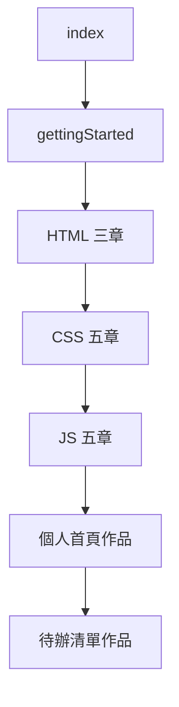

# 前端入門學習路徑

> 依序讀完本系列，零程式基礎也能做出有排版、有互動的網頁。

## 讀完本系列你能做什麼

| 讀者 | 讀完後的能力 |
|------|-------------|
| 完全新手 | 用 HTML 寫出結構清楚的網頁、用 CSS 排版美化、用 JS 做按鈕互動 |
| 照作品練完 | 獨立完成個人首頁 + 待辦清單，並用 fetch 讀取公開 API |

**先修知識：無。** 從 [零基礎起步](./gettingStarted.md) 開始。

## 你需要準備

- **瀏覽器**：Chrome 或 Edge（建議 Chrome，開發者工具教學以此為準）
- **編輯器**：[Visual Studio Code](https://code.visualstudio.com/)（免費）
- **不必安裝**：Node.js、npm、任何框架

## 學習路徑總覽

預估時間（業餘自學、每天 1–2 小時）：約 3–4 週。

## 閱讀順序

| 順序 | 文章 | 讀完能… |
|------|------|---------|
| 1 | [零基礎起步](./gettingStarted.md) | 建立第一個 .html 並用瀏覽器打開 |
| 2 | [HTML 網頁骨架](./html/htmlStructure.md) | 寫出正確的 head / body 結構 |
| 3 | [常用標籤與語意](./html/htmlTags.md) | 標題、段落、清單、連結、圖片 |
| 4 | [表單基礎](./html/htmlForms.md) | 聯絡表單、輸入欄位 |
| 5 | [CSS 怎麼寫進網頁](./css/cssIntro.md) | 外部樣式表、分離 HTML 與 CSS |
| 6 | [選擇器](./css/cssSelectors.md) | 指定要改樣式的元素 |
| 7 | [盒模型與間距](./css/cssBoxModel.md) | padding、margin、邊框 |
| 8 | [Flexbox 排版](./css/cssFlexbox.md) | 導覽列、多欄排版 |
| 9 | [響應式入門](./css/cssResponsive.md) | 手機與桌機都能看 |
| 10 | [JavaScript 入門](./js/jsIntro.md) | console.log、DevTools |
| 11 | [變數與流程](./js/jsBasics.md) | if、for、基本型別 |
| 12 | [函式](./js/jsFunctions.md) | 封裝可重複使用的邏輯 |
| 13 | [DOM 與事件](./js/jsDom.md) | 按鈕互動、表單驗證 |
| 14 | [用 fetch 讀 API](./js/jsFetch.md) | 從網路載入 JSON 資料 |
| 15 | [作品一：個人首頁](./projects/projectPersonalPage.md) | 綜合 HTML + CSS |
| 16 | [作品二：待辦清單](./projects/projectTodoList.md) | 綜合 JS + localStorage |

## 本系列不涵蓋

- React、Vue 等框架
- npm、webpack 等建置工具
- TypeScript、後端、資料庫
- 網站部署上線（可之後另學）

## 下一步（學完後）

- [MDN Learn](https://developer.mozilla.org/zh-TW/docs/Learn) — 官方完整教程
- [freeCodeCamp](https://www.freecodecamp.org/) — 免費互動練習
- 框架入門可從 React 或 Vue 官方文件開始