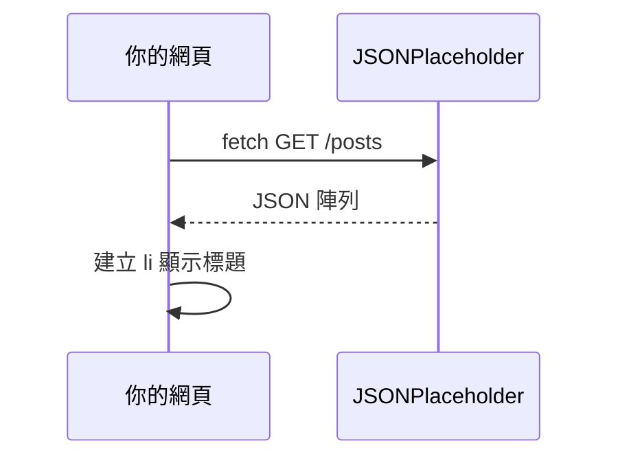

# 用 fetch 讀 API

> 從網路載入 JSON 資料，顯示在網頁上。使用免 API key 的 [JSONPlaceholder](https://jsonplaceholder.typicode.com/)。

## 你會用到什麼

- [DOM 與事件](./jsDom.md)

## 步驟 1：什麼是 API

**API** 像餐廳菜單：你照格式點餐（發請求），廚房回菜（回 JSON 資料）。

瀏覽器用 `fetch` 發 HTTP 請求，常拿到 JSON 字串再轉成 JavaScript 物件。

## 步驟 2：最簡單的 fetch

```javascript
fetch("https://jsonplaceholder.typicode.com/posts/1")
  .then((response) => response.json())
  .then((data) => {
    console.log(data.title);
  })
  .catch((error) => {
    console.error("載入失敗", error);
  });
```

在 Console 或 `script` 裡執行，應印出該貼文標題。

## 步驟 3：async / await 寫法（建議）

```javascript
async function loadPost() {
  try {
    const response = await fetch("https://jsonplaceholder.typicode.com/posts/1");
    if (!response.ok) {
      throw new Error("HTTP " + response.status);
    }
    const data = await response.json();
    console.log(data.title);
  } catch (error) {
    console.error("載入失敗", error);
  }
}

loadPost();
```

`async` 函式裡可用 `await` 等待網路回應，讀起來像同步程式。

## 步驟 4：顯示在頁面上

HTML：

```html
<button type="button" id="load-btn">載入貼文</button>
<ul id="post-list"></ul>
```

JS：

```javascript
const loadBtn = document.querySelector("#load-btn");
const postList = document.querySelector("#post-list");

loadBtn.addEventListener("click", async () => {
  postList.innerHTML = "<li>載入中…</li>";

  try {
    const response = await fetch("https://jsonplaceholder.typicode.com/posts?_limit=5");
    if (!response.ok) {
      throw new Error("HTTP " + response.status);
    }
    const posts = await response.json();

    postList.innerHTML = "";
    for (let i = 0; i < posts.length; i++) {
      const li = document.createElement("li");
      li.textContent = posts[i].title;
      postList.appendChild(li);
    }
  } catch (error) {
    postList.innerHTML = "<li>載入失敗：" + error.message + "</li>";
  }
});
```

## 步驟 5：CORS 白話說明

瀏覽器有**同源政策**：從 `file://` 開本地 HTML 時，有些 API 會被擋（CORS 錯誤）。

**建議**：用 VS Code 外掛 [Live Server](https://marketplace.visualstudio.com/items?itemName=ritwickdey.LiveServer) 啟動本地 `http://localhost:5500`，再測 fetch。

若 Console 出現 `CORS` 或 `Failed to fetch`：

1. 確認是否用 `http://` 開頁面，而非直接雙擊檔案。
2. 換成允許跨域的公開 API（JSONPlaceholder 通常可以）。
3. 檢查網址是否打錯。



## 動手做

建立 `api-demo.html` + `api.js`：

1. 按鈕「載入貼文」。
2. 成功時在 `<ul>` 顯示 5 筆貼文標題。
3. 失敗時顯示錯誤訊息。
4. 用 Live Server 或類似方式以 `http://` 開啟測試。

**完成標準**：點按鈕後列表出現 5 個標題；斷網時顯示失敗訊息。

## 常見卡關

| 問題 | 解法 |
|------|------|
| CORS / Failed to fetch | 用 Live Server，不要 `file://` |
| `Unexpected token` | 可能回傳不是 JSON；確認 `response.json()` 前 `response.ok` |
| 按鈕沒反應 | 檢查 `addEventListener` 與元素 id |

## 參考

- [MDN：fetch](https://developer.mozilla.org/zh-TW/docs/Web/API/Fetch_API/Using_Fetch)
- [MDN：async/await](https://developer.mozilla.org/zh-TW/docs/Learn/JavaScript/Asynchronous/Introducing_async_await)
- [JSONPlaceholder](https://jsonplaceholder.typicode.com/)