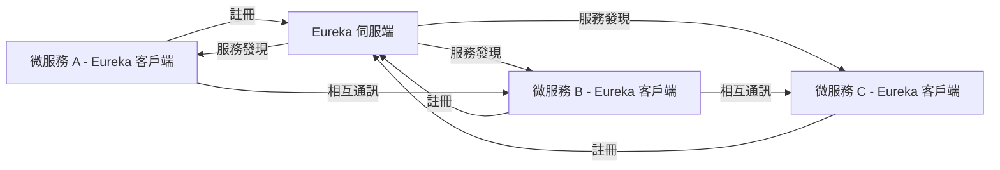

# 🌧️ Netflix Eureka

## Spring Cloud Eureka

> 如果使用 Netflix Eureka ，它包含了伺服端與客戶端的模組，
>
> 並且客戶端與伺服端都是以 java 撰寫的，
>
> 因此 Eureka 適用於 java 的分散式系統或是相容 JVM 語言的系統

## 使用 Eureka 管理

> Eureka 提供完整的 RESTful API，這意味著即使是用其他語言編寫的服務也可以與 Eureka 進行交互
>
> 這種語言無關性使得 Eureka 更加靈活和廣泛適用，
>
> 對於非 Java 平台，需要開發或使用特定語言的 Eureka 客戶端，對於一些流行的語言，
>
> 如 .NET 和 Node.js，已經有現成的客戶端框架，例如: Dotnet 的 Steeltoe 和 Node.js 的 eureka-js-client 就是這樣的解決方案

## Eureka 伺服端（服務註冊中心）

- 可稱之為 `服務註冊中心`

- 所有微服務都在此註冊自己，以便於被發現和呼叫

- 支援高度可用的設定

- 可應對不同的故障 (ex: 當整個服務群集有某個分片故障時，會自動轉入保護模式)

## Eureka 客戶端

- 主要處理註冊與發現

- 它將服務資訊註冊到 Eureka 伺服端，並從伺服端查詢其他服務的資訊

- 透過註解或是參數設定嵌入應用的程式碼中

- 程式運作時，Eureka 客戶端會主動發送生存確認給伺服端

## 註冊與通訊

- 微服務 A、B、C 代表使用 Eureka 客戶端的不同微服務
- 它們各自向 Eureka 伺服端（服務註冊中心）註冊自己
- 一旦註冊，這些微服務可以透過 Eureka 伺服端進行服務發現，意味著它們可以找到彼此並進行相互通訊
- Eureka 伺服端維護著所有註冊服務的列表，並在需要時提供這些資訊給客戶端
- 微服務之間的通訊是直接的，但是它們的發現和註冊是透過 Eureka 伺服端完成的

