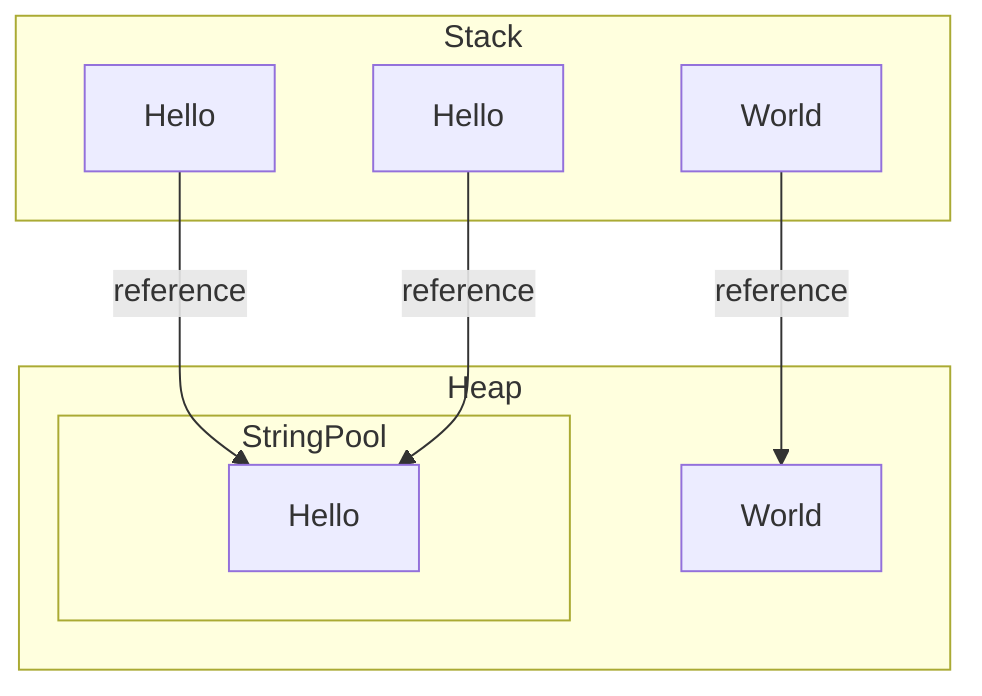

# 🦑 Java String

> String 為字串，字串為多個文字組成

## String

- 字串須由兩個雙引號 `" "` 包裝起來

```java
public class firstString {
    public static void main(String[] args) {

        // 宣告字串
        String hi = "hi hi";

        // 印出結果
        System.out.println(hi);
    }
}
```

- [Github 範例](https://github.com/LonelyYeezhiChicken/java-exercises/blob/%40string/javaString/firstString.java)

## new String

- 字串除了使用 `= "hi hi"` 也可以使用 `new`

```java
public class newString {
    public static void main(String[] args) {
        // 使用 new 來宣告字串
        String hi = new String("hi hi");

        // 印出結果
        System.out.println(hi);
    }
}
```

- [Github 範例](https://github.com/LonelyYeezhiChicken/java-exercises/blob/%40string/javaString/newString.java)

## String 與 new String 的差異

> 直接等於 String 的時候，會先到 String pool 尋找是否有相同的字串，拿來做使用
>
> new String 則是直接在記憶體中開一段新的位址



## var String

:::caution
在 java 10 之後可以使用 `var` 來當宣告物件，它會自動判斷型別

使用前請先用 `java -version` 確認版本
:::

```java
public static void main(String[] args) {
     // 使用 var 來宣告字串
     var hi = "hi hi";
     // 印出結果
     System.out.println(hi);
 }
```

- [Github 範例](https://github.com/LonelyYeezhiChicken/java-exercises/blob/%40string/javaString/varString.java)

## 字串相加

- 字串相加會將相加的字串按照順序組合在一起

```java
public static void main(String[] args) {
    // 宣告字串
    String one = "1";
    // 宣告第二字串
    String two = "2";
    // 相加字串
    String ans = "ans=" + one + two;
    // 印出結果
    System.out.println(ans);
}
```

> 結果: ans=12

- [Github 範例](https://github.com/LonelyYeezhiChicken/java-exercises/blob/%40string/javaString/additionString.java)

## 常用方法

### 長度 (length)

- 如果需要字串的長度可使用 `length()`

```java
public static void main(String[] args) {
    // 宣告字串
    String hi = "hi hi";
    // 印出結果
    System.out.println("長度 = " + hi.length());
}
```

> 結果: 長度 = 5

- [Github 範例](https://github.com/LonelyYeezhiChicken/java-exercises/blob/%40string/javaString/lengthString.java)

### 字串比較(contentEquals)

- 比較兩個字串是否相同
- 比較的是 `StringBuffer`

```java
public static void main(String[] args) {
    // 宣告字串
    String hi1 = "hi hi";
    String hi2 = "hi hi";
    String hi3 = "你好";
    // 印出結果
    System.out.println("hi1:hi2 " + hi1.contentEquals(hi2));
    System.out.println("hi1:hi3 " + hi1.contentEquals(hi3));
}
```

> 結果:
>
> hi1:hi2 true
>
> hi1:hi3 false

- [Github 範例](https://github.com/LonelyYeezhiChicken/java-exercises/blob/%40string/javaString/contentEqualsString.java)

### 結尾是否符合(endsWith)

- 確認結尾是否符合

```java
public static void main(String[] args) {
    // 宣告字串
    String ten = "10";
    // 印出結果
    System.out.println(ten.endsWith("0"));
}
```

> 結果: true

- [Github 範例](https://github.com/LonelyYeezhiChicken/java-exercises/blob/%40string/javaString/endsWithString.java)

### 字串比較(equals)

- 比較兩個字串是否相同
- 比較的是 `object`

```java
public static void main(String[] args) {
    // 宣告字串
    String hi1 = "hi hi";
    String hi2 = "hi hi";
    String hi3 = "你好";
    // 印出結果
    System.out.println("hi1:hi2 " + hi1.equals(hi2));
    System.out.println("hi1:hi3 " + hi1.equals(hi3));
}
```

- [Github 範例](https://github.com/LonelyYeezhiChicken/java-exercises/blob/%40string/javaString/equalsString.java)

:::caution
`equals` 與 `==` 的差異

`==` 比較的是`位址`，`equals` 比較的則是物件
:::

```java
public static void main(String[] args) {
    // 宣告字串
    String hi1 = "hi hi";
    String hi2 = new String("hi hi");
    // 印出結果
    System.out.println("hi1.equals(hi2) " + hi1.equals(hi2));
    System.out.println("hi1 == hi2 " + (hi1 == hi2));
}
```

- [Github 範例](https://github.com/LonelyYeezhiChicken/java-exercises/blob/%40string/javaString/equals2String.java)

### 字串比較(equalsIgnoreCase)

- 比較兩個字串是否相同
- 不考慮大小寫

```java
public static void main(String[] args) {
    // 宣告字串
    String hi1 = "hi hi";
    String hi2 = new String("hi hi");
    // 印出結果
    System.out.println("hi1.equals(hi2) " + hi1.equals(hi2));
    System.out.println("hi1 == hi2 " + (hi1 == hi2));
}
```

- [Github 範例](https://github.com/LonelyYeezhiChicken/java-exercises/blob/%40string/javaString/equalsIgnoreCaseString.java)
