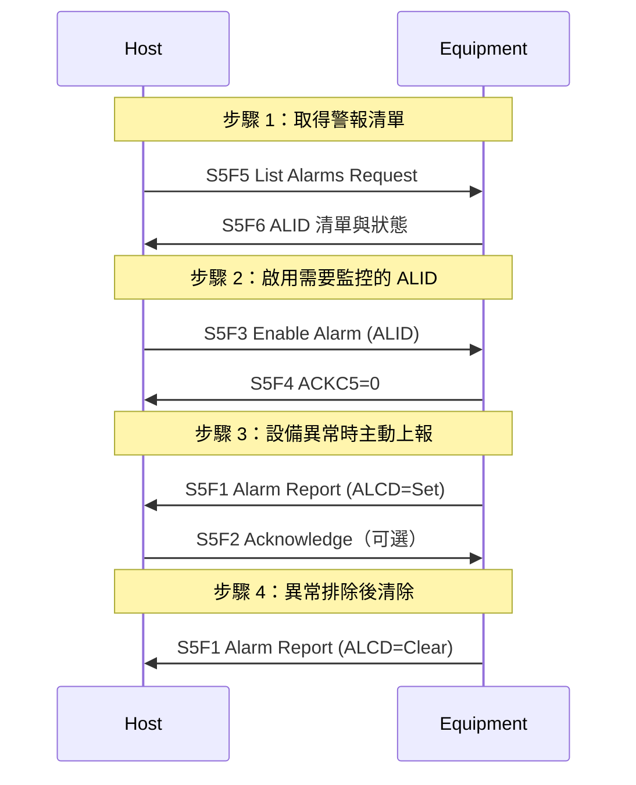

# 🔰 GEM 警報管理

本章節從 GEM 行為層面說明警報管理流程。S5 Stream 定義了訊息格式（見 [s5-alarm](/docs/secs/messages/s5-alarm)），本篇聚焦 Host 在實務中如何設定、監控與處理設備警報。

:::info 資料來源聲明
本文為學習筆記性質之原創整理，**非 SEMI E30 全文轉載**。完整定義請以 [SEMI 官方標準](https://www.semi.org/) 為準。
:::

## GEM 警報管理在做什麼

1. **發現**：設備有哪些 ALID？
2. **篩選**：哪些 ALID 需要 Host 監控？
3. **上報**：設備異常時如何通知 Host？
4. **追蹤**：警報 Set（觸發）與 Clear（排除）怎麼區分？

## 管理流程



## 啟用與停用

| 訊息 | 用途 |
|------|------|
| **S5F3 → S5F4** | 啟用或停用**單一** ALID |
| **S5F7 → S5F8** | **批次**啟用或停用多個 ALID |

Host 啟動時通常只啟用關鍵 ALID（如設備安全、製程異常），避免被大量低優先警報淹沒。

| ACKC5 | 意義 |
|-------|------|
| 0 | 接受 |
| 1 | 拒絕（ALID 不存在等） |

## S5F1 上報解讀

設備偵測到已啟用的 ALID 異常時，**主動發送 S5F1**（W=0，不需 Host 先請求）：

```yaml
# S5F1 Body 示意
B 1 128              # ALCD
U4 1 2001            # ALID
A 20 "ChamberTempHigh" # ALTX
```

### ALCD 的 Set / Clear

| ALCD bit 0 | 意義 |
|------------|------|
| 0 | **Clear**：警報已排除 |
| 1 | **Set**：警報剛觸發 |

Host 應維護一張 ALID 狀態表，Set 時觸發告警動作（通知操作員、停機等），Clear 時解除告警。

### 嚴重度（ALCD 高位元）

| bit | 類別 |
|-----|------|
| 7 | Personal Safety（人身安全） |
| 6 | Equipment Safety（設備安全） |
| 5–0 | 警報類別編碼 |

人身安全類警報通常需要最高優先處理。

## 與其他 GEM 狀態的互動

| 情境 | 可能行為 |
|------|----------|
| 嚴重 ALID Set | 設備可能自動進入 PAUSE 或 OFF-LINE |
| Processing State = EXECUTING 時警報 | 設備可能中止製程並發 ProcessEnd 事件 |
| 通訊中斷 | 已 Set 的警報狀態可能需重新查詢（S5F5） |

## Host 實務檢查清單

- [ ] 啟動時 S5F5 取得完整 ALID 清單
- [ ] 依廠商文件啟用關鍵 ALID
- [ ] S5F1 處理邏輯區分 Set / Clear
- [ ] 人身安全類 ALID 有獨立告警通道
- [ ] 通訊重建後重新同步警報狀態

## 與其他文章的關聯

- S5 訊息字典：[`s5-alarm`](/docs/secs/messages/s5-alarm)
- 端到端場景：[`startupScenario`](/docs/secs/gem/startupScenario)
- 術語：[`glossary`](/docs/secs/basics/glossary)
- 測試除錯：[`secsGemTesting`](/docs/secs/protocol-advanced/secsGemTesting)