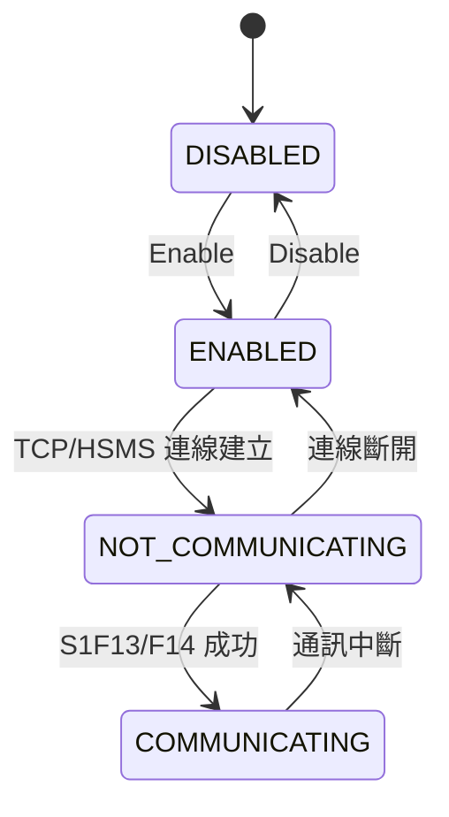
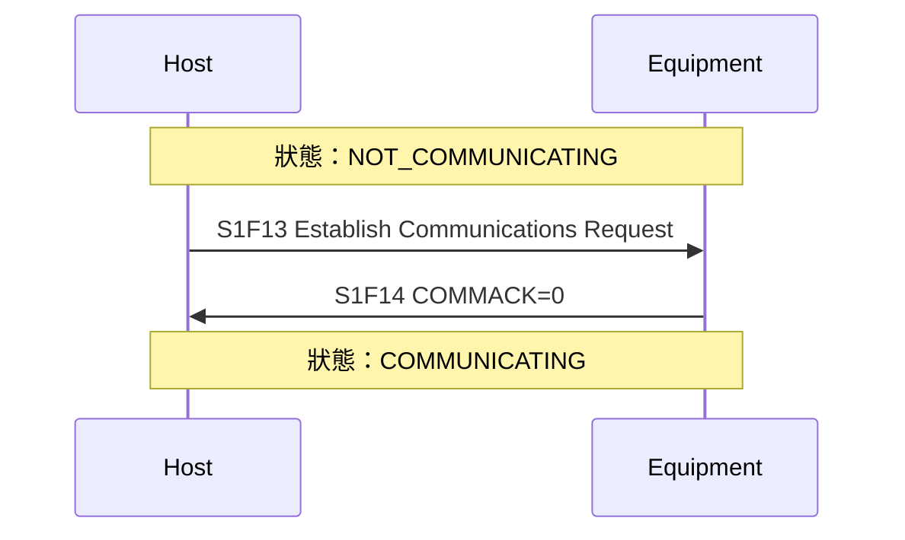

# 🔰 GEM 通訊狀態機

本章節解析 GEM（E30）的 Communication State 狀態機。理解設備如何從斷線走向 COMMUNICATING，是 Host 整合的第一個實戰關卡。

:::info 資料來源聲明
本文狀態機與流程為學習筆記性質之原創整理，**非 SEMI E30 全文轉載**。完整定義請以 [SEMI 官方標準](https://www.semi.org/) 為準。
:::

## 狀態一覽

| 狀態 | 意義 |
|------|------|
| **DISABLED** | 通訊功能關閉 |
| **ENABLED** | 通訊功能開啟，但尚未連線 |
| **NOT_COMMUNICATING** | 已連線（TCP/RS-232），但 SECS 通訊未建立 |
| **COMMUNICATING** | SECS 通訊已建立，可交換業務訊息 |

## 建立通訊：S1F13 → S1F14

進入 COMMUNICATING 的關鍵步驟：

| COMMACK | 意義 | 處理 |
|---------|------|------|
| 0 | Accepted | 進入 COMMUNICATING |
| 1 | Denied | 檢查設備狀態或重試 |

## 心跳維持：S1F1 → S1F2

COMMUNICATING 期間，Host 定期發送 S1F1 確認設備仍回應。若逾時未收到 S1F2，視為通訊中斷，退回 NOT_COMMUNICATING。

## 與 HSMS 的關係

HSMS 層的 TCP 連線（Select.req/rsp）對應 ENABLED → NOT_COMMUNICATING；S1F13/F14 對應 NOT_COMMUNICATING → COMMUNICATING。詳見 [`hsmsConnection`](/docs/secs/protocol-advanced/hsmsConnection)。

## 與其他文章的關聯

- 端到端場景：[`startupScenario`](/docs/secs/gem/startupScenario)
- S1 訊息對照：[`s1-equipmentStatus`](/docs/secs/messages/s1-equipmentStatus)
- 控制狀態機：[`controlState`](/docs/secs/gem/controlState)
- SECS 與 GEM：[`secsAndGem`](/docs/secs/overView/secsAndGem)