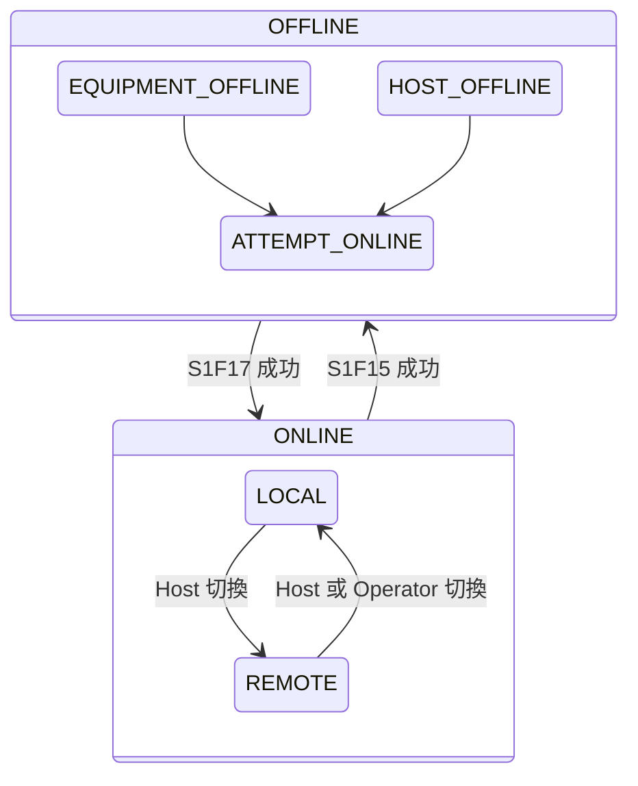

# 🔰 GEM 控制狀態機

本章節解析 GEM 的 Control State。通訊建立後，設備還需經過 OFF-LINE / ON-LINE 與 LOCAL / REMOTE 的轉換，Host 才能真正下達生產指令。

:::info 資料來源聲明
本文為學習筆記性質之原創整理，**非 SEMI E30 全文轉載**。完整定義請以 [SEMI 官方標準](https://www.semi.org/) 為準。
:::

## 狀態層次

## OFF-LINE 子狀態

| 子狀態 | 意義 |
|--------|------|
| **EQUIPMENT OFF-LINE** | 設備端主動下線 |
| **HOST OFF-LINE** | Host 要求下線（S1F15） |
| **ATTEMPT ON-LINE** | 正在嘗試上線 |

## ON-LINE 子狀態

| 子狀態 | 意義 | Host 能遠端控制？ |
|--------|------|------------------|
| **LOCAL** | 本地操作模式 | 有限（視設備而定） |
| **REMOTE** | 遠端控制模式 | 是（S2F41 等指令） |

生產自動化通常要求設備處於 **ON-LINE / REMOTE**。

## 關鍵訊息

| 轉換 | 訊息 | 回覆 |
|------|------|------|
| 請求 OFF-LINE | S1F15 | S1F16（OFLACK） |
| 請求 ON-LINE | S1F17 | S1F18（ONLACK） |

| ONLACK / OFLACK | 意義 |
|-----------------|------|
| 0 | 接受 |
| 1 | 拒絕 |
| 2 | 已在目標狀態 |

## 典型啟動順序

1. HSMS TCP 連線 + Select.req（[`hsmsConnection`](/docs/secs/protocol-advanced/hsmsConnection)）
2. S1F13 → S1F14（Communication State → COMMUNICATING）
3. S1F17 → S1F18（Control State → ON-LINE）
4. 切換至 REMOTE（設備特定方式，通常透過 S2F41 或內建邏輯）
5. 定義事件報告（S2F33–F38）並開始生產

## 與其他文章的關聯

- 通訊狀態機：[`communicationState`](/docs/secs/gem/communicationState)
- S1 訊息：[`s1-equipmentStatus`](/docs/secs/messages/s1-equipmentStatus)
- S2 遠端指令：[`s2-equipmentControl`](/docs/secs/messages/s2-equipmentControl)