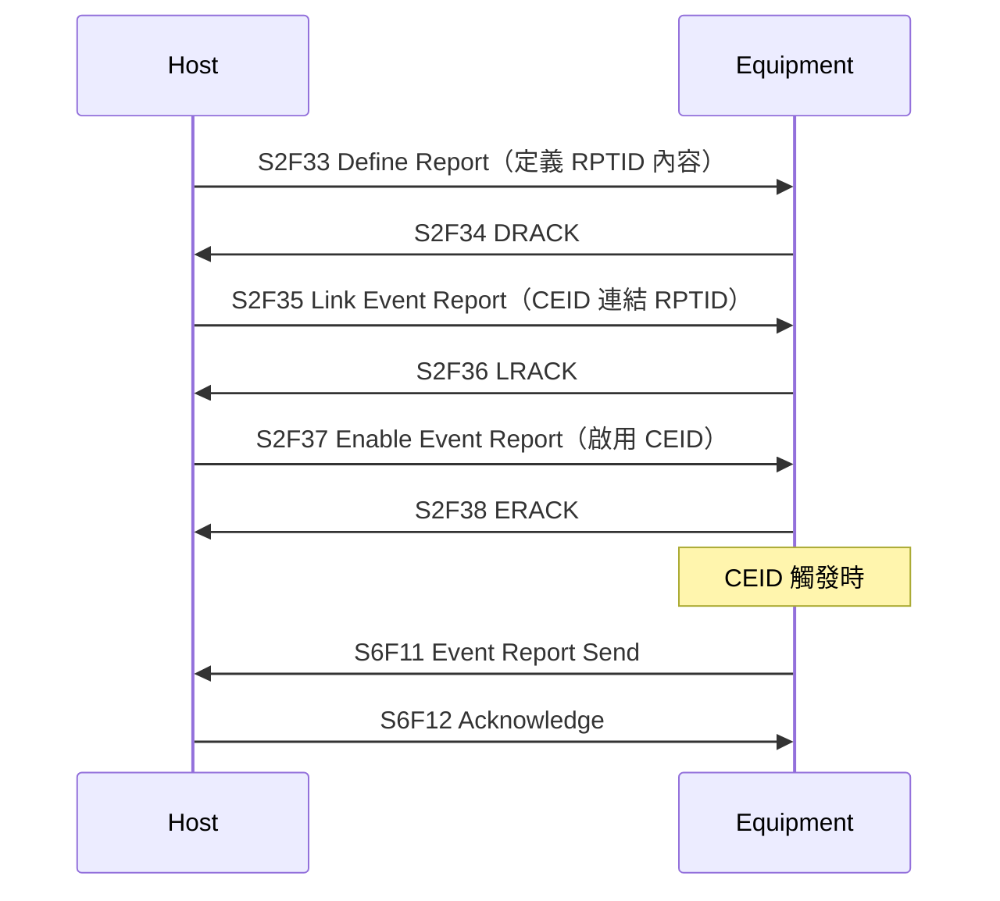

# 🔰 GEM 事件報告

本章節解析 GEM 事件報告（Event Report）的定義與觸發流程。Host 透過 S2 定義「什麼事件要回報什麼資料」，設備在事件發生時以 S6F11 主動推送。

:::info 資料來源聲明
本文為學習筆記性質之原創整理，**非 SEMI E30 全文轉載**。完整定義請以 [SEMI 官方標準](https://www.semi.org/) 為準。
:::

## 核心概念

| 術語 | 全名 | 說明 |
|------|------|------|
| **CEID** | Collection Event ID | 事件編號（如「片盒載入」「製程結束」） |
| **RPTID** | Report ID | 報告編號，定義要回報哪些 VID/SVID |
| **VID** | Variable ID | 變數編號 |
| **DATAID** | Data ID | 事件資料識別碼 |

## 定義流程（四步驟）

## 常見 DRACK / LRACK / ERACK

| 值 | 意義 |
|----|------|
| 0 | 接受 |
| 1 | 拒絕（定義不合法） |
| 2 | 不存在此 ID |
| 3 | 已存在 |

## 與其他文章的關聯

- S2 定義訊息：[`s2-equipmentControl`](/docs/secs/messages/s2-equipmentControl)
- S6 上報訊息：[`s6-dataCollection`](/docs/secs/messages/s6-dataCollection)
- SECS 與 GEM：[`secsAndGem`](/docs/secs/overView/secsAndGem)