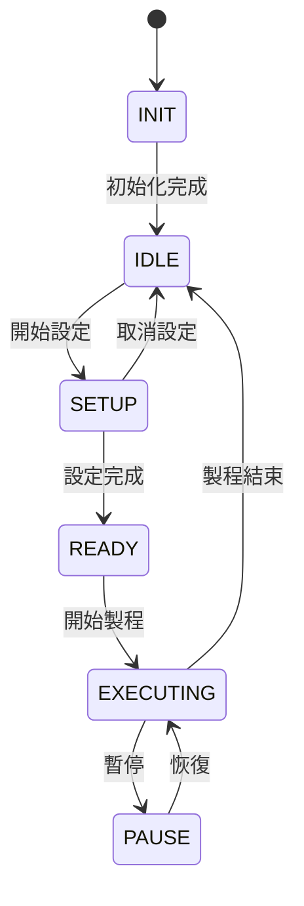
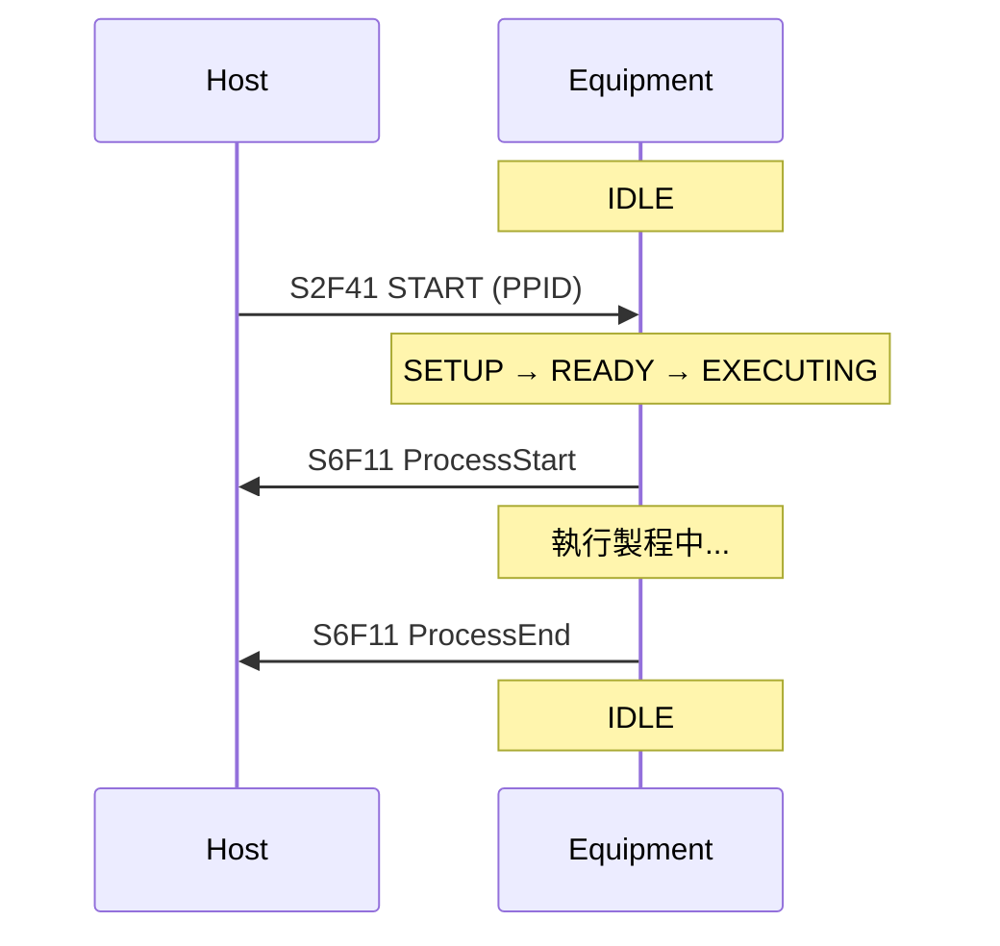

# 🔰 GEM 處理狀態

本章節解析 GEM 的 Processing State（處理狀態）。它描述設備「正在做什麼」——是閒置、設定中、還是執行製程。Host 監控此狀態以判斷能否下指令或上線。

:::info 資料來源聲明
本文狀態定義為學習筆記性質之原創整理，**非 SEMI E30 全文轉載**。完整定義請以 [SEMI 官方標準](https://www.semi.org/) 為準。
:::

## 狀態一覽



| 狀態 | 意義 | Host 常見動作 |
|------|------|--------------|
| **INIT** | 設備開機初始化中 | 等待，不發控制指令 |
| **IDLE** | 閒置，可接受新任務 | 可上線、下配方、下 START |
| **SETUP** | 正在設定（如載入片盒） | 等待 SETUP 完成 |
| **READY** | 設定完成，準備執行 | 可下 START 指令 |
| **EXECUTING** | 正在執行製程 | 監控 S6F11 事件，可下 STOP/ABORT |
| **PAUSE** | 製程暫停 | 等待恢復或中止 |

:::info
並非所有設備都實作全部狀態。有些設備簡化為 IDLE / EXECUTING 兩態。實際狀態清單請查廠商 Spec 或 SVID。
:::

## 如何查詢 Processing State

Processing State 通常作為 **SVID（Status Variable）** 回報，Host 以 `S1F3 → S1F4` 查詢：

```yaml
# S1F3 請求示意
L 1
  U4 1 1002    # SVID = ProcessState（編號因設備而異）

# S1F4 回覆示意
L 1
  U1 1 4       # 值 = 4，可能代表 EXECUTING（對照廠商文件）
```

也可用 `S1F11 → S1F12` 先取得 SVID 名稱清單，找到 `ProcessState` 或類似名稱的編號。

## 與 Control State 的關係

Processing State 和 Control State（ON-LINE / REMOTE）是**獨立維度**：

| Control State | Processing State | 能否下 START？ |
|---------------|------------------|---------------|
| OFF-LINE | IDLE | 否（需先上線） |
| ON-LINE / REMOTE | IDLE | 是 |
| ON-LINE / REMOTE | EXECUTING | 否（已在跑） |
| ON-LINE / LOCAL | IDLE | 視設備而定 |

設備拒絕 ON-LINE（ONLACK=1）有時是因為 Processing State 仍在 INIT。

## 與事件報告的關係

狀態轉換常觸發 **CEID** 事件，Host 透過 S6F11 收到通知：

| 狀態轉換 | 常見 CEID 語意 |
|----------|---------------|
| IDLE → EXECUTING | ProcessStart |
| EXECUTING → IDLE | ProcessEnd |
| → PAUSE | ProcessPaused |

事件定義見 [eventReport](/docs/secs/gem/eventReport)。

## 典型生產中的狀態流



完整場景見 [startupScenario](/docs/secs/gem/startupScenario)。

## 與其他文章的關聯

- 控制狀態：[`controlState`](/docs/secs/gem/controlState)
- S1 狀態查詢：[`s1-equipmentStatus`](/docs/secs/messages/s1-equipmentStatus)
- S7 配方：[`s7-recipe`](/docs/secs/messages/s7-recipe)
- 術語：[`glossary`](/docs/secs/basics/glossary)