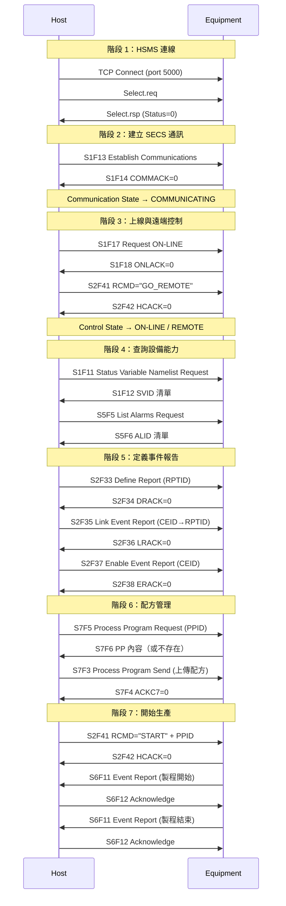

# 🔰 GEM 端到端啟動場景

本章節把分散在各篇文章的知識串成一條故事線：Host 從零開始連上一台設備，完成通訊建立、上線、定義事件、下載配方，直到設備回報生產事件。讀完本篇，你應能向同事描述完整的 SECS 啟動流程。

:::info 資料來源聲明
本文場景流程為學習筆記性質之原創整理，**非 SEMI E30 全文轉載**。實際設備步驟可能因廠牌而異，請以設備廠商 SECS Interface Specification 為準。
:::

## 場景設定

- **Host**：FAB 中央 EAP / MES 系統
- **Equipment**：一台製程機台（Passive 模式，監聽 TCP 5000）
- **目標**：設備進入 ON-LINE / REMOTE，定義事件報告，下載配方並開始生產

## 完整時序圖

## 七個階段說明

### 階段 1：HSMS 連線

Host 主動連入 Equipment 的 IP:5000，送出 `Select.req`。Equipment 回 `Select.rsp Status=0` 表示 Session 建立。

- 若 TCP 連不上 → 檢查網路、防火牆、Equipment IP
- 若 Select 逾時 → 檢查 T7 計時器，見 [hsmsConnection](/docs/secs/protocol-advanced/hsmsConnection)

### 階段 2：建立 SECS 通訊

`S1F13 → S1F14`，COMMACK=0 後進入 **COMMUNICATING**。這是 GEM 啟動的硬性門檻。

詳見 [communicationState](/docs/secs/gem/communicationState)。

### 階段 3：上線與遠端控制

`S1F17 → S1F18` 讓設備進入 ON-LINE。多數設備還需切換到 **REMOTE** 才接受 S2F41 指令——實作方式因廠牌而異，常見為 `S2F41 RCMD="GO_REMOTE"` 或設備內建邏輯。

詳見 [controlState](/docs/secs/gem/controlState)。

### 階段 4：查詢設備能力

啟動後 Host 通常會：

- `S1F11 → S1F12`：取得支援的 SVID 清單
- `S5F5 → S5F6`：取得 ALID 清單，再決定啟用哪些警報

這一步讓 Host 知道「這台機台能回報什麼」。

### 階段 5：定義事件報告

四步驟定義鏈：`S2F33 → S2F35 → S2F37`，分別定義 RPTID 內容、連結 CEID、啟用 CEID。之後設備在事件觸發時會主動發 `S6F11`。

詳見 [eventReport](/docs/secs/gem/eventReport)。

### 階段 6：配方管理

Host 可先 `S7F5` 查詢設備上是否已有配方，再以 `S7F3` 上傳新配方。PPID 是配方的唯一識別名稱。

詳見 [s7-recipe](/docs/secs/messages/s7-recipe)。

### 階段 7：開始生產

Host 以 `S2F41 RCMD="START"` 搭配 PPID 參數啟動製程。設備在關鍵節點發送 `S6F11` 事件（如 ProcessStart、ProcessEnd），Host 以 `S6F12` 確認收到。

Processing State 會在過程中從 IDLE 轉為 EXECUTING，詳見 [processingState](/docs/secs/gem/processingState)。

## 平行進行的背景機制

| 機制 | 訊息 | 說明 |
|------|------|------|
| 心跳 | S1F1 → S1F2 | COMMUNICATING 期間定期確認在線 |
| HSMS 心跳 | Linktest.req/rsp | TCP 層連線存活確認 |
| 警報上報 | S5F1 | 設備異常時主動推送，不需 Host 請求 |
| 錯誤回覆 | S9F1 | 收到無效訊息時 Equipment 回報 |

## 常見卡關點

| 現象 | 可能原因 | 查哪篇 |
|------|----------|--------|
| TCP 連不上 | IP/Port 錯誤、防火牆 | [hsmsConnection](/docs/secs/protocol-advanced/hsmsConnection) |
| S1F14 COMMACK≠0 | 設備未就緒或已在通訊中 | [communicationState](/docs/secs/gem/communicationState) |
| S1F18 ONLACK=1 | 設備拒絕上線（如 Processing State 不允許） | [controlState](/docs/secs/gem/controlState) |
| S2F42 HCACK≠0 | 不在 REMOTE 或 RCMD 不支援 | [s2-equipmentControl](/docs/secs/messages/s2-equipmentControl) |
| 收不到 S6F11 | CEID 未定義或未啟用 | [eventReport](/docs/secs/gem/eventReport) |
| T3 逾時 | 對端未回覆 W=1 訊息 | [secsGemTesting](/docs/secs/protocol-advanced/secsGemTesting) |

## 與其他文章的關聯

- 學習路徑：[`index`](/docs/secs/index)
- 術語查詢：[`glossary`](/docs/secs/basics/glossary)
- 測試除錯：[`secsGemTesting`](/docs/secs/protocol-advanced/secsGemTesting)