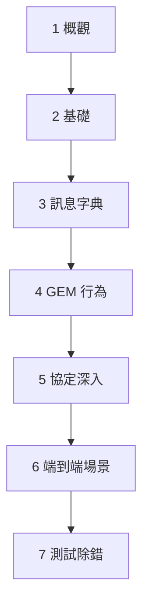

# 🔰 SECS 學習路徑

本章節是 SECS 系列的導航首頁。若你從未接觸過半導體設備通訊，依下方順序讀完整系列，即可建立「概念懂、實務能對話」的基礎。

## 適用對象

- 剛進入 FAB 自動化、MES、EAP 領域的工程師
- 需要與設備廠商對接 SECS Interface 的開發者
- 想快速搞懂 `S1F12`、`S2F41` 等代號意義的讀者

**先修知識：無。** 本系列從 Host / Equipment 架構講起。

## 建議閱讀順序

### 第一階段：建立全局觀（概觀）

| 順序 | 文章 | 讀完能回答 |
|------|------|-----------|
| 1 | [SECS 簡介](/docs/secs/overView/aboutSECS) | SECS 是什麼？Host 和 Equipment 各做什麼？ |
| 2 | [SECS 通訊協定](/docs/secs/overView/protocol) | SECS-I、SECS-II、HSMS 怎麼分工？ |
| 3 | [SECS 與 GEM](/docs/secs/overView/secsAndGem) | GEM 在 SECS 之上加了什麼行為？ |

### 第二階段：讀懂訊息代號（基礎）

| 順序 | 文章 | 讀完能回答 |
|------|------|-----------|
| 4 | [SECS-II 訊息結構](/docs/secs/basics/secsStructure) | SxFy、W-Bit、Data Item 是什麼？ |
| 5 | [術語表](/docs/secs/basics/glossary) | SVID、CEID、PPID、HCACK 各代表什麼？ |

### 第三階段：查訊息字典（Messages）

| 順序 | 文章 | 讀完能回答 |
|------|------|-----------|
| 6 | [Stream 總覽](/docs/secs/messages/streamOverview) | S1–S10 各管什麼？ |
| 7 | [S1 設備狀態](/docs/secs/messages/s1-equipmentStatus) | S1F12、S1F13 等怎麼用？ |
| 8 | [S2 設備控制](/docs/secs/messages/s2-equipmentControl) | 遠端指令 S2F41 怎麼下？ |
| 9 | [S5 警報](/docs/secs/messages/s5-alarm) | 設備怎麼上報 ALID？ |
| 10 | [S6 資料收集](/docs/secs/messages/s6-dataCollection) | S6F11 事件資料長什麼樣？ |
| 11 | [S7 配方管理](/docs/secs/messages/s7-recipe) | PPID 怎麼上傳下載？ |
| 12 | [S9 錯誤訊息](/docs/secs/messages/s9-error) | 收到 S9F1 代表什麼？ |
| 選讀 | [S3/S4 材料搬運](/docs/secs/messages/s3-s4-material) | 晶圓搬運相關 Stream（進階場景） |

### 第四階段：理解設備行為（GEM）

| 順序 | 文章 | 讀完能回答 |
|------|------|-----------|
| 13 | [通訊狀態機](/docs/secs/gem/communicationState) | 怎麼從斷線到 COMMUNICATING？ |
| 14 | [控制狀態機](/docs/secs/gem/controlState) | ON-LINE / REMOTE 怎麼切？ |
| 15 | [處理狀態](/docs/secs/gem/processingState) | IDLE、EXECUTING 代表什麼？ |
| 16 | [事件報告](/docs/secs/gem/eventReport) | CEID、RPTID 怎麼定義？ |
| 17 | [警報管理](/docs/secs/gem/alarmManagement) | GEM 層怎麼管理 ALID？ |
| 18 | [端到端啟動場景](/docs/secs/gem/startupScenario) | 從連線到生產的完整時序 |

### 第五階段：協定與實務（Protocol + 除錯）

| 順序 | 文章 | 讀完能回答 |
|------|------|-----------|
| 19 | [HSMS 訊息格式](/docs/secs/protocol-advanced/hsmsMessage) | 10-byte Header 各欄位意義 |
| 20 | [HSMS 連線生命週期](/docs/secs/protocol-advanced/hsmsConnection) | Select.req、T3 逾時怎麼除錯？ |
| 21 | [SECS-I 區塊傳輸](/docs/secs/protocol-advanced/secs1BlockTransfer) | 老設備 RS-232 怎麼傳？ |
| 22 | [測試與除錯入門](/docs/secs/protocol-advanced/secsGemTesting) | Log 怎麼看？常見失敗怎麼判斷？ |

## 讀完整系列後，你應該能

- 說清 **SECS / GEM / HSMS** 三層各自負責什麼
- 查任意常見 **SxFy**（S1/S2/S5/S6/S7/S9）並理解用途
- 描述設備從 **TCP 連線 → 通訊建立 → 上線 → 定義事件 → 下配方** 的訊息時序
- 閱讀 SECS log、與廠商討論 **COMMACK、HCACK、DRACK** 等回覆碼
- 判斷常見連線問題是 **HSMS 層**還是 **GEM 層**的問題

## 本系列不涵蓋

- SEMI 標準全文的逐條實作細節
- 各廠牌設備的 Capability 差異（請查廠商 Interface Spec）
- Host 端 SECS driver 的程式碼實作

## 快速查詢

- 不知道代號？→ 先查 [Stream 總覽](/docs/secs/messages/streamOverview)，再進對應 Stream 文章
- 不知道縮寫？→ [術語表](/docs/secs/basics/glossary)
- 想看完整流程？→ [端到端啟動場景](/docs/secs/gem/startupScenario)