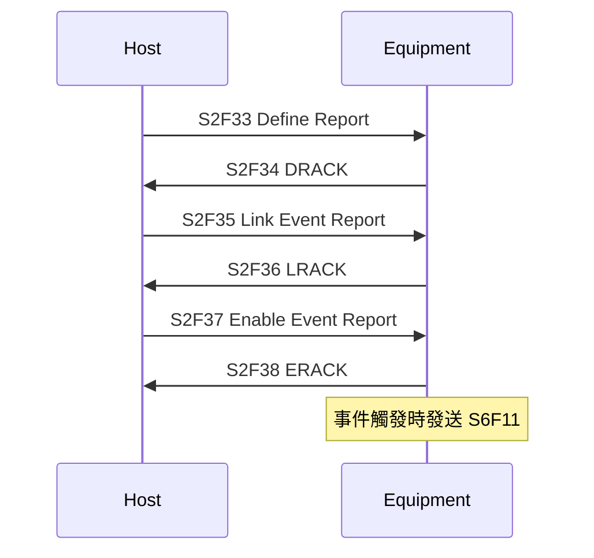

# 🔰 S2 設備控制 Stream

本章節整理 S2（Equipment Control and Diagnostics）的常用訊息。S2 是 Host 下達遠端指令與定義事件報告的核心 Stream。

:::info 資料來源聲明
本文為學習筆記性質之原創整理，**非 SEMI 標準全文轉載**。完整格式請以 [SEMI 官方標準](https://www.semi.org/) 或設備廠商 Spec 為準。
:::

## 常用訊息對照表

| 代號 | 標準名稱 | 方向 | 配對 | 用途摘要 |
|------|----------|------|------|----------|
| **S2F13** | Equipment Constant Request | H→E | → S2F14 | 請求設備常數（ECID）值 |
| **S2F14** | Equipment Constant Data | E→H | ← S2F13 | 回覆 ECID 值 |
| **S2F15** | New Equipment Constant Send | H→E | → S2F16 | 設定新常數值 |
| **S2F16** | New Equipment Constant Acknowledge | E→H | ← S2F15 | 回覆設定結果（EAC） |
| **S2F17** | Date and Time Request | H→E | → S2F18 | 請求設備日期時間 |
| **S2F18** | Date and Time Data | E→H | ← S2F17 | 回覆日期時間 |
| **S2F23** | Trace Initialize Send | H→E | → S2F24 | 啟動資料追蹤 |
| **S2F24** | Trace Initialize Acknowledge | E→H | ← S2F23 | 回覆追蹤啟動結果 |
| **S2F33** | Define Report | H→E | → S2F34 | 定義事件報告內容（RPTID） |
| **S2F34** | Define Report Acknowledge | E→H | ← S2F33 | 回覆定義結果（DRACK） |
| **S2F35** | Link Event Report | H→E | → S2F36 | 將 CEID 連結到 RPTID |
| **S2F36** | Link Event Report Acknowledge | E→H | ← S2F35 | 回覆連結結果（LRACK） |
| **S2F37** | Enable/Disable Event Report | H→E | → S2F38 | 啟用或停用事件報告 |
| **S2F38** | Enable/Disable Event Report Ack | E→H | ← S2F37 | 回覆啟用/停用結果（ERACK） |
| **S2F41** | Host Command Send | H→E | → S2F42 | 發送遠端指令（RCMD） |
| **S2F42** | Host Command Acknowledge | E→H | ← S2F41 | 回覆指令結果（HCACK） |

## 重點：S2F41 → S2F42 Remote Command

GEM 中最常用的控制訊息。Host 透過 RCMD 下達標準化指令。

```yaml
# S2F41 Body 示意
L 2
  A 13 "START"          # RCMD 指令名稱
  L 1                   # 參數列表
    L 2
      A 4 "PPID"
      A 8 "RECIPE01"

# S2F42 Body 示意
B 1 0                   # HCACK = 0（已執行）
```

### HCACK 常見值

| HCACK | 意義 |
|-------|------|
| 0 | 已執行 / Accepted |
| 1 | 不存在此指令 |
| 2 | 目前無法執行 |
| 3 | 參數錯誤 |
| 4 | 已接受，將稍後執行 |

## 事件報告定義流程（S2F33–F38）



詳見 [`eventReport`](/docs/secs/gem/eventReport)。

## 與其他文章的關聯

- 訊息結構範例：[`secsStructure`](/docs/secs/basics/secsStructure)
- S6 事件資料：[`s6-dataCollection`](/docs/secs/messages/s6-dataCollection)
- Stream 總覽：[`streamOverview`](/docs/secs/messages/streamOverview)