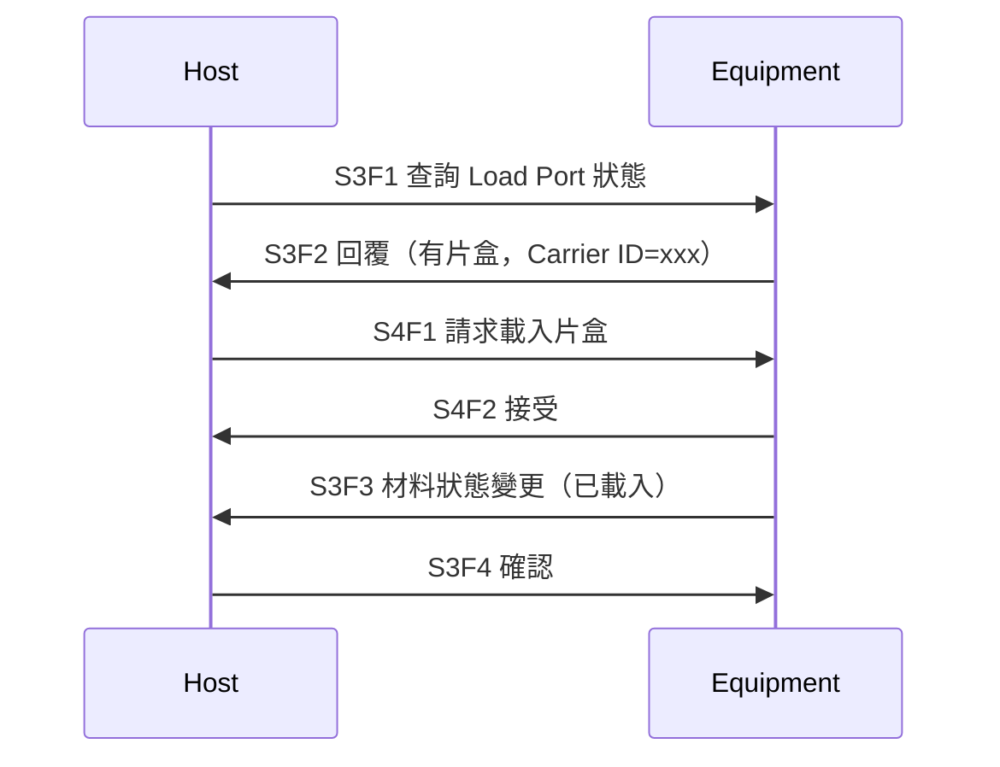

# 🔰 S3/S4 材料搬運 Stream

本章節入門介紹 S3（Material Status）與 S4（Material Control）。這兩個 Stream 主要用於**晶圓、片盒（Carrier/FOUP）的狀態查詢與搬運控制**，在自動化搬送（Stocker、OHT）與設備 Load Port 場景中較常見。

:::info 資料來源聲明
本文為學習筆記性質之原創整理，**非 SEMI 標準全文轉載**。完整格式請以 [SEMI 官方標準](https://www.semi.org/) 或設備廠商 Spec 為準。
:::

## 何時需要 S3/S4

| 場景 | 相關 Stream |
|------|------------|
| 查詢 Load Port 是否有片盒 | S3 |
| 查詢片盒內晶圓位置與狀態 | S3 |
| 請求設備載入/卸載片盒 | S4 |
| 自動搬送系統與設備交接 | S3 + S4 |

若你負責的是純製程機台通訊（不涉及搬送），S1/S2/S6/S7 通常已足夠，S3/S4 可選讀。

## S3：Material Status（狀態查詢）

S3 讓 Host **查詢**材料相關資訊，不直接執行搬運動作。

| 代號 | 標準名稱 | 方向 | 用途摘要 |
|------|----------|------|----------|
| **S3F1** | Material Status Request | H→E | 請求指定材料的狀態 |
| **S3F2** | Material Status Data | E→H | 回覆材料狀態 |
| **S3F3** | Material Status Change | E→H | 設備主動通知材料狀態變更 |
| **S3F4** | Material Status Confirm | H→E | Host 確認收到 S3F3 |
| **S3F5** | Material Foundry Status Request | H→E | 請求晶圓廠狀態（較少見） |
| **S3F6** | Material Foundry Status Data | E→H | 回覆晶圓廠狀態 |

### 常見查詢內容

- Load Port 上是否有 Carrier
- Carrier ID（片盒識別碼）
- Slot Map（各槽位是否有晶圓）

## S4：Material Control（搬運控制）

S4 讓 Host **下達搬運指令**，如載入、卸載、移動材料。

| 代號 | 標準名稱 | 方向 | 用途摘要 |
|------|----------|------|----------|
| **S4F1** | Material Transfer Request | H→E | 請求搬運材料 |
| **S4F2** | Material Transfer Acknowledge | E→H | 回覆搬運請求結果 |
| **S4F3** | Material Ready to Send | E→H | 設備準備好送出材料 |
| **S4F4** | Material Ready to Receive | H→E | Host 準備好接收 |
| **S4F5** | Material Transfer Complete | E→H | 搬運完成通知 |
| **S4F6** | Material Transfer Complete Ack | H→E | Host 確認搬運完成 |

## 簡化流程示意

實際流程因設備類型（Etcher、Stocker、AMHS）差異很大，以上僅為概念示意。

## 與 GEM 的關係

材料搬運事件常透過 **S6F11** 上報（如 CarrierArrived、CarrierRemoved），CEID 定義方式與一般事件相同，見 [eventReport](/docs/secs/gem/eventReport)。

## 與其他文章的關聯

- Stream 總覽：[`streamOverview`](/docs/secs/messages/streamOverview)
- 事件報告：[`eventReport`](/docs/secs/gem/eventReport)
- 學習路徑：[`index`](/docs/secs/index)