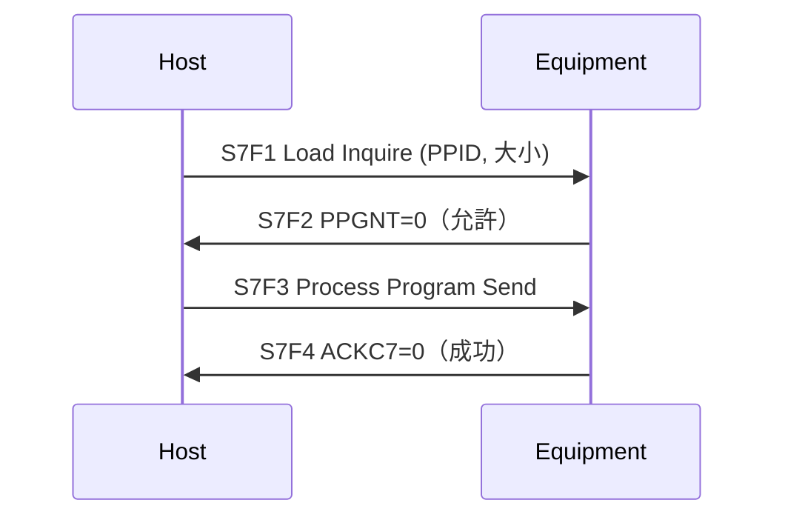
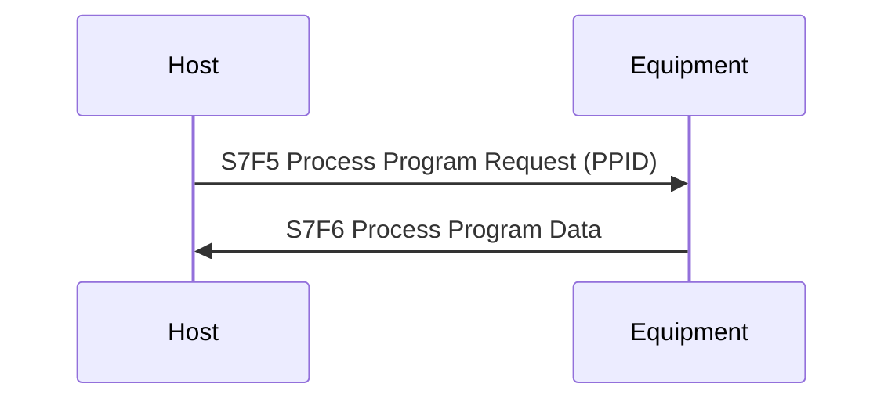

# 🔰 S7 配方管理 Stream

本章節整理 S7（Process Program Management）的訊息對照。配方（Process Program, PP）是設備執行製程的參數集合，**PPID** 是其唯一識別名稱。Host 透過 S7 上傳、查詢、刪除配方，是 GEM 生產流程的核心能力之一。

:::info 資料來源聲明
本文 SxFy 名稱與用途摘要整理自 SEMI E5（SECS-II）公開慣例與產業實務，為學習筆記性質之原創整理，**非 SEMI 標準全文轉載**。完整訊息格式請以 [SEMI 官方標準](https://www.semi.org/) 或設備廠商 SECS Interface Specification 為準。
:::

## Stream 職責

S7 管理設備上的 **Process Program（PP）**：

- Host 上傳配方到設備（Download）
- Host 從設備下載配方（Upload）
- Host 刪除設備上的配方
- Host 查詢設備支援哪些 PPID

## 完整訊息對照表

| 代號 | 標準名稱 | 方向 | 配對 | 用途摘要 |
|------|----------|------|------|----------|
| **S7F1** | Process Program Load Inquire | H→E | → S7F2 | 詢問設備是否有足夠空間載入配方 |
| **S7F2** | Process Program Load Grant | E→H | ← S7F1 | 回覆是否允許載入（PPGNT） |
| **S7F3** | Process Program Send | H→E | → S7F4 | 上傳配方內容到設備 |
| **S7F4** | Process Program Acknowledge | E→H | ← S7F3 | 回覆上傳結果（ACKC7） |
| **S7F5** | Process Program Request | H→E | → S7F6 | 請求下載指定 PPID 的配方 |
| **S7F6** | Process Program Data | E→H | ← S7F5 | 回覆配方內容 |
| **S7F17** | Delete Process Program Send | H→E | → S7F18 | 刪除指定 PPID |
| **S7F18** | Delete Process Program Acknowledge | E→H | ← S7F17 | 回覆刪除結果（ACKC7） |
| **S7F19** | Current Process Program Dir Request | H→E | → S7F20 | 請求設備上所有 PPID 清單 |
| **S7F20** | Current Process Program Dir Data | E→H | ← S7F19 | 回覆 PPID 清單 |

:::caution
S7F7–F16 等進階訊息（如 Formatted PP）因設備而異，入門階段以 S7F1–F6 與 S7F17–F20 為主。實際支援清單請查廠商 Capability 文件。
:::

## 核心概念：PPID

**PPID（Process Program ID）** 是配方的名稱或編號，通常為 ASCII 字串。

```yaml
# S7F3 Body 示意（上傳配方）
L 2
  A 8 "RECIPE01"     # PPID
  B 1 0              # PP Body（實際格式因設備而異，可能是 B[n] 或 L...）
```

同一台設備上每個 PPID 唯一。Host 下達 `S2F41 START` 時常帶 PPID 參數指定要用哪個配方。

## 典型流程

### 上傳配方（Host → Equipment）



| PPGNT | 意義 |
|-------|------|
| 0 | 允許載入 |
| 1 | 空間不足 |
| 2 | PPID 已存在且不允許覆寫 |

| ACKC7 | 意義 |
|-------|------|
| 0 | 接受 |
| 1 | 拒絕（格式錯誤等） |

### 下載配方（Equipment → Host）



若 PPID 不存在，設備可能回 S9F7 或 S7F6 中含錯誤指示，視廠牌實作而定。

### 查詢配方清單

`S7F19 → S7F20` 回覆設備上所有 PPID，Host 啟動時常用此步驟確認設備狀態。

## 與生產流程的關係

1. Host 以 S7 上傳或確認配方存在
2. Host 以 `S2F41 RCMD="START"` + PPID 啟動製程
3. 設備以 S6F11 回報 ProcessStart / ProcessEnd 事件

完整時序見 [startupScenario](/docs/secs/gem/startupScenario)。

## 與其他文章的關聯

- 遠端指令 START：[`s2-equipmentControl`](/docs/secs/messages/s2-equipmentControl)
- 處理狀態：[`processingState`](/docs/secs/gem/processingState)
- Stream 總覽：[`streamOverview`](/docs/secs/messages/streamOverview)
- 術語：[`glossary`](/docs/secs/basics/glossary)