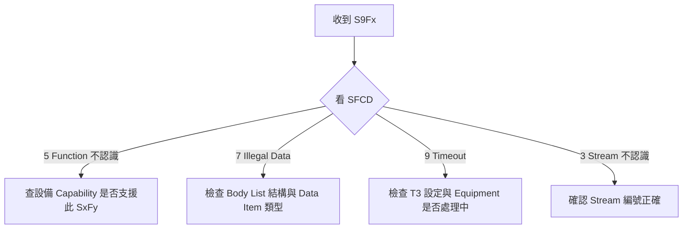

# 🔰 S9 錯誤訊息 Stream

本章節整理 S9（Error Messages）Stream。當 Host 或 Equipment 收到無法處理的訊息時，S9 負責回報錯誤原因——是除錯 SECS 通訊的必備知識。

:::info 資料來源聲明
本文為學習筆記性質之原創整理，**非 SEMI 標準全文轉載**。完整格式請以 [SEMI 官方標準](https://www.semi.org/) 或設備廠商 Spec 為準。
:::

## S9 的特殊性

S9 **不遵循**一般「奇數 Primary、偶數 Reply」的配對規則。它專門用於**錯誤回覆**，由接收方在無法處理訊息時主動發送。

## 常用訊息對照表

| 代號 | 標準名稱 | 方向 | 用途摘要 |
|------|----------|------|----------|
| **S9F1** | Unrecognized Device ID | E→H 或 H→E | 不認識的 Device ID |
| **S9F3** | Unrecognized Stream Type | E→H 或 H→E | 不認識的 Stream 編號 |
| **S9F5** | Unrecognized Function Type | E→H 或 H→E | 不認識的 Function 編號 |
| **S9F7** | Illegal Data | E→H 或 H→E | 資料格式或內容不合法 |
| **S9F9** | Transaction Timer Timeout | E→H 或 H→E | 交易逾時（T3 超時） |
| **S9F11** | Data Too Long | E→H 或 H→E | 訊息資料過長 |
| **S9F13** | Conversation Timeout | E→H 或 H→E | 對話逾時 |

## 重點：S9F1 結構

最常見的錯誤回覆，Body 包含原始訊息的 Header 資訊：

```yaml
# S9F7 Illegal Data 示意
B 1 7                # SFCD = 7（Illegal Data）
B 10 <original_header_bytes>  # 造成錯誤的原始訊息標頭
```

### 常見 SFCD 白話解讀

| SFCD | 訊息 | 常見原因 |
|------|------|----------|
| 1 | Unrecognized Device ID | Session/Device ID 不符 |
| 3 | Unrecognized Stream Type | 設備不支援該 Stream |
| 5 | Unrecognized Function Type | 設備不支援該 Function |
| 7 | Illegal Data | Body 結構或 Data Item 類型錯誤 |
| 9 | Transaction Timer Timeout | 發送後 T3 內未收到回覆 |
| 11 | Data Too Long | 訊息超過長度限制 |

## 除錯流程



## 與其他文章的關聯

- 訊息結構：[`secsStructure`](/docs/secs/basics/secsStructure)
- HSMS 計時器 T3：[`hsmsConnection`](/docs/secs/protocol-advanced/hsmsConnection)
- Stream 總覽：[`streamOverview`](/docs/secs/messages/streamOverview)