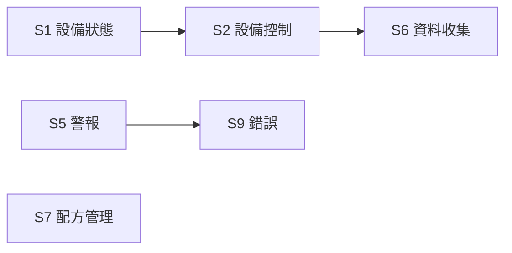

# 🔰 Stream 總覽

本章節提供 SECS-II 十大 Stream 的導航地圖。每個 Stream 是一個訊息主題分類，底下有多則 `SxFy` 訊息，各自有標準名稱與用途。

:::info 資料來源聲明
本文 SxFy 名稱與用途摘要整理自 SEMI E5（SECS-II）公開慣例與產業實務，為學習筆記性質之原創整理，**非 SEMI 標準全文轉載**。完整訊息格式請以 [SEMI 官方標準](https://www.semi.org/) 或設備廠商 SECS Interface Specification 為準。
:::

## Stream 地圖

| Stream | 名稱 | 職責摘要 | 深入文章 |
|--------|------|----------|----------|
| **S1** | Equipment Status | 在線確認、通訊建立、上下線、狀態變數查詢 | [`s1-equipmentStatus`](/docs/secs/messages/s1-equipmentStatus) |
| **S2** | Equipment Control | 遠端指令、事件報告定義、常數/變數設定 | [`s2-equipmentControl`](/docs/secs/messages/s2-equipmentControl) |
| **S3** | Material Status | 材料（晶圓/片盒）狀態查詢 | 待撰寫 |
| **S4** | Material Control | 材料搬運與控制 | 待撰寫 |
| **S5** | Exception / Alarm | 警報上報、啟用/停用、查詢 | [`s5-alarm`](/docs/secs/messages/s5-alarm) |
| **S6** | Data Collection | 事件資料收集與追蹤 | [`s6-dataCollection`](/docs/secs/messages/s6-dataCollection) |
| **S7** | Process Program | 配方（PP）上傳、下載、刪除 | 待撰寫 |
| **S8** | Control Program | 控制程式傳輸 | 待撰寫 |
| **S9** | Error Messages | 錯誤回報（不遵循奇偶配對） | [`s9-error`](/docs/secs/messages/s9-error) |
| **S10** | Terminal Services | 終端機訊息顯示 | 待撰寫 |

## 最常用的訊息配對（入門必記）

| 配對 | 用途 |
|------|------|
| S1F1 → S1F2 | 心跳 / 在線確認 |
| S1F13 → S1F14 | 建立通訊（GEM 啟動必經） |
| S1F15 → S1F16 | 請求 OFF-LINE |
| S1F17 → S1F18 | 請求 ON-LINE |
| S1F11 → S1F12 | 查詢狀態變數名稱清單 |
| S1F3 → S1F4 | 查詢指定狀態變數值 |
| S2F41 → S2F42 | 遠端指令（Remote Command） |
| S5F1 | 警報主動上報（Equipment 發送） |
| S6F11 | 事件資料上報（Collection Event） |
| S9F1 | 對無效訊息的錯誤回覆 |

## 如何查一個代號？

1. 看 **S 數字** → 找到上表對應 Stream 文章
2. 在該 Stream 的 **完整對照表** 中查 **F 數字**
3. 例如 `S1F12` → S1 文章 → Status Variable Namelist Reply

## 與其他文章的關聯

- 訊息結構 SxFy：[`secsStructure`](/docs/secs/basics/secsStructure)
- SECS 與 GEM：[`secsAndGem`](/docs/secs/overView/secsAndGem)