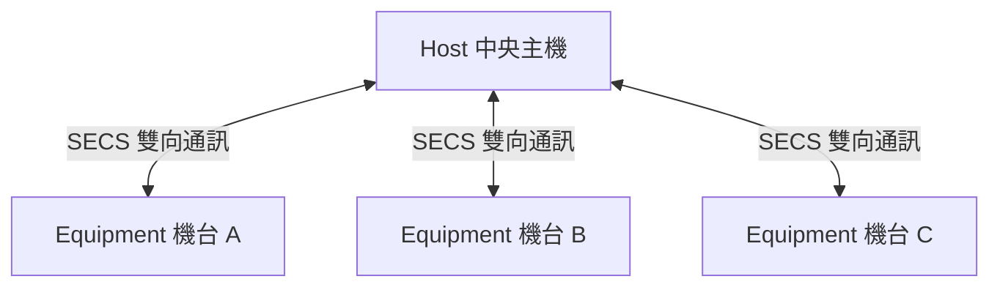

# 🔰 SECS 簡介

本章節介紹半導體工廠自動化的通訊基石——SECS。理解 Host 與 Equipment 的主從架構，是後續學習 SxFy 訊息與 GEM 行為模型的起點。

## 什麼是 SECS？

想像一座巨大的半導體工廠裡有數百台來自不同製造商的機器，要如何讓它們與中央控制系統有效溝通、協同工作？

答案就是 **SECS (Semiconductor Equipment Communication Standard)**。

SECS 是由國際半導體產業協會 (SEMI) 制定的「溝通語言」與「訊息格式」標準，確保不論機台品牌或新舊，都能用同一套語言與主機對話。

## 兩個主要角色：Host 與 Equipment

| 角色 | 職責 |
|------|------|
| **Host（主機）** | 工廠中央控制電腦，發送指令、收集數據、監控設備 |
| **Equipment（設備）** | 蝕刻機、清洗機等機台，執行任務並回報狀態 |

這種 **Host-Equipment** 主從式架構讓工廠管理有效率且可擴展。

## SECS 為何如此重要？

1. **標準化**：主機不需為每台設備學習新語言，降低整合成本
2. **即時性**：警報、完成訊號可即時傳遞，Host 迅速反應
3. **可靠性**：穩定的訊息交換機制，可追蹤傳遞狀態
4. **擴充性**：新設備遵循 SECS 即可加入現有系統

## SECS 與其他通訊標準的比較

| 標準 | 主要應用場景 | 模型 | 特點 |
|------|-------------|------|------|
| **SECS/GEM** | 半導體、電子組裝 | Host / Equipment | 專為 FAB 自動化設計 |
| **OPC UA** | 工業自動化 | Client / Server | 跨平台、安全性高 |
| **MQTT** | 物聯網 (IoT) | Publish / Subscribe | 輕量、低頻寬 |

## 與其他文章的關聯

- 通訊協定（SECS-I / HSMS）：[`protocol`](/docs/secs/overView/protocol)
- SECS 與 GEM 關係：[`secsAndGem`](/docs/secs/overView/secsAndGem)
- 訊息結構 SxFy：[`secsStructure`](/docs/secs/basics/secsStructure)
- Stream 訊息總覽：[`streamOverview`](/docs/secs/messages/streamOverview)