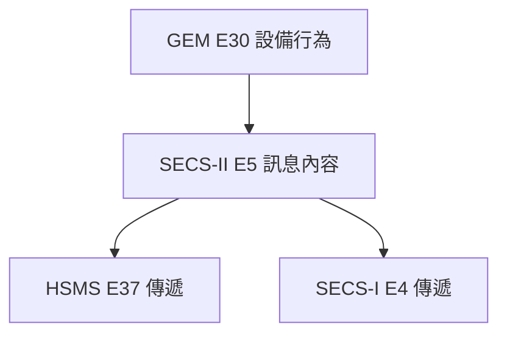

# 🔰 SECS 通訊協定

本章節解析 SECS 訊息如何從 Host 傳到 Equipment。SECS-II 定義「說什麼」，SECS-I 與 HSMS 定義「怎麼傳」——兩者分離是理解整個架構的關鍵。

## 1. SECS-II (SEMI E5)：信件的內容

**SECS-II** 定義訊息的內容與格式：

- 說什麼（例如 `S1F1` = Are You There）
- 怎麼組織（List、ASCII、Integer 等 Data Item）

無論使用 SECS-I 或 HSMS 傳遞，**SECS-II 訊息內容相同**。

> SECS-II 是溝通的**核心內容**，與傳遞方式無關。

訊息代號詳見 [`streamOverview`](/docs/secs/messages/streamOverview)。

## 2. 傳遞方式：SECS-I vs HSMS

### 2.1 SECS-I (SEMI E4)：RS-232 序列埠

- 底層：**RS-232** 序列埠（COM Port）
- 模式：點對點專線，一線一機
- 速度：常見預設 **9600 bps**（實作可更高）
- 距離：約 15 公尺以內
- 傳輸單位：以 **Block** 為單位，含長度、序號與 **Checksum**，透過 ENQ/EOT/ACK/NAK 握手

適用：老舊設備、單機連線。深入說明見 [`secs1BlockTransfer`](/docs/secs/protocol-advanced/secs1BlockTransfer)。

### 2.2 HSMS (SEMI E37)：TCP/IP 網路

- 底層：**TCP/IP**
- 預設 **TCP Port：5000**
- 模式：區域網路內一對多
- 速度：遠超 SECS-I（取決於網路頻寬）

**HSMS-SS（Single Session，E37.1）** 是現代晶圓廠的主流模式，每條 TCP 連線只維持一個 Session，簡化連線管理。

適用：現代 FAB、多機連線。深入說明見 [`hsmsConnection`](/docs/secs/protocol-advanced/hsmsConnection)。

## 3. 連線參數對照

| 項目 | SECS-I | HSMS |
|------|--------|------|
| 實體介面 | RS-232 | Ethernet |
| 位址 | COM Port 名稱 | IP + Port（預設 5000） |
| 連線數 | 1:1 | 1:N |
| SEMI 標準 | E4 | E37 / E37.1 |

## 4. 三者關係總結

| 特性 | SECS-I (E4) | HSMS (E37) |
|------|-------------|------------|
| 底層協定 | RS-232 | TCP/IP |
| 連線方式 | 點對點 | 網路 |
| 速度 | 慢（常見 9600 bps） | 快 |
| 應用場景 | 老舊設備 | 現代工廠 |

現代半導體工廠以 **HSMS + SECS-II + GEM** 為主流組合。

## 5. 與其他文章的關聯

- 學習路徑：[`index`](/docs/secs/index)
- SECS 簡介：[`aboutSECS`](/docs/secs/overView/aboutSECS)
- SECS 與 GEM：[`secsAndGem`](/docs/secs/overView/secsAndGem)
- 訊息結構：[`secsStructure`](/docs/secs/basics/secsStructure)