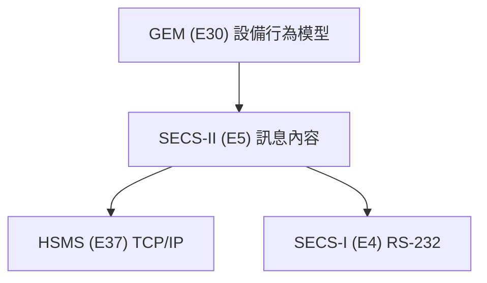

# 🔰 SECS 與 GEM

本章節解析 SECS 與 GEM 的協作關係。SECS 提供溝通詞彙，GEM 規範對話流程——兩者合作，才能讓不同廠牌的設備實現真正的即插即用。

## 語言 vs 對話

- **SECS（特別是 SECS-II）** = 語言：定義詞彙與語法
- **GEM (SEMI E30)** = 對話手冊：規定何時、如何說

SECS 告訴你可以說什麼，但沒有嚴格規定**必須**在什麼情境下說。GEM 補上了這一塊。

## 標準分層架構

## GEM 核心能力與典型 Stream

| GEM 能力 | 說明 | 典型 Stream / 訊息 |
|----------|------|-------------------|
| 通訊狀態 | 建立/斷開連線 | S1 — S1F13/F14 |
| 控制狀態 | 上線/下線、LOCAL/REMOTE | S1 — S1F15–F18 |
| 事件報告 | 狀態改變主動通知 | S2/S6 — S6F11 |
| 警報管理 | 警報上報與查詢 | S5 — S5F1–F7 |
| 數據收集 | 即時感測器數據 | S1/S6 — S1F3/F4 |
| 配方管理 | 上傳/下載 Process Program | S7 — S7F1–F26 |

## 為何需要 GEM？

若沒有 GEM，每家廠商可用 SECS-II 詞彙自創「方言」：

:::note 反例示意（非 SEMI 標準定義）
- A 廠商用 `S2F41` 啟動，B 廠商卻自訂 `S2F101`
- A 廠商用 `S5F1` 發警報，B 廠商卻自訂 `S5F201`
:::

這會迫使 Host 為每種設備客製化程式。**GEM 統一了對話流程**，讓 Host 以標準化方式與所有合規設備溝通。

## 總結對照

| 特性 | SECS (SECS-II) | GEM (E30) |
|------|----------------|-----------|
| 角色 | 語言 | 對話 |
| SEMI 標準 | E5 | E30 |
| 功能 | 訊息詞彙、語法、結構 | 設備標準行為與流程 |
| 關係 | 基礎層 | 建立在 SECS-II 之上 |

**SECS 是基礎，GEM 是應用。** 設備須先支援 SECS，才能實現 GEM。

## 與其他文章的關聯

- SECS 簡介：[`aboutSECS`](/docs/secs/overView/aboutSECS)
- 通訊協定：[`protocol`](/docs/secs/overView/protocol)
- S1 設備狀態訊息：[`s1-equipmentStatus`](/docs/secs/messages/s1-equipmentStatus)
- GEM 通訊狀態機：[`communicationState`](/docs/secs/gem/communicationState)
- GEM 控制狀態機：[`controlState`](/docs/secs/gem/controlState)