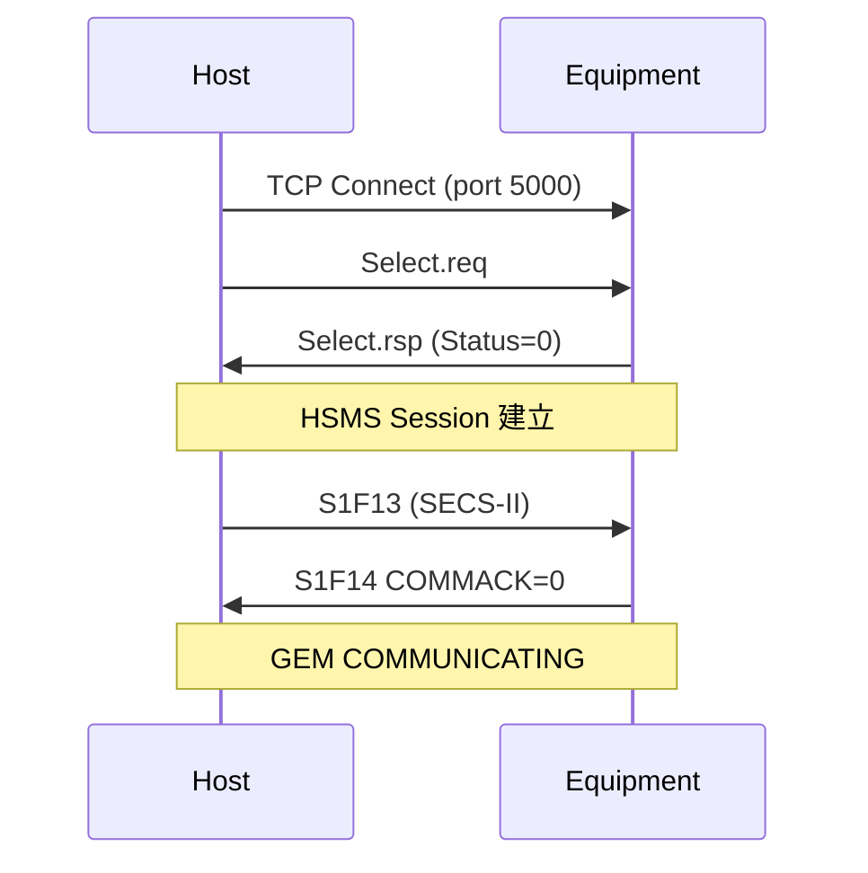

# 🔰 HSMS 連線生命週期

本章節解析 HSMS 從 TCP 連線到 SECS 通訊的完整流程，以及 T3–T8 計時器在除錯中的意義。

:::info 資料來源聲明
本文為學習筆記性質之原創整理，**非 SEMI E37 全文轉載**。完整定義請以 [SEMI 官方標準](https://www.semi.org/) 為準。
:::

## 連線參數

| 項目 | 常見值 |
|------|--------|
| TCP Port | **5000**（慣例，可自訂） |
| 模式 | HSMS-SS（Single Session，E37.1） |
| 角色 | Equipment 通常為 **Passive**（監聽），Host 為 **Active**（連入） |

## 連線建立流程

## 計時器

| 計時器 | 預設值 | 用途 |
|--------|--------|------|
| **T3** | 45 秒 | Reply Timeout：發送 W=1 訊息後等待回覆 |
| **T5** | 10 秒 | Connect Separation：連線嘗試間隔 |
| **T6** | 5 秒 | Control Transaction：Select/Linktest 等控制訊息逾時 |
| **T7** | 10 秒 | Not Selected：TCP 連上後須在 T7 內完成 Select |
| **T8** | 5 秒 | Network Intercharacter：字元間最大間隔 |

### 除錯提示

| 現象 | 相關計時器 | 可能原因 |
|------|-----------|----------|
| 收到 S9F9 | T3 | Equipment 處理太慢或未回覆 |
| TCP 連上但無法通訊 | T7 | 未發送 Select.req |
| 連線反覆斷開 | T5/T6 | 網路不穩或防火牆 |

## Linktest 心跳

HSMS 層的連線維持機制。週期性發送 Linktest.req，對方回 Linktest.rsp。與 SECS 層的 S1F1/F2 心跳互補。

## 斷線

Host 或 Equipment 發送 **Separate.req** 後關閉 TCP 連線。GEM Communication State 退回 NOT_COMMUNICATING。

## 與其他文章的關聯

- 封包結構：[`hsmsMessage`](/docs/secs/protocol-advanced/hsmsMessage)
- 通訊狀態機：[`communicationState`](/docs/secs/gem/communicationState)
- S9 逾時錯誤：[`s9-error`](/docs/secs/messages/s9-error)
- 通訊協定概覽：[`protocol`](/docs/secs/overView/protocol)