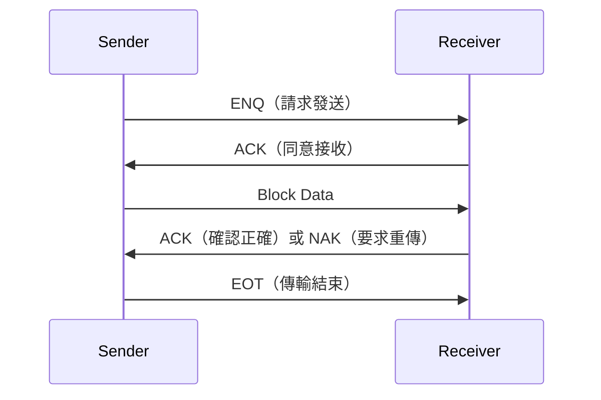

# 🔰 SECS-I 區塊傳輸

本章節說明 SECS-I（SEMI E4）如何在 RS-232 序列埠上傳遞 SECS-II 訊息。現代 FAB 以 HSMS 為主，但維護老設備或單機連線時仍會遇到 SECS-I。

:::info 資料來源聲明
本文為學習筆記性質之原創整理，**非 SEMI E4 全文轉載**。完整定義請以 [SEMI 官方標準](https://www.semi.org/) 為準。
:::

## SECS-I vs HSMS 一句話對照

| | SECS-I | HSMS |
|---|--------|------|
| 實體層 | RS-232 序列埠 | TCP/IP（Port 5000） |
| 傳輸單位 | Block + 握手 | TCP Stream + HSMS Header |
| 連線 | 1:1 專線 | 1:N 網路 |
| 訊息內容 | **相同 SECS-II** | **相同 SECS-II** |

底層不同，**SxFy 與 Body 內容完全一樣**。學會 SECS-II 後，換傳輸層只需理解握手差異。

## 連線參數

| 項目 | 常見值 |
|------|--------|
| 介面 | RS-232（COM Port） |
| 鮑率 | 9600 bps（可更高，需雙方一致） |
| 資料位 | 8 |
| 同位檢查 | None 或 Even（視設備） |
| 停止位 | 1 |
| 距離 | 約 15 公尺以內 |

## 握手流程

SECS-I 使用控制字元協調傳輸：

| 字元 | 名稱 | 用途 |
|------|------|------|
| **ENQ** | Enquiry | 請求發送權 |
| **EOT** | End of Transmission | 傳輸結束 |
| **ACK** | Acknowledge | 確認收到 |
| **NAK** | Negative Acknowledge | 拒收，要求重傳 |



## Block 結構

一個 SECS-I Block 包含：

```
[Length][Header][Body][Checksum]
```

| 欄位 | 說明 |
|------|------|
| **Length** | Block 總長度（含 Header + Body + Checksum） |
| **Header** | SECS-II 訊息標頭（Stream、Function、W-Bit 等） |
| **Body** | SECS-II Data Item 內容 |
| **Checksum** | 校驗和，Receiver 驗證資料完整性 |

若 Checksum 不符，Receiver 回 **NAK**，Sender 重傳該 Block。

## 多 Block 訊息

較大的 SECS-II 訊息可能拆成多個 Block 傳送：

1. 第一個 Block 的 Header 含完整 SxFy 資訊
2. 後續 Block 延續 Body 資料
3. 最後一個 Block 後送 EOT

這與 HSMS 將整則訊息放在一個 TCP 封包中的方式不同，除錯時需注意「訊息被拆成幾個 Block」。

## 何時還會遇到 SECS-I

- 老舊機台僅有 RS-232 介面
- 設備維修或單機測試的臨時連線
- 部分量測設備、周邊輔助設備
- 透過 Serial-to-Ethernet 閘道器轉接（底層仍是 SECS-I 語意）

## 除錯提示

| 現象 | 可能原因 |
|------|----------|
| 完全無回應 | COM Port 設定錯誤（鮑率、同位） |
| 持續 NAK | Checksum 錯誤或線材品質問題 |
| ENQ 後無 ACK | 對端未就緒或佔線 |
| 訊息截斷 | Block 重傳邏輯異常，檢查多 Block 組裝 |

實務上可用 SECS 模擬器或 Serial Sniffer 觀察 ENQ/ACK/NAK 序列，詳見 [secsGemTesting](/docs/secs/protocol-advanced/secsGemTesting)。

## 與其他文章的關聯

- 協定概觀：[`protocol`](/docs/secs/overView/protocol)
- HSMS 對照：[`hsmsConnection`](/docs/secs/protocol-advanced/hsmsConnection)
- 訊息結構：[`secsStructure`](/docs/secs/basics/secsStructure)