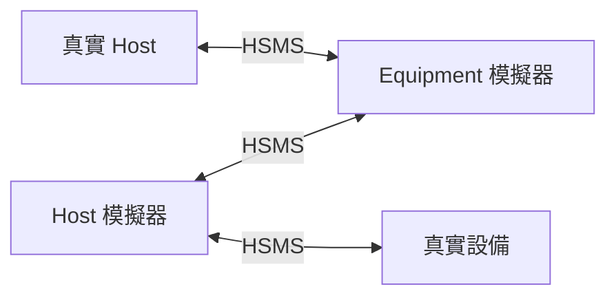
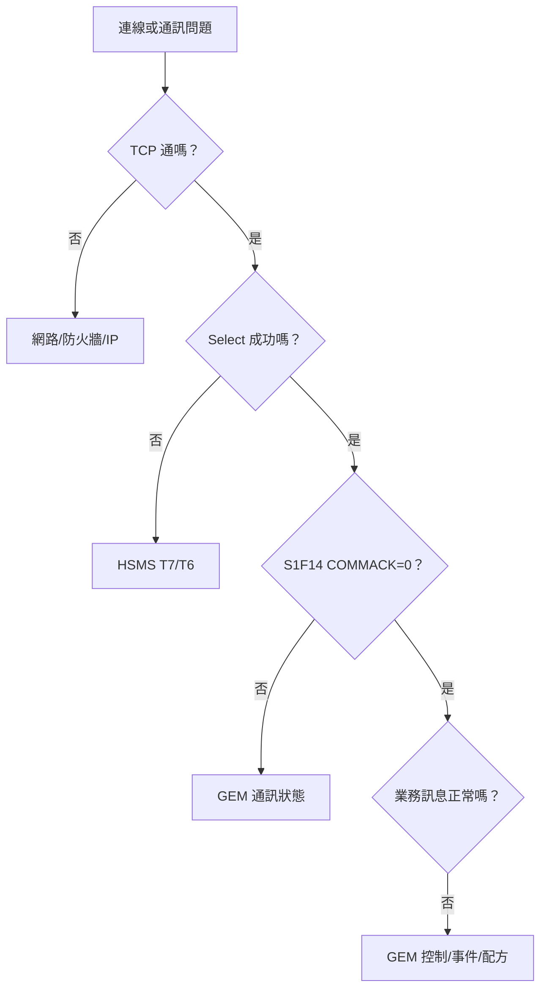

# 🔰 SECS/GEM 測試與除錯入門

本章節提供淺層實務導讀：如何用模擬器驗證連線、如何閱讀 SECS log、以及五個最常見的失敗情境。目標是讓你能參與除錯對話，而非自行開發 SECS driver。

:::info 資料來源聲明
本文為學習筆記性質之原創整理，基於產業常見實務，**非 SEMI 標準全文轉載**。
:::

## 測試環境概念



| 組合 | 用途 |
|------|------|
| Host Sim + Equipment Sim | 學習訊息流程、驗證 SxFy 格式 |
| 真實 Host + Equipment Sim | 驗證 Host 端邏輯 |
| Host Sim + 真實設備 | 驗證設備 Capability、除錯連線 |

常見工具類型：SECS/GEM Host Simulator、Equipment Simulator、SECS Log Analyzer。選擇時確認支援 HSMS-SS 與你需要的 Stream。

## 如何閱讀 SECS Log

典型 log 一行包含：

```
[SxFy] [Direction] [W-Bit] [System Bytes] [Body 摘要] [耗時]
```

### 閱讀順序

1. **看 Direction**：`H→E` 還是 `E→H`？
2. **看 W-Bit**：W=1 的訊息應有配對回覆
3. **看 System Bytes**：HSMS 層配對請求與回覆（見 [hsmsMessage](/docs/secs/protocol-advanced/hsmsMessage)）
4. **看 Body 中的 ACK 碼**：COMMACK、HCACK、DRACK 等
5. **看時間間隔**：超過 T3（45 秒）表示 Reply Timeout

### 範例解讀

```
H→E  S1F13 W=1  Sys=00000001
E→H  S1F14 W=0  Sys=00000001  COMMACK=0     (120ms)
```

→ Host 請求建立通訊，設備 120ms 內回覆成功。

```
H→E  S2F41 W=1  Sys=00000005  RCMD=START
(45s timeout — no reply)
```

→ T3 逾時，設備未回 S2F42。可能設備當掉、Processing State 不允許、或 RCMD 不被支援但未正確回覆。

## 五個常見失敗情境

### 1. TCP 連線失敗

| 症狀 | Log 中看不到任何 SxFy |
|------|----------------------|
| 原因 | IP/Port 錯誤、防火牆、設備未啟動 Passive 監聽 |
| 排查 | `ping` IP、`telnet IP 5000`、確認 Equipment 為 Passive |

### 2. Select 逾時（T7）

| 症狀 | TCP 連上但無法進入 SECS 通訊 |
|------|------------------------------|
| 原因 | 連上後未在 T7（預設 10 秒）內送 Select.req |
| 排查 | 檢查 Host 連線程式是否自動送 Select |

### 3. S1F14 COMMACK ≠ 0

| 症狀 | 建立通訊被拒絕 |
|------|---------------|
| 原因 | 設備已在 COMMUNICATING、DISABLED、或內部錯誤 |
| 排查 | 重啟設備通訊、確認無其他 Host 佔用 Session |

### 4. S2F42 HCACK ≠ 0

| 症狀 | 遠端指令被拒絕 |
|------|---------------|
| 原因 | 不在 REMOTE、RCMD 名稱錯誤、Processing State 不允許 |
| 排查 | 確認 Control State、查廠商 RCMD 清單 |

| HCACK | 意義 |
|-------|------|
| 0 | 已接受 |
| 1 | 指令不存在 |
| 2 | 目前狀態不允許 |
| 3 | 參數錯誤 |

### 5. 收不到 S6F11 事件

| 症狀 | 設備在跑但 Host 沒收到事件 |
|------|---------------------------|
| 原因 | CEID 未定義、未啟用、或 RPTID 連結錯誤 |
| 排查 | 確認 S2F33/F35/F37 都回 ACK=0，查 DRACK/LRACK/ERACK |

## 分層除錯策略



先確認底層（網路 → HSMS → GEM 通訊），再查業務層（控制狀態、事件定義、配方）。

## 實務建議

- 保留完整 SECS log（含時間戳），與廠商溝通時必備
- 用模擬器先跑通 [startupScenario](/docs/secs/gem/startupScenario) 的七個階段
- 對照廠商 **SECS Interface Specification** 的 Capability 清單，確認支援的 SxFy
- 術語不熟時查 [glossary](/docs/secs/basics/glossary)

## 與其他文章的關聯

- 端到端場景：[`startupScenario`](/docs/secs/gem/startupScenario)
- HSMS 計時器：[`hsmsConnection`](/docs/secs/protocol-advanced/hsmsConnection)
- 學習路徑：[`index`](/docs/secs/index)