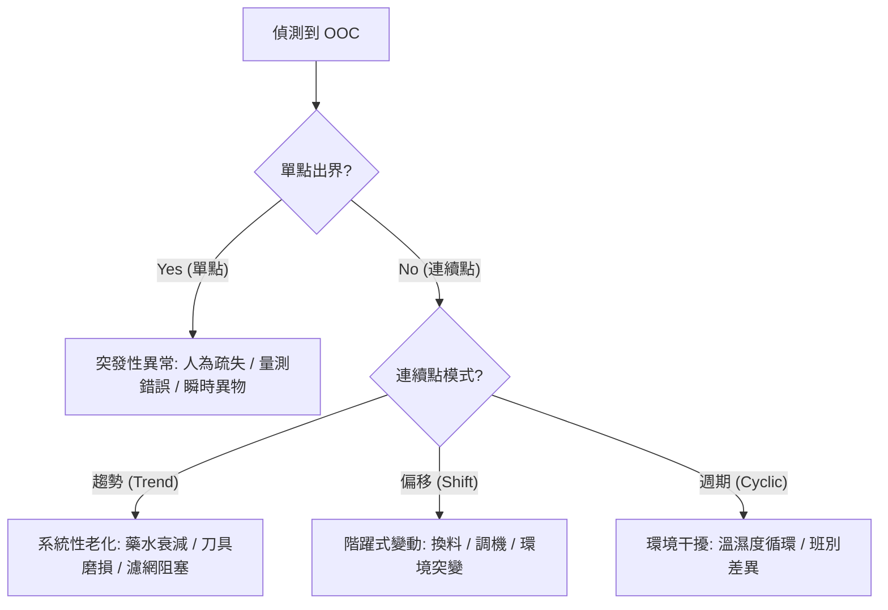

# 📊 判讀規則與模式識別

本章節介紹如何透過「規則引擎」捕捉除了「出界」以外的統計異常。領域專家能從數據的連續模式中，偵測出微小的製程衰退信號。

## 1. 規則引擎的核心邏輯

數據點在界限內並不代表絕對的安全。基於統計學規則，系統能識別出具備規律的「非隨機模式」。

### 📊 訊號判類：OOC 異常來源診斷樹

### 1.1 偏移偵測 (Shift Detection)
- **邏輯**：連續 9 個點落在平均值 ($CL$) 的同一側。
- **數學意義**：連續 9 點發生的機率極低，低於 $\alpha = 0.0027$ 的閾值。
- **製程對應**：暗示製程中心發生了「階躍式」變動。

### 1.2 趨勢偵測 (Trend Detection)
- **邏輯**：連續 6 個點持續增加或減少。
- **製程對應**：通常是系統性老化的徵兆。

### 1.3 循環偵測 (Cyclic Pattern)
- **邏輯**：14 個點呈現上下規律交替。
- **製程對應**：往往與環境因素有關。

## 2. 滑動窗口與實時判定

為了實現高效判定，系統採用了滑動窗口算法。引擎執行位元掩碼 (Bitmask) 運算，迅速判定是否觸發違規，複雜度為 $\mathcal{O}(1)$。

## 3. 邊界案例處理

### 3.1 零變異與最小界限
- **解決方案**：系統強制插入一個最小界限值，防止微小噪聲觸發大量虛警。

### 3.2 樣本數變動與係數調整
- **解決方案**：引擎自動查找統計係數表（如 $d_2, A_2$），即時縮放界限。

## 4. 領域專家思維：模式分析勝過單點判斷

專家會觀察「出界」與「趨勢」的關聯。若趨勢已連續 5 點上升，即便第 6 點仍在界限內，專家也會提前介入。
