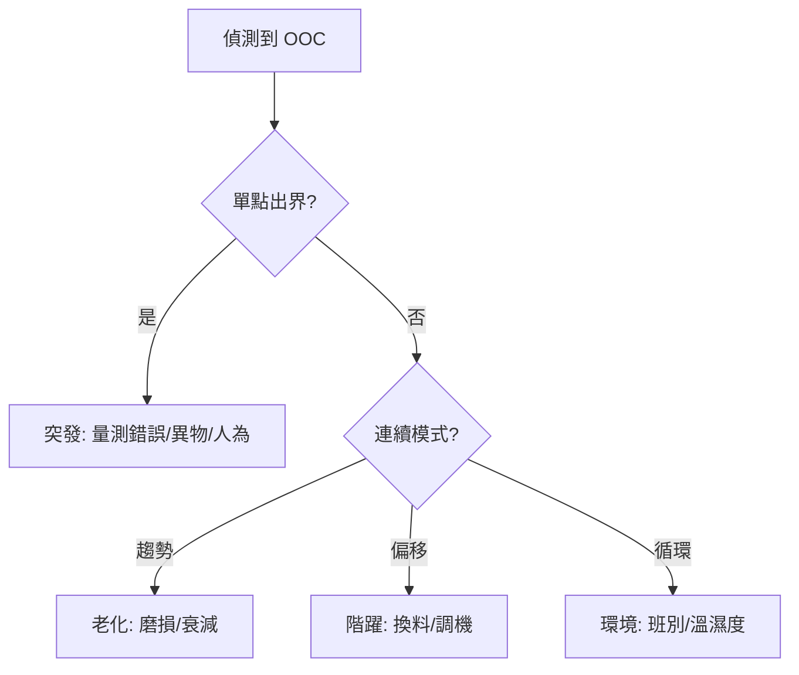

# 📊 判讀規則與模式識別

本章節只做一件事：說明**不出界也可能 OOC** 的常見模式，以及如何從模式推測製程原因。引擎實作（滑動窗口、位元遮罩）見 [`rule-engine`](../engine/rule-engine.md)。

## 讀完本篇你能回答

- 除了點出 UCL/LCL，還有哪些統計模式代表失控？
- 單點出界 vs 連續趨勢，各暗示什麼製程問題？
- 趨勢已明顯但尚未出界時，該不該介入？

## 1. 常見 Nelson 規則

| 模式 | 規則（常見） | 製程暗示 |
|------|-------------|----------|
| 偏移 Shift | 連續 9 點在 CL 同側 | 換料、調機、環境突變 |
| 趨勢 Trend | 連續 6 點遞增或遞減 | 刀具磨損、藥水衰減 |
| 循環 Cyclic | 14 點規律交替 | 班別、溫濕度週期 |

點在界內不代表安全——連續模式的發生機率極低，代表非隨機變異已出現。

## 2. 偵測到 OOC 後怎麼想

## 3. 邊界情況

| 情況 | 處理 |
|------|------|
| 零變異 / 噪聲過小 | 設最小界限，避免虛警風暴 |
| 樣本數 $n$ 變動 | 自動查 $d_2$、$A_2$ 等係數重算界限 |

:::info 實務提醒
連續 5–6 點已呈上升趨勢，即使第 7 點仍在界內，專家通常會提前介入，不必等到出界。
:::

## 延伸閱讀

| 主題 | 文章 |
|------|------|
| 規則引擎實作 | [`rule-engine`](../engine/rule-engine.md) |
| 告警觸發 | [`detection-and-alert`](../exception-handling/detection-and-alert.md) |
| 看圖除錯 | [`spcDebugging`](../exception-handling/spcDebugging.md) |
| 端到端流程 | [`endToEndLifecycle`](./endToEndLifecycle.md) |